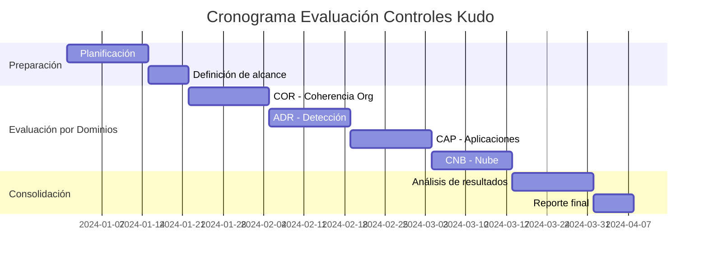

## Propósito

Establecer un enfoque sistemático para evaluar la efectividad de los controles de seguridad definidos en los dominios Kudo, asegurando que cumplan con los objetivos de seguridad establecidos.

## Estructura del Assessment Plan

### 1. Metadatos del Plan
- **Versión**: v1.0.0
- **Fecha de creación**: Fecha actual
- **Responsable**: CISO de DivisionCero
- **Periodicidad**: Anual con revisiones trimestrales

### 2. Alcance de la Evaluación

#### Dominios Kudo a Evaluar:
- **COR**: Coherencia Organizacional
- **ADR**: Análisis, Detección y Respuesta
- **CAP**: Ciberseguridad en Aplicaciones
- **CCN**: Continuidad y Cambios del Negocio
- **CNB**: Ciberseguridad en Nube
- **CIP**: Ciberseguridad en Identidad y Puntos Finales
- **DIA**: Ciberseguridad en Datos e IA
- **THP**: Ciberseguridad en Talento Humano y Proveedores

### 3. Metodología de Evaluación

#### Tipos de Evaluación:
1. **Evaluación Documental**: Revisión de políticas y procedimientos
2. **Evaluación Técnica**: Pruebas automatizadas y manuales
3. **Evaluación Operacional**: Observación de procesos en funcionamiento
4. **Entrevistas**: Con personal responsable de controles

#### Criterios de Evaluación:
- **Efectivo**: Control implementado y funcionando según diseño
- **Parcialmente Efectivo**: Control implementado con deficiencias menores
- **No Efectivo**: Control no implementado o con deficiencias críticas

### 4. Cronograma de Evaluación

### 5. Recursos Necesarios

#### Equipo de Evaluación:
- **Líder de Evaluación**: CISO
- **Evaluadores Técnicos**: Equipo de Seguridad TI
- **Evaluadores de Procesos**: Auditores Internos
- **Especialistas por Dominio**: Según dominio evaluado

#### Herramientas:
- Herramientas de escaneo de vulnerabilidades
- Sistemas de monitoreo y logs
- Plataformas de gestión documental
- Herramientas de análisis de configuración

### 6. Entregables Esperados

1. **Assessment Results (AR)**: Resultados detallados por control
2. **Executive Summary**: Resumen ejecutivo para la dirección
3. **Plan of Action and Milestones (POA&M)**: Plan de remediación
4. **Lessons Learned**: Lecciones aprendidas y mejoras

### 7. Integración con Otros Procesos

- **Risk Management**: Actualización de la matriz de riesgos
- **Continuous Monitoring**: Alimentación del monitoreo continuo
- **Compliance**: Evidencias para auditorías externas
- **Incident Response**: Identificación de gaps en respuesta

## Implementación en DivisionCero

Este Assessment Plan se ejecuta como parte del ciclo de mejora continua de la postura de seguridad de DivisionCero, asegurando que todos los controles Kudo mantengan su efectividad a lo largo del tiempo.

---

*Documento generado según estándares OSCAL para framework Kudo v1.0*
