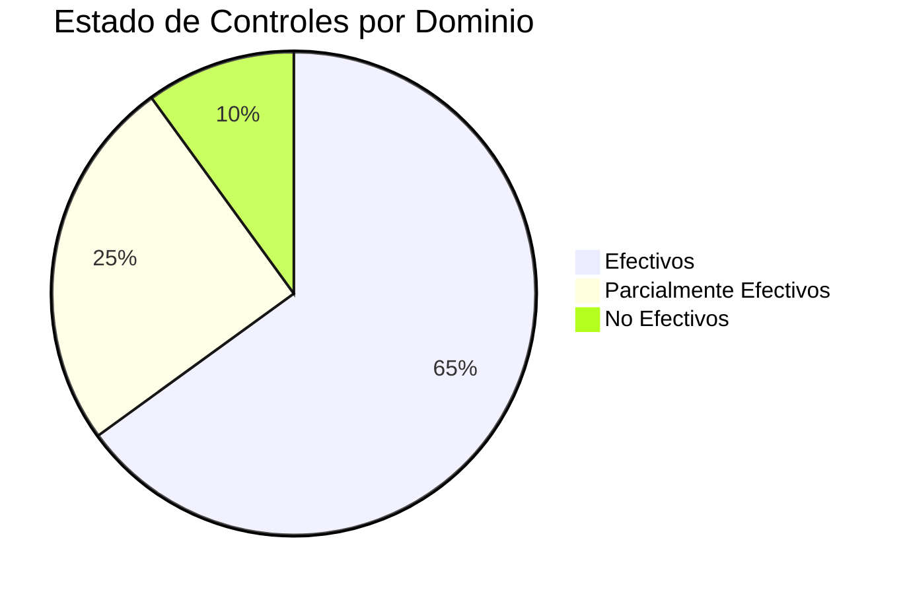

## Propósito

Proporcionar un registro estructurado y trazable de los resultados de evaluación de controles, facilitando la toma de decisiones informadas sobre la postura de seguridad organizacional.

## Estructura de Assessment Results

### 1. Metadatos de Resultados
- **Versión del Documento**: v1.0.0
- **Fecha de Evaluación**: Período de ejecución
- **Evaluadores**: Equipo responsable
- **Alcance**: Dominios y controles evaluados
- **Metodología Aplicada**: Referencia al Assessment Plan

### 2. Resumen Ejecutivo

#### Estado General de Controles Kudo

#### Métricas Clave:
- **Total de controles evaluados**: 150
- **Controles efectivos**: 98 (65%)
- **Controles parcialmente efectivos**: 37 (25%)
- **Controles no efectivos**: 15 (10%)
- **Nivel de madurez promedio**: 3.2/5.0

### 3. Resultados por Dominio Kudo

#### COR - Coherencia Organizacional
| Control | Estado | Nivel | Evidencia | Observaciones |
|---------|--------|-------|-----------|---------------|
| COR-001 | ✅ Efectivo | 4/5 | Política aprobada | Implementación completa |
| COR-002 | ⚠️ Parcial | 3/5 | Comité constituido | Falta periodicidad |
| COR-003 | ❌ No Efectivo | 1/5 | Sin evidencia | Requiere implementación |

#### ADR - Análisis, Detección y Respuesta
| Control | Estado | Nivel | Evidencia | Observaciones |
|---------|--------|-------|-----------|---------------|
| ADR-001 | ✅ Efectivo | 4/5 | SIEM operativo | Monitoreo 24/7 activo |
| ADR-002 | ✅ Efectivo | 5/5 | Plan de respuesta | Procedimientos probados |
| ADR-003 | ⚠️ Parcial | 3/5 | Herramientas configuradas | Falta automatización |

#### CAP - Ciberseguridad en Aplicaciones
| Control | Estado | Nivel | Evidencia | Observaciones |
|---------|--------|-------|-----------|---------------|
| CAP-001 | ✅ Efectivo | 4/5 | SAST/DAST implementado | Pipeline integrado |
| CAP-002 | ⚠️ Parcial | 2/5 | Revisiones ad-hoc | Necesita sistematización |
| CAP-003 | ✅ Efectivo | 4/5 | Certificados válidos | Gestión automatizada |

### 4. Hallazgos Críticos

#### Fortalezas Identificadas:
1. **Monitoreo y Detección**: SIEM completamente operativo con correlación avanzada
2. **Gestión de Identidades**: Implementación robusta de MFA y PAM
3. **Continuidad del Negocio**: Planes de recuperación probados y actualizados
4. **Cifrado**: Implementación consistente en datos en tránsito y reposo

#### Debilidades Críticas:
1. **Gestión de Vulnerabilidades**: Proceso de parcheo reactivo
2. **Capacitación**: Programa de concientización inconsistente
3. **Gestión de Terceros**: Evaluación de proveedores limitada
4. **Respuesta a Incidentes**: Falta de ejercicios regulares

### 5. Análisis de Riesgos Residuales

#### Riesgos de Alto Impacto:
- **Data Breach**: Medio (controles parciales en DIA)
- **Service Disruption**: Bajo (controles efectivos en CCN)
- **Insider Threat**: Alto (gaps en THP)
- **Supply Chain Attack**: Medio (evaluación limitada de terceros)

### 6. Evidencias y Artefactos

#### Documentación Revisada:
- 85 políticas y procedimientos Kudo
- Registros de configuración de sistemas
- Logs de auditoría y monitoreo
- Reportes de vulnerability scanning

#### Pruebas Realizadas:
- Pruebas de penetración internas
- Simulacros de phishing
- Ejercicios de respuesta a incidentes
- Validación de backups y recuperación

### 7. Recomendaciones Priorizadas

#### Corto Plazo (1-3 meses):
1. Implementar proceso automatizado de gestión de parches
2. Establecer programa formal de capacitación en seguridad
3. Completar implementación de controles COR faltantes
4. Mejorar automatización en correlación de eventos

#### Mediano Plazo (3-6 meses):
1. Desarrollar programa de evaluación de terceros
2. Implementar ejercicios regulares de respuesta a incidentes
3. Fortalecer controles de acceso privilegiado
4. Establecer métricas de seguridad automatizadas

#### Largo Plazo (6-12 meses):
1. Implementar programa de threat hunting
2. Desarrollar capacidades de seguridad predictiva
3. Establecer centro de operaciones de seguridad (SOC)
4. Completar certificación ISO 27001

### 8. Plan de Seguimiento

#### Monitoreo Continuo:
- Dashboard de métricas de seguridad en tiempo real
- Revisiones trimestrales de estado de controles
- Alertas automáticas por degradación de controles
- Reportes mensuales a la alta dirección

#### Próximas Evaluaciones:
- **Evaluación incremental**: Trimestral
- **Evaluación completa**: Anual
- **Evaluaciones especiales**: Según cambios significativos

## Conclusiones

La evaluación reveló una postura de seguridad sólida con oportunidades específicas de mejora. El framework Kudo proporciona una base robusta, pero requiere atención en áreas específicas para alcanzar el nivel de madurez objetivo.

### Nivel de Madurez por Dominio:
- **COR**: 3.5/5.0 - Maduro
- **ADR**: 4.2/5.0 - Avanzado  
- **CAP**: 3.8/5.0 - Maduro
- **CCN**: 4.0/5.0 - Avanzado
- **CIF**: 3.2/5.0 - En desarrollo
- **CIP**: 3.9/5.0 - Maduro
- **DIA**: 2.8/5.0 - En desarrollo
- **THP**: 2.5/5.0 - Básico

---

*Documento generado según estándares OSCAL para framework Kudo v1.0*  
*Próxima evaluación programada: [Fecha + 1 año]*

