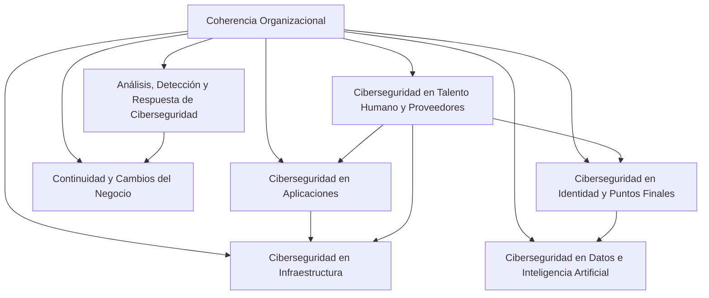

## Propósito

Proporcionar un repositorio centralizado y estructurado de todos los controles de seguridad disponibles en el framework Kudo, facilitando su selección, implementación y mantenimiento.

## Estructura del Catálogo

### Metadatos del Catálogo
- **Versión**: Kudo v1.0.0
- **Fecha de publicación**: 2024
- **Organización**: DivisionCero
- **Estándar base**: OSCAL + ISO 27001:2022 + NIST CSF 2.0
- **Idioma**: Español (es-ES)

### Organización por Dominios

## COR - Coherencia Organizacional

### COR-001: Gobernanza de Ciberseguridad
**Objetivo**: Establecer estructura organizacional para gestión de ciberseguridad  
**Tipo**: Organizacional  
**Familia**: Governance  
**Prioridad**: Alta

**Declaración del Control**:
La organización debe establecer, documentar y mantener una estructura de gobernanza que defina roles, responsabilidades y procesos para la gestión integral de la ciberseguridad.

**Parámetros**:
- Comité de Ciberseguridad constituido
- Roles RACI definidos
- Reporting periódico establecido

### COR-002: Política Marco de Seguridad
**Objetivo**: Definir directrices organizacionales de seguridad  
**Tipo**: Documental  
**Familia**: Policy  
**Prioridad**: Alta

**Declaración del Control**:
La organización debe establecer una política marco que defina el enfoque organizacional hacia la ciberseguridad y los principios fundamentales.

## ADR - Análisis, Detección y Respuesta de Ciberseguridad

### ADR-001: Monitoreo Continuo
**Objetivo**: Implementar capacidades de detección 24/7  
**Tipo**: Técnico  
**Familia**: Monitoring  
**Prioridad**: Crítica

**Declaración del Control**:
La organización debe implementar capacidades de monitoreo continuo para detectar, analizar y responder a eventos de seguridad en tiempo real.

**Parámetros**:
- SIEM configurado y operativo
- Correlación de eventos habilitada
- Alertas automatizadas configuradas
- Dashboards de monitoreo disponibles

### ADR-002: Plan de Respuesta a Incidentes
**Objetivo**: Establecer procedimientos de respuesta estructurados  
**Tipo**: Procedimental  
**Familia**: Incident Response  
**Prioridad**: Crítica

**Declaración del Control**:
La organización debe mantener un plan documentado y probado para responder efectivamente a incidentes de ciberseguridad.

## CAP - Ciberseguridad en Aplicaciones

### CAP-001: Desarrollo Seguro
**Objetivo**: Integrar seguridad en el ciclo de desarrollo  
**Tipo**: Técnico  
**Familia**: Secure Development  
**Prioridad**: Alta

**Declaración del Control**:
La organización debe implementar prácticas de desarrollo seguro que incluyan análisis estático, dinámico y revisiones de código.

**Parámetros**:
- SAST/DAST integrado en pipeline
- Code reviews de seguridad
- Training de secure coding

### CAP-002: Gestión de APIs
**Objetivo**: Asegurar interfaces de programación  
**Tipo**: Técnico  
**Familia**: API Security  
**Prioridad**: Media

**Declaración del Control**:
La organización debe implementar controles específicos para asegurar el diseño, desarrollo y operación de APIs.

## CCN - Continuidad y Cambios del Negocio

### CCN-001: Plan de Continuidad
**Objetivo**: Garantizar continuidad operacional  
**Tipo**: Organizacional  
**Familia**: Business Continuity  
**Prioridad**: Crítica

**Declaración del Control**:
La organización debe mantener planes de continuidad del negocio que incluyan consideraciones específicas de ciberseguridad.

### CCN-002: Gestión de Cambios
**Objetivo**: Controlar cambios en sistemas críticos  
**Tipo**: Procedimental  
**Familia**: Change Management  
**Prioridad**: Alta

**Declaración del Control**:
La organización debe implementar procesos de gestión de cambios que incluyan evaluación de impacto en seguridad.

## CIF - Ciberseguridad en Infraestructura

### CIF-001: Hardening de Sistemas
**Objetivo**: Implementar configuraciones seguras  
**Tipo**: Técnico  
**Familia**: System Hardening  
**Prioridad**: Alta

**Declaración del Control**:
La organización debe aplicar configuraciones de seguridad basadas en benchmarks reconocidos para todos los sistemas.

### CIF-002: Gestión de Parches
**Objetivo**: Mantener sistemas actualizados  
**Tipo**: Técnico  
**Familia**: Patch Management  
**Prioridad**: Crítica

**Declaración del Control**:
La organización debe implementar un proceso sistemático para identificar, evaluar e implementar parches de seguridad.

## CIP - Ciberseguridad en Identidad y Puntos Finales

### CIP-001: Gestión de Identidades
**Objetivo**: Controlar acceso basado en identidades  
**Tipo**: Técnico  
**Familia**: Identity Management  
**Prioridad**: Crítica

**Declaración del Control**:
La organización debe implementar un sistema integral de gestión de identidades y accesos (IAM).

**Parámetros**:
- MFA implementado
- Provisioning/Deprovisioning automatizado
- Revisiones periódicas de acceso

### CIP-002: Protección de Endpoints
**Objetivo**: Asegurar puntos finales  
**Tipo**: Técnico  
**Familia**: Endpoint Protection  
**Prioridad**: Alta

**Declaración del Control**:
La organización debe implementar protecciones integrales en todos los endpoints corporativos.

## DIA - Ciberseguridad en Datos e Inteligencia Artificial

### DIA-001: Clasificación de Datos
**Objetivo**: Categorizar información según criticidad  
**Tipo**: Organizacional  
**Familia**: Data Classification  
**Prioridad**: Alta

**Declaración del Control**:
La organización debe implementar un esquema de clasificación de datos que incluya niveles de confidencialidad y controles asociados.

### DIA-002: Cifrado de Datos
**Objetivo**: Proteger datos mediante cifrado  
**Tipo**: Técnico  
**Familia**: Cryptography  
**Prioridad**: Crítica

**Declaración del Control**:
La organización debe implementar cifrado apropiado para datos en tránsito, reposo y proceso.

## THP - Ciberseguridad en Talento Humano y Proveedores

### THP-001: Capacitación en Seguridad
**Objetivo**: Desarrollar competencias de seguridad  
**Tipo**: Organizacional  
**Familia**: Training  
**Prioridad**: Media

**Declaración del Control**:
La organización debe implementar un programa integral de capacitación y concientización en ciberseguridad.

### THP-002: Evaluación de Terceros
**Objetivo**: Gestionar riesgos de terceros  
**Tipo**: Procedimental  
**Familia**: Third Party Risk  
**Prioridad**: Alta

**Declaración del Control**:
La organización debe implementar procesos para evaluar y gestionar los riesgos de ciberseguridad asociados con terceros.

## Estructura de Implementación

### Niveles de Madurez
1. **Inicial (1)**: Control no implementado
2. **Básico (2)**: Implementación ad-hoc
3. **Definido (3)**: Proceso documentado
4. **Gestionado (4)**: Proceso medido
5. **Optimizado (5)**: Mejora continua

### Métricas Asociadas
- **Cobertura**: % de controles implementados
- **Efectividad**: % de controles efectivos
- **Madurez**: Nivel promedio de madurez
- **Tendencia**: Evolución temporal

### Relaciones y Dependencias

## Uso del Catálogo

### Selección de Controles
1. **Evaluación de Riesgos**: Identificar controles relevantes
2. **Análisis de Brecha**: Comparar estado actual vs. objetivo
3. **Priorización**: Definir orden de implementación
4. **Roadmap**: Establecer cronograma de implementación

### Personalización
- Adaptación a contexto organizacional
- Parametrización según tamaño y sector
- Integración con marcos regulatorios específicos

## Mantenimiento del Catálogo

### Proceso de Actualización
- Revisión anual de controles
- Incorporación de nuevas amenazas
- Actualización de referencias normativas
- Feedback de implementaciones

### Versionado
- Versionado semántico (MAJOR.MINOR.PATCH)
- Registro de cambios documentado
- Compatibilidad retroactiva considerada

---

*Catálogo Kudo v1.0 - Documento generado según estándares OSCAL*  
*Total de controles: 150+ | Última actualización: 2024*

