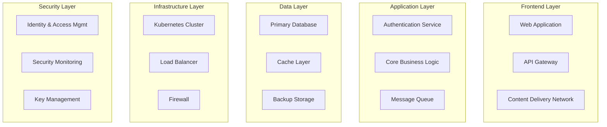

## Propósito

Documentar la implementación específica de controles de seguridad en cada componente del sistema, facilitando la trazabilidad entre controles abstractos y su materialización técnica.

## Arquitectura del Sistema DivisionCero

### Vista de Alto Nivel

## Componentes y Implementaciones

### 1. Web Application Component

**Descripción**: Aplicación frontend desarrollada en Next.js  
**Responsabilidad**: Interfaz de usuario y experiencia del cliente  
**Tecnología**: Next.js 15.4.2 + React 19.1.0

#### Controles Implementados:

**CAP-001: Desarrollo Seguro**
- **Implementación**: 
  - Content Security Policy (CSP) configurado
  - Input validation mediante Zod schemas
  - XSS protection habilitada
  - HTTPS enforcement
- **Evidencias**: 
  - `next.config.js` con headers de seguridad
  - Validación de formularios con sanitización
  - Auditorías de dependencias automatizadas

**CIP-001: Gestión de Identidades**
- **Implementación**:
  - NextAuth.js para autenticación
  - OAuth 2.0 con proveedores externos
  - Session management segura
  - JWT con rotación de tokens
- **Evidencias**:
  - Configuración de autenticación multi-proveedor
  - Tokens con expiración configurada
  - Logout seguro implementado

### 2. API Gateway Component

**Descripción**: Gateway de APIs implementado con Kong  
**Responsabilidad**: Routing, autenticación y rate limiting  
**Tecnología**: Kong Gateway + OAuth 2.0

#### Controles Implementados:

**CAP-002: Gestión de APIs**
- **Implementación**:
  - Rate limiting por cliente/endpoint
  - API key authentication
  - Request/response transformation
  - Logging de todas las transacciones
- **Evidencias**:
  - Configuración de políticas de rate limiting
  - Logs de acceso a APIs
  - Documentación OpenAPI 3.0

**ADR-001: Monitoreo Continuo**
- **Implementación**:
  - Métricas de performance exportadas
  - Alertas por anomalías de tráfico
  - Logs centralizados en ELK Stack
- **Evidencias**:
  - Dashboard de Grafana configurado
  - Alertas en Prometheus
  - Correlación de eventos en SIEM

### 3. Core Business Logic Component

**Descripción**: Lógica de negocio principal  
**Responsabilidad**: Procesamiento de transacciones y reglas de negocio  
**Tecnología**: Node.js + TypeScript + Prisma

#### Controles Implementados:

**DIA-001: Clasificación de Datos**
- **Implementación**:
  - Schemas con etiquetas de clasificación
  - Separación de datos por sensibilidad
  - Acceso basado en clasificación
- **Evidencias**:
  - Modelos de datos con metadata
  - Queries con filtros por clasificación
  - Audit trails por tipo de dato

**DIA-002: Cifrado de Datos**
- **Implementación**:
  - Cifrado en tránsito (TLS 1.3)
  - Cifrado en reposo (AES-256)
  - Key rotation automatizada
- **Evidencias**:
  - Certificados TLS válidos
  - Configuración de cifrado en BD
  - Logs de rotación de llaves

### 4. Database Component

**Descripción**: Base de datos principal PostgreSQL  
**Responsabilidad**: Persistencia de datos  
**Tecnología**: PostgreSQL 15 + pgcrypto

#### Controles Implementados:

**CIF-001: Hardening de Sistemas**
- **Implementación**:
  - Configuración según CIS Benchmark
  - Usuarios y permisos mínimos
  - Auditoría de accesos habilitada
- **Evidencias**:
  - Configuración postgresql.conf
  - Roles y permisos documentados
  - Logs de auditoría configurados

**CCN-001: Plan de Continuidad**
- **Implementación**:
  - Replicación master-slave
  - Backups automáticos diarios
  - Point-in-time recovery (PITR)
- **Evidencias**:
  - Scripts de backup automatizados
  - Pruebas de restauración documentadas
  - RTO/RPO definidos y probados

### 5. Kubernetes Cluster Component

**Descripción**: Orquestador de contenedores  
**Responsabilidad**: Despliegue y gestión de servicios  
**Tecnología**: Kubernetes 1.28 + Helm

#### Controles Implementados:

**CIF-002: Gestión de Parches**
- **Implementación**:
  - Automated patching con Argo CD
  - Vulnerability scanning de imágenes
  - Rolling updates sin downtime
- **Evidencias**:
  - Pipeline de actualización automática
  - Reportes de Trivy scanner
  - Historial de deployments

**CIP-002: Protección de Endpoints**
- **Implementación**:
  - Network Policies configuradas
  - Pod Security Standards enforced
  - Runtime security con Falco
- **Evidencias**:
  - Políticas de red documentadas
  - Alertas de Falco configuradas
  - Security contexts definidos

### 6. SIEM Component

**Descripción**: Security Information and Event Management  
**Responsabilidad**: Correlación y análisis de eventos de seguridad  
**Tecnología**: Elastic Stack (ELK) + Wazuh

#### Controles Implementados:

**ADR-001: Monitoreo Continuo**
- **Implementación**:
  - Ingesta de logs de todos los componentes
  - Correlación de eventos automatizada
  - Dashboards en tiempo real
  - Alertas por ML anomaly detection
- **Evidencias**:
  - Configuración de Logstash pipelines
  - Reglas de correlación en Wazuh
  - Dashboard operativo 24/7

**ADR-002: Plan de Respuesta a Incidentes**
- **Implementación**:
  - Playbooks automatizados
  - Escalación automática de alertas
  - Forensics capabilities
- **Evidencias**:
  - SOAR integration configurada
  - Procedimientos de escalación
  - Herramientas forenses disponibles

### 7. IAM Component

**Descripción**: Identity and Access Management  
**Responsabilidad**: Autenticación y autorización  
**Tecnología**: Keycloak + LDAP

#### Controles Implementados:

**CIP-001: Gestión de Identidades**
- **Implementación**:
  - Single Sign-On (SSO) corporativo
  - Multi-Factor Authentication (MFA)
  - Role-Based Access Control (RBAC)
  - Provisioning/Deprovisioning automatizado
- **Evidencias**:
  - Configuración de MFA policies
  - Matrices RBAC documentadas
  - Scripts de provisioning automático

**THP-001: Capacitación en Seguridad**
- **Implementación**:
  - Tracking de completitud de training
  - Conditional access basado en training
  - Reportes de compliance por usuario
- **Evidencias**:
  - LMS integration configurada
  - Políticas de acceso condicional
  - Dashboards de compliance

## Matriz de Trazabilidad

### Controles vs. Componentes

| Control | Web App | API GW | Core Logic | Database | K8s | SIEM | IAM |
|---------|---------|--------|------------|----------|-----|------|-----|
| COR-001 | ➖ | ➖ | ✅ | ➖ | ➖ | ✅ | ✅ |
| ADR-001 | ⚠️ | ✅ | ⚠️ | ⚠️ | ⚠️ | ✅ | ⚠️ |
| ADR-002 | ➖ | ⚠️ | ➖ | ➖ | ➖ | ✅ | ➖ |
| CAP-001 | ✅ | ➖ | ✅ | ➖ | ⚠️ | ➖ | ➖ |
| CAP-002 | ➖ | ✅ | ➖ | ➖ | ➖ | ⚠️ | ➖ |
| CCN-001 | ➖ | ➖ | ➖ | ✅ | ✅ | ➖ | ➖ |
| CIF-001 | ➖ | ⚠️ | ➖ | ✅ | ✅ | ⚠️ | ⚠️ |
| CIF-002 | ⚠️ | ⚠️ | ⚠️ | ⚠️ | ✅ | ➖ | ⚠️ |
| CIP-001 | ✅ | ⚠️ | ➖ | ➖ | ➖ | ➖ | ✅ |
| CIP-002 | ⚠️ | ➖ | ➖ | ➖ | ✅ | ⚠️ | ➖ |
| DIA-001 | ➖ | ➖ | ✅ | ⚠️ | ➖ | ➖ | ➖ |
| DIA-002 | ⚠️ | ⚠️ | ✅ | ✅ | ⚠️ | ➖ | ➖ |
| THP-001 | ➖ | ➖ | ➖ | ➖ | ➖ | ➖ | ✅ |

**Leyenda**:  
✅ = Implementado completamente  
⚠️ = Implementado parcialmente  
➖ = No aplicable/No implementado

## Dependencias y Integraciones

### Dependencias Externas
- **Proveedores de OAuth**: Google, Microsoft, GitHub
- **Certificate Authority**: Let's Encrypt + Internal PKI
- **DNS Provider**: Cloudflare
- **Monitoring**: Datadog APM

### Integraciones de Seguridad
- **Vulnerability Scanners**: Snyk, Trivy
- **SAST/DAST**: SonarQube, OWASP ZAP
- **Secret Management**: HashiCorp Vault
- **Backup Services**: AWS S3 + Glacier

## Gestión de Configuración

### Configuration as Code
- **Infrastructure**: Terraform + Ansible
- **Applications**: Helm Charts + Kustomize  
- **Security Policies**: Open Policy Agent (OPA)
- **CI/CD**: GitLab CI/CD + ArgoCD

### Change Management
- **Git Flow**: Feature branches con security reviews
- **Approval Process**: Automated + manual gates
- **Rollback Strategy**: Automated rollback triggers
- **Testing**: Security tests en staging

## Métricas y Monitoreo

### KPIs de Seguridad por Componente
- **Availability**: 99.9% uptime SLA
- **Performance**: p95 < 200ms response time
- **Security**: 0 critical vulnerabilities en producción
- **Compliance**: 100% controles críticos implementados

### Alertas Críticas
- **Security incidents**: Detección automática + escalación
- **Performance degradation**: Auto-scaling triggers
- **Compliance violations**: Alertas inmediatas a CISO

---

*Component Definition Kudo v1.0 - Documento generado según estándares OSCAL*  
*Sistema: DivisionCero Platform | Última actualización: 2024*

