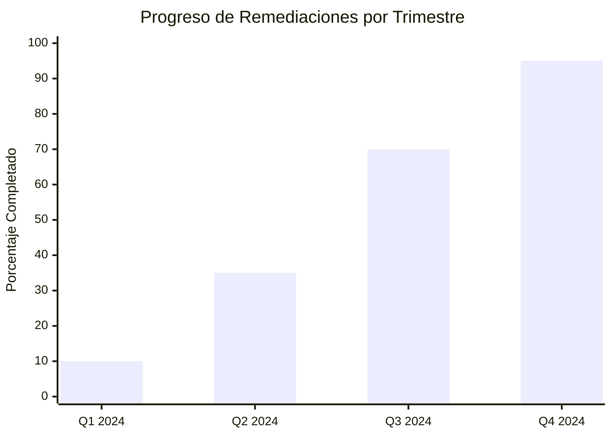

## Propósito

Proporcionar un framework sistemático para rastrear, priorizar y remediar las deficiencias de seguridad identificadas, asegurando la mejora continua de la postura de seguridad organizacional.

## Metodología de Priorización

### Matriz de Riesgo
```mermaid
quadrant-chart
    title Matriz de Priorización de Remediaciones
    x-axis Baja --> Alta : Dificultad de Implementación
    y-axis Bajo --> Alto : Impacto en Seguridad
    quadrant-1 Prioridad ALTA
    quadrant-2 Prioridad CRÍTICA
    quadrant-3 Prioridad BAJA
    quadrant-4 Prioridad MEDIA
    
    POA-001: [0.2, 0.9]
    POA-002: [0.4, 0.8]
    POA-003: [0.8, 0.7]
    POA-004: [0.3, 0.4]
    POA-005: [0.7, 0.3]
    POA-006: [0.9, 0.9]
    POA-007: [0.6, 0.6]
    POA-008: [0.1, 0.5]
```

## Deficiencias Identificadas y Plan de Remediación

### POA-001: Gestión Automatizada de Vulnerabilidades [CRÍTICA]

**Control Afectado**: CNB-002 - Gestión de Parches  
**Dominio**: Ciberseguridad en Nube  
**Estado Actual**: No Efectivo  

**Descripción de la Deficiencia**:
El proceso actual de gestión de parches es reactivo y manual, lo que genera ventanas de exposición prolongadas para vulnerabilidades críticas.

**Impacto en Seguridad**:
- **Alto**: Exposición a explotación de vulnerabilidades conocidas
- **CVSS Base**: 8.5 (High)
- **Sistemas Afectados**: 85% de la infraestructura

**Plan de Acción**:
1. **Evaluación de herramientas** (Semana 1-2)
   - Análisis de Qualys VMDR vs. Rapid7 InsightVM
   - POC con 10% de sistemas piloto
   - Definición de criterios de automatización

2. **Implementación de solución** (Semana 3-8)
   - Despliegue de agentes en infraestructura crítica
   - Configuración de policies de parcheo automatizado
   - Integración con SIEM para alertas

3. **Operacionalización** (Semana 9-12)
   - Capacitación del equipo de operaciones
   - Documentación de runbooks
   - Establecimiento de SLAs de remediación

**Responsable**: Equipo de Infraestructura  
**Fecha Compromiso**: 12 semanas desde aprobación  
**Presupuesto Estimado**: $125,000 USD  
**Recursos Requeridos**: 2 FTE + consultoría externa  

**Hitos**:
- ✅ **H1**: Aprobación de presupuesto (Semana 0)
- 🔄 **H2**: Selección de herramienta (Semana 2)
- ⏳ **H3**: Implementación piloto (Semana 4)
- ⏳ **H4**: Rollout producción (Semana 8)
- ⏳ **H5**: Operacionalización completa (Semana 12)

---

### POA-002: Programa de Capacitación en Seguridad [CRÍTICA]

**Control Afectado**: THP-001 - Capacitación en Seguridad  
**Dominio**: Talento Humano y Proveedores  
**Estado Actual**: Parcialmente Efectivo  

**Descripción de la Deficiencia**:
Falta de programa estructurado y medible de capacitación en ciberseguridad que cubra todos los empleados con contenido actualizado.

**Impacto en Seguridad**:
- **Alto**: Factor humano como vector de ataque principal
- **Estadística**: 95% de ataques exitosos involucran error humano
- **Personal Afectado**: 180 empleados sin training actualizado

**Plan de Acción**:
1. **Diseño del programa** (Semana 1-4)
   - Evaluación de plataformas LMS (KnowBe4, Proofpoint)
   - Desarrollo de contenido personalizado por rol
   - Definición de métricas y KPIs

2. **Implementación** (Semana 5-8)
   - Configuración de plataforma LMS
   - Creación de tracks por departamento
   - Integración con sistema de RRHH

3. **Lanzamiento y seguimiento** (Semana 9-16)
   - Campaña de lanzamiento corporativo
   - Simulacros de phishing mensuales
   - Reportes de completion rate

**Responsable**: CISO + RRHH  
**Fecha Compromiso**: 16 semanas desde aprobación  
**Presupuesto Estimado**: $80,000 USD/año  
**Recursos Requeridos**: 1 FTE + contractor para contenido  

**Hitos**:
- ⏳ **H1**: Selección de LMS (Semana 2)
- ⏳ **H2**: Contenido desarrollado (Semana 6)  
- ⏳ **H3**: Piloto con 20% de personal (Semana 10)
- ⏳ **H4**: Rollout completo (Semana 16)

---

### POA-003: Evaluación de Riesgos de Terceros [ALTA]

**Control Afectado**: THP-002 - Evaluación de Terceros  
**Dominio**: Talento Humano y Proveedores  
**Estado Actual**: No Efectivo  

**Descripción de la Deficiencia**:
Ausencia de proceso formal para evaluar y gestionar riesgos de ciberseguridad de proveedores críticos.

**Impacto en Seguridad**:
- **Medio-Alto**: Exposición a riesgos de supply chain
- **Proveedores Críticos**: 25 sin evaluación de seguridad
- **Acceso a Datos**: 80% tienen acceso a información sensible

**Plan de Acción**:
1. **Framework de evaluación** (Semana 1-6)
   - Desarrollo de cuestionario SIG Lite personalizado
   - Definición de criterios de aceptación de riesgos
   - Creación de proceso de due diligence

2. **Evaluación de proveedores existentes** (Semana 7-20)
   - Envío de cuestionarios a 25 proveedores críticos
   - Análisis de respuestas y scoring
   - Planes de remediación por proveedor

3. **Operacionalización** (Semana 21-24)
   - Integración con proceso de compras
   - Training a equipos de procurement
   - Dashboard de riesgos de terceros

**Responsable**: CISO + Procurement  
**Fecha Compromiso**: 24 semanas desde aprobación  
**Presupuesto Estimado**: $60,000 USD  
**Recursos Requeridos**: 1.5 FTE + herramienta de vendor risk mgmt  

---

### POA-004: Mejora en Respuesta a Incidentes [MEDIA]

**Control Afectado**: ADR-002 - Plan de Respuesta a Incidentes  
**Dominio**: Análisis, Detección y Respuesta  
**Estado Actual**: Parcialmente Efectivo  

**Descripción de la Deficiencia**:
Plan de respuesta documentado pero falta de ejercicios regulares y automatización en escalación.

**Plan de Acción**:
1. **Actualización de runbooks** (Semana 1-4)
2. **Simulacros trimestrales** (Ongoing)
3. **Automatización de escalación** (Semana 5-12)

**Responsable**: SOC Manager  
**Fecha Compromiso**: 12 semanas  
**Presupuesto Estimado**: $35,000 USD  

---

### POA-005: Clasificación Formal de Datos [MEDIA]

**Control Afectado**: DIA-001 - Clasificación de Datos  
**Dominio**: Ciberseguridad en Datos e IA  
**Estado Actual**: Parcialmente Efectivo  

**Descripción de la Deficiencia**:
Sistema informal de clasificación sin herramientas automatizadas para enforcement.

**Plan de Acción**:
1. **Definición de esquema formal** (Semana 1-3)
2. **Implementación de DLP** (Semana 4-12)  
3. **Data discovery y etiquetado** (Semana 13-20)

**Responsable**: Data Protection Officer  
**Fecha Compromiso**: 20 semanas  
**Presupuesto Estimado**: $95,000 USD  

## Dashboard de Seguimiento

### Estado General de POA&M

| ID | Control | Prioridad | Estado | Progress | Due Date | Owner |
|----|---------|-----------|--------|----------|----------|-------|
| POA-001 | CNB-002 | 🔴 CRÍTICA | 🔄 En Progreso | 15% | 2024-06-15 | Infra Team |
| POA-002 | THP-001 | 🔴 CRÍTICA | ⏳ Pendiente | 0% | 2024-07-30 | CISO |
| POA-003 | THP-002 | 🟡 ALTA | ⏳ Pendiente | 0% | 2024-09-15 | Procurement |
| POA-004 | ADR-002 | 🟢 MEDIA | 🔄 En Progreso | 40% | 2024-05-30 | SOC |
| POA-005 | DIA-001 | 🟢 MEDIA | ⏳ Pendiente | 0% | 2024-08-30 | DPO |

### Métricas de Performance



### Inversión por Dominio

| Dominio | Inversión USD | % del Total | ROI Estimado |
|---------|---------------|-------------|--------------|
| CNB | $125,000 | 31% | Alto |
| THP | $140,000 | 35% | Muy Alto |
| ADR | $35,000 | 9% | Medio |
| DIA | $95,000 | 24% | Alto |
| **Total** | **$395,000** | **100%** | **Alto** |

## Governance y Reporting

### Comité de Seguimiento
- **Chair**: CISO  
- **Miembros**: CTO, CFO, Head of Engineering, Head of Operations
- **Frecuencia**: Reuniones quincenales
- **Escalación**: Board level para riesgos críticos

### Reportes Ejecutivos
- **Frecuencia**: Mensual
- **Audiencia**: C-Level + Board
- **Métricas Clave**:
  - % de remediaciones completadas en tiempo
  - Reducción de riesgo residual
  - ROI de inversiones en seguridad

### Criterios de Cierre
Una deficiencia se considera cerrada cuando:
1. Control implementado y operacional
2. Evidencias de efectividad documentadas  
3. Validación por evaluador independiente
4. Actualización en System Security Plan

## Continuous Monitoring

### Alertas Automáticas
- **Desviaciones de cronograma**: > 10% delay
- **Escalación de presupuesto**: > 15% overrun  
- **Riesgos emergentes**: Nuevas vulnerabilidades críticas

### Revisión y Actualización
- **Frecuencia**: Mensual
- **Triggers de actualización**:
  - Nuevos hallazgos de assessment
  - Cambios en threat landscape
  - Modificaciones en business priorities

---

*POA&M Kudo v1.0 - Documento generado según estándares OSCAL*  
*Última actualización: 2024 | Próxima revisión: Marzo 2024*

