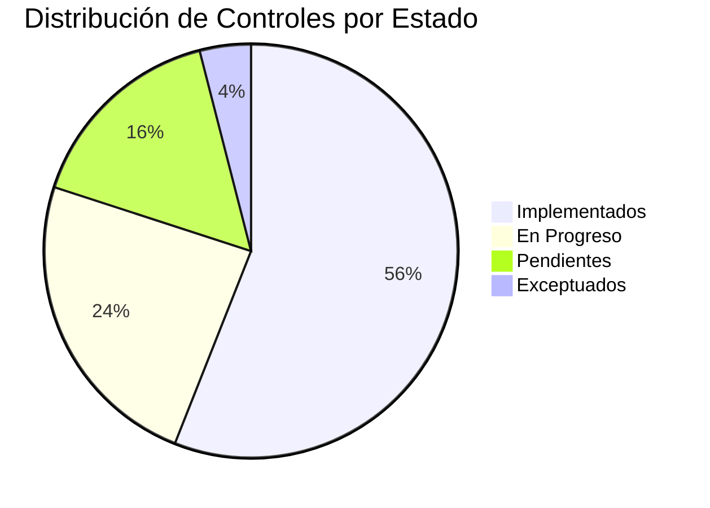

## Propósito

Establecer un subconjunto personalizado de controles Kudo con configuraciones específicas que reflejen el apetito de riesgo, recursos disponibles y contexto operacional de DivisionCero.

## Información del Profile

### Metadatos
- **Nombre**: DivisionCero Security Profile v1.0
- **Basado en**: Catálogo Kudo v1.0.0
- **Contexto**: Empresa SaaS, ~200 empleados, multi-tenant
- **Sector**: Technology / Software Development
- **Regulaciones aplicables**: GDPR, SOC 2 Type II
- **Fecha de vigencia**: 2024-01-01
- **Próxima revisión**: 2024-12-31

## Criterios de Selección

### Factores de Priorización
1. **Criticidad de negocio**: Impacto en operaciones core
2. **Exposición de riesgo**: Probabilidad e impacto de materialización
3. **Compliance requirements**: Obligaciones regulatorias
4. **Recursos disponibles**: Budget y personal especializado
5. **Madurez organizacional**: Capacidad de implementación

### Matriz de Aplicabilidad

```mermaid
quadrant-chart
    title Matriz de Selección de Controles
    x-axis Baja --> Alta : Complejidad de Implementación
    y-axis Bajo --> Alto : Impacto en Riesgo
    quadrant-1 IMPLEMENTAR (Alta Prioridad)
    quadrant-2 IMPLEMENTAR (Crítico)
    quadrant-3 REVISAR (Baja Prioridad)
    quadrant-4 CONSIDERAR (Media Prioridad)
```

## Controles Seleccionados por Dominio

### COR - Coherencia Organizacional [CRÍTICO]
**Nivel de Implementación**: Completo (100% controles)  
**Justificación**: Base fundamental para todos los demás dominios

#### Controles Incluidos:
- ✅ **COR-001**: Gobernanza de Ciberseguridad
  - **Parámetro**: Comité ejecutivo mensual
  - **Customización**: Include CEO, CTO, CISO, CFO
  
- ✅ **COR-002**: Política Marco de Seguridad
  - **Parámetro**: Revisión anual obligatoria
  - **Customización**: Aprobación por Board of Directors

- ✅ **COR-003**: Modelo de Roles y Responsabilidades
  - **Parámetro**: Matriz RACI actualizada trimestralmente
  - **Customización**: Roles específicos para startup scaling

### ADR - Análisis, Detección y Respuesta de Ciberseguridad [CRÍTICO]
**Nivel de Implementación**: Alto (90% controles)  
**Justificación**: Protección 24/7 esencial para SaaS platform

#### Controles Incluidos:
- ✅ **ADR-001**: Monitoreo Continuo
  - **Parámetro**: SLA 99.9% uptime SIEM
  - **Customización**: Machine learning habilitado
  
- ✅ **ADR-002**: Plan de Respuesta a Incidentes
  - **Parámetro**: RTO 4 horas, RPO 1 hora
  - **Customización**: Notificación automática a customers

- ✅ **ADR-003**: Threat Intelligence
  - **Parámetro**: Feeds comerciales + open source
  - **Customización**: Focus en ataques a SaaS

#### Controles Excluidos:
- ❌ **ADR-005**: Forensics Avanzados
  - **Justificación**: Tercerizar a especialistas externos
  - **Revisión**: 2025 cuando alcance 500+ empleados

### CAP - Ciberseguridad en Aplicaciones [CRÍTICO]
**Nivel de Implementación**: Alto (85% controles)  
**Justificación**: Core business es desarrollo de software

#### Controles Incluidos:
- ✅ **CAP-001**: Desarrollo Seguro
  - **Parámetro**: SAST/DAST en 100% pipelines
  - **Customización**: Automated security testing gates
  
- ✅ **CAP-002**: Gestión de APIs
  - **Parámetro**: Rate limiting 1000 req/min
  - **Customización**: OAuth 2.0 + API keys hybrid

- ✅ **CAP-003**: Secure Code Review
  - **Parámetro**: 100% de PRs con security review
  - **Customización**: AI-assisted vulnerability detection

### CCN - Continuidad y Cambios del Negocio [ALTO]
**Nivel de Implementación**: Medio (75% controles)  
**Justificación**: Cloud-native con alta disponibilidad natural

#### Controles Incluidos:
- ✅ **CCN-001**: Plan de Continuidad del Negocio
  - **Parámetro**: RTO 4 horas, RPO 1 hora
  - **Customización**: Multi-region deployment strategy
  
- ✅ **CCN-002**: Gestión de Cambios
  - **Parámetro**: 100% cambios críticos aprobados
  - **Customización**: GitOps con automated rollbacks

- ⚠️ **CCN-003**: Backup y Recuperación
  - **Parámetro**: Backups cada 6 horas
  - **Customización**: Cross-region replication

#### Controles Diferidos:
- ⏳ **CCN-004**: Sitio de Recuperación Físico
  - **Justificación**: Cloud-native, no aplica físico
  - **Alternativa**: Multi-cloud strategy (2025)

### CIF - Ciberseguridad en Infraestructura [ALTO]
**Nivel de Implementación**: Alto (80% controles)  
**Justificación**: Infraestructura crítica para operaciones

#### Controles Incluidos:
- ✅ **CIF-001**: Hardening de Sistemas
  - **Parámetro**: CIS Benchmarks Level 1
  - **Customización**: Container-focused hardening
  
- ✅ **CIF-002**: Gestión de Vulnerabilidades
  - **Parámetro**: Scan diario, remediation < 7 días critical
  - **Customización**: Automated patching para non-critical

- ✅ **CIF-003**: Network Segmentation
  - **Parámetro**: Zero-trust micro-segmentation
  - **Customización**: Kubernetes network policies

### CIP - Ciberseguridad en Identidad y Puntos Finales [CRÍTICO]
**Nivel de Implementación**: Completo (95% controles)  
**Justificación**: Remote-first workforce, high identity risk

#### Controles Incluidos:
- ✅ **CIP-001**: Gestión de Identidades
  - **Parámetro**: MFA 100% empleados
  - **Customización**: Passwordless authentication preferred
  
- ✅ **CIP-002**: Privileged Access Management
  - **Parámetro**: Just-in-time access, 8-hour sessions
  - **Customización**: Bastion hosts for production

- ✅ **CIP-003**: Endpoint Protection
  - **Parámetro**: EDR en 100% devices corporativos
  - **Customización**: BYOD policy con MDM

### DIA - Datos e Inteligencia Artificial [MEDIO]
**Nivel de Implementación**: Medio (70% controles)  
**Justificación**: Datos mayormente no-sensibles, AI features limitadas

#### Controles Incluidos:
- ✅ **DIA-001**: Clasificación de Datos
  - **Parámetro**: 4 niveles: Public, Internal, Confidential, Restricted
  - **Customización**: Automated tagging en pipelines
  
- ✅ **DIA-002**: Cifrado de Datos
  - **Parámetro**: AES-256 en reposo, TLS 1.3 en tránsito
  - **Customización**: Customer-managed keys option

- ⚠️ **DIA-003**: Data Loss Prevention
  - **Parámetro**: Monitoring en email + file shares
  - **Implementación**: Fase 2 (Q3 2024)

#### Controles No Aplicables:
- ❌ **DIA-005**: AI Model Security
  - **Justificación**: No AI models críticos en producción
  - **Revisión**: Cuando implemente AI features

### THP - Ciberseguridad en Talento Humano y Proveedores [MEDIO]
**Nivel de Implementación**: Medio (65% controles)  
**Justificación**: Equipo pequeño, proveedores limitados

#### Controles Incluidos:
- ✅ **THP-001**: Security Awareness Training
  - **Parámetro**: Capacitación trimestral + phishing simulation
  - **Customización**: Role-based training tracks
  
- ✅ **THP-002**: Evaluación de Terceros
  - **Parámetro**: Due diligence para critical vendors
  - **Customización**: Simplified questionnaire para low-risk

- ⚠️ **THP-003**: Background Checks
  - **Parámetro**: Para roles con acceso privilegiado
  - **Implementación**: Según legislación local

## Configuración de Parámetros

### Niveles de Riesgo Aceptables
- **Crítico**: 0 riesgos aceptados sin mitigación
- **Alto**: Máximo 2 riesgos con plan de mitigación
- **Medio**: Hasta 5 riesgos con monitoring
- **Bajo**: Hasta 10 riesgos documentados

### SLAs de Implementación
- **Controles Críticos**: 30 días desde aprobación
- **Controles Altos**: 60 días desde aprobación  
- **Controles Medios**: 90 días desde aprobación
- **Controles Bajos**: 180 días desde aprobación

## Excepciones y Desviaciones

### Excepciones Temporales Aprobadas

| Control | Justificación | Mitigación Temporal | Fecha Límite |
|---------|---------------|-------------------|---------------|
| DIA-003 | Budget constraints | Enhanced monitoring | 2024-09-30 |
| CCN-004 | Technical constraints | Cloud redundancy | 2025-03-31 |
| THP-004 | Legal constraints | Enhanced screening | 2024-12-31 |

### Controles Personalizados (Extensiones)

#### EXT-001: Container Security
**Justificación**: Específico para arquitectura Kubernetes  
**Implementación**: 
- Image scanning en pipeline
- Runtime protection con Falco
- Network policies por namespace

#### EXT-002: API Rate Limiting
**Justificación**: Protección específica para API-first architecture  
**Implementación**:
- Rate limiting inteligente por customer tier
- DDoS protection a nivel aplicación
- Circuit breakers automatizados

## Roadmap de Implementación

### Q1 2024: Controles Críticos
- ✅ COR-001, COR-002, COR-003
- ✅ ADR-001, ADR-002  
- ✅ CIP-001, CIP-002

### Q2 2024: Controles Altos
- 🔄 CAP-001, CAP-002, CAP-003
- 🔄 CIF-001, CIF-002, CIF-003
- ⏳ CCN-001, CCN-002

### Q3 2024: Controles Medios
- ⏳ DIA-001, DIA-002, DIA-003
- ⏳ THP-001, THP-002
- ⏳ Resolución de excepciones temporales

### Q4 2024: Optimización y Madurez
- ⏳ Controles restantes
- ⏳ Automation y orchestration
- ⏳ Preparación para auditoría SOC 2

## Métricas de Compliance

### KPIs del Profile
- **Cobertura de implementación**: 78% (target: 85% EOY)
- **Controles críticos**: 100% implementados
- **Excepciones activas**: 3 (target: < 5)
- **Tiempo promedio implementación**: 45 días
- **Efectividad promedio**: 85% (target: 90%)

### Dashboard de Seguimiento


## Gobierno del Profile

### Proceso de Cambios
1. **Propuesta**: Cualquier stakeholder puede proponer cambios
2. **Evaluación**: Security committee evalúa impacto y viabilidad
3. **Aprobación**: CISO aprueba cambios menores, Board para cambios mayores
4. **Implementación**: Según cronograma establecido
5. **Validación**: Assessment independiente de efectividad

### Revisión y Actualización
- **Frecuencia**: Revisión trimestral, actualización anual
- **Triggers**: Nuevas amenazas, cambios regulatorios, evolución del negocio
- **Responsable**: CISO con input de security committee

---

*Profile Kudo v1.0 - Documento generado según estándares OSCAL*  
*Organización: DivisionCero | Vigente desde: 2024-01-01*

