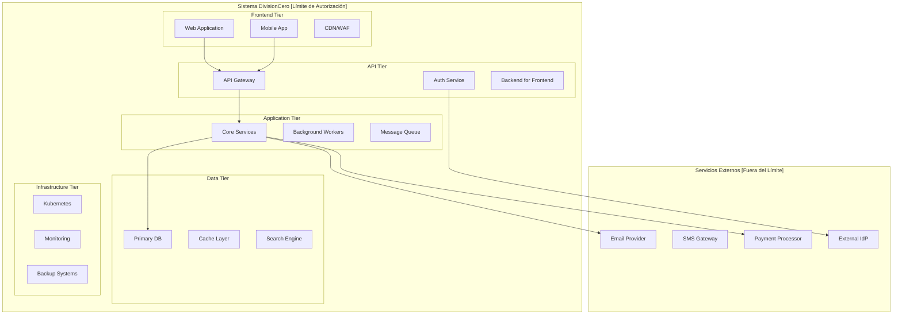
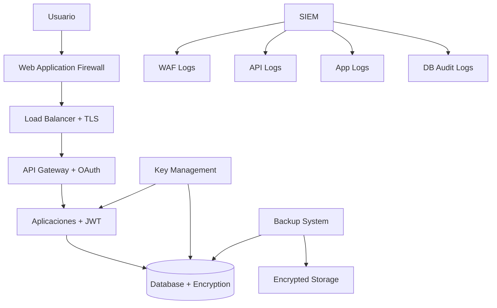
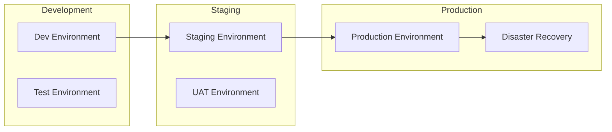
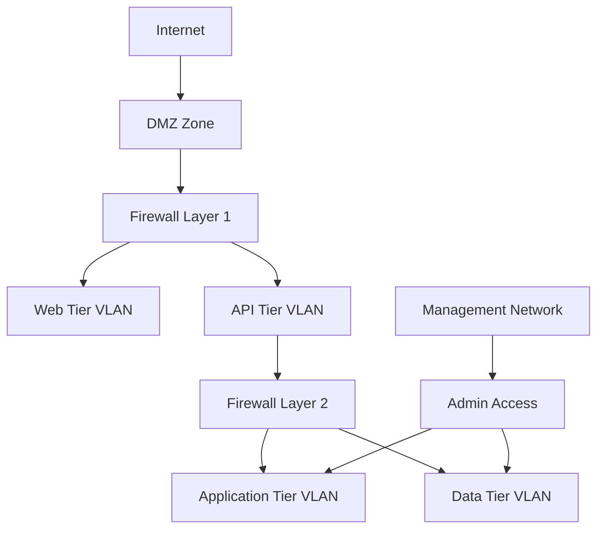
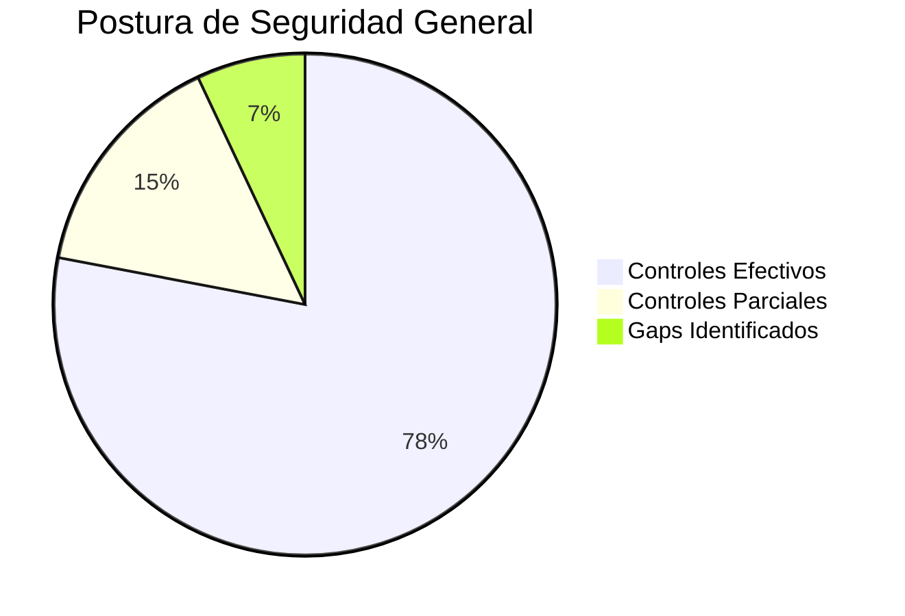

## Información del Sistema

### Identificación
- **Nombre del Sistema**: DivisionCero SaaS Platform
- **Versión SSP**: 1.0.0
- **Tipo de Sistema**: SaaS Multi-tenant  
- **Clasificación**: Confidential (Internal Use)
- **Propietario**: DivisionCero Inc.
- **Custodio**: Chief Technology Officer (CTO)
- **CISO Responsable**: Chief Information Security Officer

### Descripción General
DivisionCero SaaS Platform es una plataforma de software como servicio que proporciona soluciones de gestión empresarial a clientes corporativos. El sistema procesa datos de negocio de múltiples organizaciones en una arquitectura multi-tenant segura.

#### Propósito del Negocio:
- Gestión de procesos empresariales
- Analytics y reporting avanzado  
- Integración con sistemas terceros
- APIs para desarrolladores externos

### Límites del Sistema

### Datos del Sistema

#### Tipos de Información Procesada:
1. **Confidential**: Datos financieros de clientes, contratos comerciales
2. **Internal**: Métricas operacionales, logs de aplicación
3. **Public**: Documentación técnica, material de marketing
4. **Restricted**: Datos de empleados, información de propiedad intelectual

#### Volumen de Datos:
- **Datos activos**: ~50 TB
- **Backups**: ~200 TB  
- **Crecimiento mensual**: ~5 TB
- **Registros de usuarios**: 25,000+ activos

## Arquitectura de Seguridad

### Modelo de Seguridad
**Principio**: Zero Trust Architecture con defensa en profundidad

#### Capas de Seguridad:
1. **Network Security**: Firewalls, VPN, Network Segmentation
2. **Identity Security**: IAM, MFA, PAM
3. **Application Security**: WAF, API Security, Secure Coding
4. **Data Security**: Encryption, DLP, Classification
5. **Infrastructure Security**: Container Security, Hardening
6. **Monitoring**: SIEM, EDR, Threat Intelligence

### Flujo de Datos de Seguridad

## Implementación de Controles por Dominio

### COR - Coherencia Organizacional

#### COR-001: Gobernanza de Ciberseguridad
**Estado**: ✅ Implementado  
**Descripción**: Comité ejecutivo de ciberseguridad establecido

**Implementación Específica**:
- **Comité**: CEO, CTO, CISO, CFO, Head Legal
- **Reuniones**: Mensuales obligatorias + ad-hoc para incidentes
- **Responsabilidades**: 
  - Aprobación de políticas de seguridad
  - Revisión de presupuesto de ciberseguridad
  - Respuesta a incidentes críticos
- **Evidencias**: Actas de reuniones, decisiones documentadas

#### COR-002: Política Marco de Seguridad  
**Estado**: ✅ Implementado  
**Descripción**: Política organizacional aprobada por Board

**Implementación Específica**:
- **Documento**: "Information Security Policy v2.1"
- **Aprobación**: Board of Directors (2024-01-15)
- **Revisión**: Anual obligatoria
- **Comunicación**: All-hands meeting + intranet
- **Evidencias**: Política firmada, training records

### ADR - Análisis, Detección y Respuesta

#### ADR-001: Monitoreo Continuo
**Estado**: ✅ Implementado  
**Descripción**: SIEM 24/7 con ML-based detection

**Implementación Específica**:
- **Plataforma**: Elastic Stack + Wazuh + Custom ML
- **Cobertura**: 100% sistemas críticos
- **SLA**: 99.9% uptime, alertas en < 5 minutos
- **Capacidades**:
  - Correlación de eventos multi-fuente
  - Anomaly detection con machine learning
  - Threat intelligence integration
  - Automated playbook execution
- **Personal**: SOC analistas 24/7/365
- **Evidencias**: Dashboards operativos, alertas configuradas

#### ADR-002: Plan de Respuesta a Incidentes
**Estado**: ✅ Implementado  
**Descripción**: Procedimientos estructurados de respuesta

**Implementación Específica**:
- **Documento**: "Incident Response Plan v1.3"
- **Clasificación**: 4 niveles (P0-P3)
- **Escalación**: Automática según severity
- **RTO/RPO**: P0: 4h/1h, P1: 8h/4h, P2: 24h/8h, P3: 72h/24h
- **Herramientas**: SOAR platform para automatización
- **Training**: Simulacros trimestrales
- **Evidencias**: Runbooks, post-mortem reports

### CAP - Ciberseguridad en Aplicaciones

#### CAP-001: Desarrollo Seguro
**Estado**: ✅ Implementado  
**Descripción**: Security-by-design en SDLC

**Implementación Específica**:
- **Pipeline**: GitLab CI/CD con security gates
- **SAST**: SonarQube con custom rules
- **DAST**: OWASP ZAP automated scanning
- **Dependency Scanning**: Snyk integration
- **Code Review**: Mandatory security reviews
- **Training**: Secure coding bootcamp para developers
- **Evidencias**: Pipeline configs, scan reports

#### CAP-002: Gestión de APIs  
**Estado**: ✅ Implementado  
**Descripción**: API security framework completo

**Implementación Específica**:
- **Gateway**: Kong Enterprise con plugins
- **Authentication**: OAuth 2.0 + API keys hybrid
- **Rate Limiting**: Intelligent per-customer limits
- **Documentation**: OpenAPI 3.0 specs
- **Monitoring**: API analytics y health checks
- **Evidencias**: API catalog, security policies

### CIF - Ciberseguridad en Infraestructura

#### CIF-001: Hardening de Sistemas
**Estado**: ✅ Implementado  
**Descripción**: Configuraciones seguras según CIS

**Implementación Específica**:
- **Baseline**: CIS Benchmarks Level 1
- **Automation**: Ansible playbooks
- **Scanning**: OpenSCAP compliance scanning
- **OS**: Ubuntu 22.04 LTS hardened
- **Containers**: Distroless base images
- **Evidencias**: Compliance reports, automation scripts

#### CIF-002: Gestión de Vulnerabilidades
**Estado**: 🔄 En Progreso (POA&M 001)  
**Descripción**: Programa automatizado de patching

**Implementación Actual**:
- **Scanning**: Tenable Nessus weekly scans
- **Prioritization**: CVSS + EPSS scoring
- **Patching**: Manual process (siendo automatizado)
- **SLA**: Critical < 72h, High < 7d, Medium < 30d
- **Gap**: Falta automatización completa
- **Timeline**: Completar en 12 semanas

### CIP - Identidad y Puntos Finales

#### CIP-001: Gestión de Identidades
**Estado**: ✅ Implementado  
**Descripción**: IAM robusto con MFA universal

**Implementación Específica**:
- **Platform**: Keycloak + Microsoft Entra ID
- **MFA**: 100% empleados (FIDO2 preferred)
- **SSO**: Integración con 25+ aplicaciones
- **Provisioning**: Automated con HR systems
- **Reviews**: Quarterly access reviews
- **Evidencias**: MFA enrollment reports, access matrices

#### CIP-002: Protección de Endpoints
**Estado**: ✅ Implementado  
**Descripción**: EDR + mobile device management

**Implementación Específica**:
- **EDR**: SentinelOne en 100% laptops corporativos
- **MDM**: Microsoft Intune para BYOD
- **Policies**: Device compliance requirements
- **Encryption**: BitLocker/FileVault mandatory  
- **Remote Wipe**: Capability para devices perdidos
- **Evidencias**: Device inventory, compliance reports

### DIA - Datos e Inteligencia Artificial

#### DIA-001: Clasificación de Datos
**Estado**: ⚠️ Parcialmente Implementado  
**Descripción**: Esquema de clasificación definido

**Implementación Específica**:
- **Niveles**: Public, Internal, Confidential, Restricted
- **Tagging**: Manual + automated discovery
- **Herramientas**: Microsoft Purview (en implementación)
- **Gap**: Falta automated enforcement
- **Timeline**: Completar en Q3 2024

#### DIA-002: Cifrado de Datos
**Estado**: ✅ Implementado  
**Descripción**: Cifrado integral en tránsito y reposo

**Implementación Específica**:
- **En Tránsito**: TLS 1.3 mandatory
- **En Reposo**: AES-256 para databases
- **Key Management**: HashiCorp Vault
- **Rotation**: Automated quarterly rotation
- **Customer Keys**: Option para enterprise clients
- **Evidencias**: Certificate inventory, encryption configs

### THP - Ciberseguridad en Talento Humano y Proveedores

#### THP-001: Capacitación en Seguridad
**Estado**: 🔄 En Progreso (POA&M 002)  
**Descripción**: Programa estructurado de awareness

**Implementación Actual**:
- **Platform**: KnowBe4 LMS
- **Content**: Role-based training tracks
- **Frequency**: Quarterly mandatory training
- **Phishing**: Monthly simulation campaigns
- **Gap**: Falta contenido personalizado
- **Timeline**: Completar en 16 semanas

#### THP-002: Evaluación de Terceros
**Estado**: ⏳ Pendiente (POA&M 003)  
**Descripción**: Due diligence de proveedores críticos

**Estado Actual**:
- **Proceso**: Ad-hoc evaluations
- **Critical Vendors**: 25 pending assessment
- **Framework**: Desarrollando SIG Lite customizado
- **Timeline**: 24 semanas para completar

## Arquitectura de Deployment

### Entornos

#### Separación de Entornos:
- **Development**: Isolated networks, mock data
- **Staging**: Production-like, sanitized data
- **Production**: Full security controls, real data
- **DR**: Cross-region replica, encrypted backups

### Red y Conectividad

#### Network Segmentation:

#### Controles de Red:
- **Firewalls**: Palo Alto Next-Gen con IPS
- **WAF**: Cloudflare Enterprise
- **VPN**: WireGuard for admin access
- **Zero Trust**: BeyondCorp implementation

## Plan de Continuidad y Recuperación

### Business Continuity Objectives
- **RTO (Recovery Time Objective)**: 4 horas
- **RPO (Recovery Point Objective)**: 1 hora  
- **MTTR (Mean Time To Repair)**: 2 horas
- **Availability Target**: 99.9% (8.77 hours downtime/year)

### Estrategias de Respaldo

#### Backup Strategy:
- **Frequency**: Continuous replication + daily snapshots
- **Retention**: Daily (30d), Weekly (12w), Monthly (12m)
- **Testing**: Monthly restore tests
- **Encryption**: AES-256 with customer-managed keys
- **Geographic**: Multi-region with 3-2-1 rule

#### Disaster Recovery:
- **Primary Site**: AWS us-east-1
- **DR Site**: AWS us-west-2  
- **Replication**: Real-time for critical data
- **Failover**: Automated with manual approval
- **Testing**: Annual DR exercises

## Métricas de Seguridad

### KPIs Principales

| Métrica | Target | Actual | Trend |
|---------|--------|--------|-------|
| Security Incidents | < 5/month | 2/month | ↓ |
| Vulnerability Remediation | 95% in SLA | 89% | ↑ |
| MFA Adoption | 100% | 98% | ↑ |
| Training Completion | 95% | 87% | ↑ |
| Backup Success Rate | 99.9% | 99.7% | → |
| Incident Response Time | < 30 min | 22 min | ↓ |

### Dashboard Ejecutivo

## Compliance y Auditoría

### Marcos Regulatorios
- **GDPR**: General Data Protection Regulation
- **SOC 2 Type II**: Security, Availability, Confidentiality
- **ISO 27001**: Information Security Management (target 2025)

### Auditorías Programadas
- **Internal**: Trimestral por equipo interno
- **External**: Anual por firma independiente  
- **Penetration Testing**: Bi-anual por especialistas
- **Compliance**: Continua con automated tools

### Certificaciones Vigentes
- ✅ **SOC 2 Type II**: Válida hasta Dec 2024
- 🔄 **ISO 27001**: En proceso de certificación
- ⏳ **GDPR**: Compliance ongoing assessment

## Gestión de Cambios

### Change Management Process
1. **RFC (Request for Change)**: Documented proposal
2. **Impact Assessment**: Security and business impact
3. **Approval**: CAB (Change Advisory Board) approval
4. **Implementation**: Controlled deployment
5. **Verification**: Post-change validation
6. **Documentation**: Updated in CMDB

### Emergency Changes
- **Criteria**: Security incidents, critical vulnerabilities
- **Approval**: CISO + CTO approval sufficient
- **Timeline**: Implement first, document after
- **Review**: Post-implementation review within 48h

## Plan de Mejora Continua

### Objetivos 2024
1. ✅ Implementar controles críticos (Q1)
2. 🔄 Automatizar vulnerability management (Q2)
3. ⏳ Completar data classification (Q3)  
4. ⏳ Obtener ISO 27001 certification (Q4)

### Roadmap 2025
- Implementar SOAR platform avanzada
- Desarrollar threat hunting capabilities
- Establecer security metrics automation
- Expandir third-party risk program

## Contactos y Responsabilidades

### Roles Clave
- **System Owner**: CTO (cto@divisioncero.com)
- **CISO**: Chief Information Security Officer
- **Security Architect**: Senior Security Engineer
- **Compliance Manager**: Legal & Compliance Team

### Escalación de Emergencias
1. **L1**: Security Analyst (24/7 SOC)
2. **L2**: Senior Security Engineer  
3. **L3**: CISO + CTO
4. **Executive**: CEO + Board (for major incidents)

---

*System Security Plan v1.0 - Documento generado según estándares OSCAL*  
*Sistema: DivisionCero SaaS Platform | Vigente desde: 2024-01-01 | Próxima revisión: 2024-12-31*

