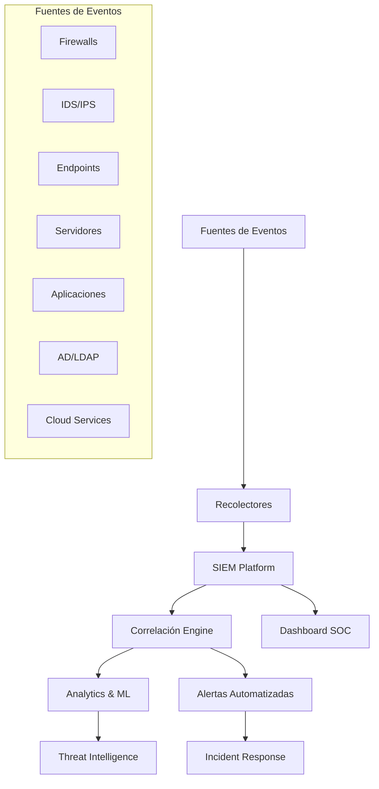
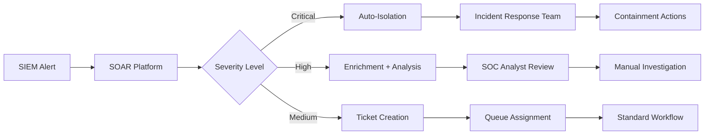

## 📋 Información General

**Documento:** Correlación de Eventos y SIEM  
**Versión:** 1.0.0  
**Fecha:** Enero 2025  
**Clasificación:** Confidencial  
**Propietario:** CISO - Oficina de Seguridad de la Información  

## 🎯 Objetivo y Alcance

### Objetivo
Establecer los lineamientos para la implementación, configuración y operación de plataformas SIEM (Security Information and Event Management) para la correlación eficaz de eventos de seguridad, detección de amenazas y respuesta a incidentes.

### Alcance
Esta política aplica para:
- **Infraestructura tecnológica**: Servidores, redes, endpoints, aplicaciones críticas
- **Plataformas SIEM**: Todas las herramientas de correlación de eventos implementadas
- **Personal responsable**: SOC, equipos de seguridad, administradores de sistemas
- **Procesos**: Monitoreo 24/7, análisis de amenazas, respuesta a incidentes

## 🏛️ Marco Normativo

### Referencias Regulatorias
- **ISO/IEC 27001:2022** - Gestión de Seguridad de la Información
- **NIST Cybersecurity Framework** - Detección y Respuesta
- **ISO/IEC 27035** - Gestión de Incidentes de Seguridad
- **SANS Critical Security Controls** - Control 6 (Monitoreo y Control de Logs)

### Estándares Aplicables
- **Common Event Expression (CEE)** - Normalización de eventos
- **MITRE ATT&CK Framework** - Tácticas, técnicas y procedimientos
- **STIX/TAXII** - Intercambio de inteligencia de amenazas

## 🏗️ Arquitectura SIEM

### Componentes Core


### Stack Tecnológico Recomendado

#### Plataformas SIEM Enterprise
- **Splunk Enterprise Security**
- **IBM QRadar SIEM**
- **Microsoft Sentinel**
- **ArcSight ESM** (OpenText)

#### Alternativas Open Source
- **Elastic Security (ELK Stack)**
- **OSSIM/AlienVault** (AT&T Cybersecurity)
- **Wazuh SIEM**
- **Security Onion**

## 📊 Fuentes de Eventos Críticos

### Infraestructura de Red
| Componente | Eventos Críticos | Frecuencia de Envío |
|------------|------------------|-------------------|
| **Firewall** | Allow/Deny, Policy Changes, VPN Connections | Tiempo real |
| **IDS/IPS** | Signatures Match, Anomalies, Blocked Traffic | Inmediato |
| **DNS** | Queries, DGA Detection, Malicious Domains | Tiempo real |
| **DHCP** | IP Assignments, Lease Changes | Cada 5 min |
| **Proxy/Web Gateway** | HTTP/HTTPS Traffic, Blocked Categories | Tiempo real |

### Sistemas Operativos y Endpoints
| Sistema | Logs Críticos | Prioridad |
|---------|----------------|-----------|
| **Windows** | Event ID 4624/4625 (Login), 4648 (Logon with creds), 4672 (Special privileges) | Alta |
| **Linux** | Auth.log, Sudo commands, Failed logins, File changes | Alta |
| **macOS** | Unified logs, Login events, Privilege escalation | Media |
| **EDR/EPP** | Malware detection, Process execution, File modifications | Crítica |

### Aplicaciones y Servicios
```yaml
Critical_Applications:
  - name: "Active Directory"
    events: 
      - Account management (4720, 4726, 4738)
      - Group changes (4728, 4732, 4733)
      - Policy changes (4719, 4739)
    priority: "Critical"
  
  - name: "Database Systems"
    events:
      - Authentication failures
      - Privilege escalation
      - Data access anomalies
      - Schema changes
    priority: "High"
  
  - name: "Web Applications"
    events:
      - Authentication attempts
      - SQL injection attempts
      - XSS attempts
      - File upload attempts
    priority: "High"
```

## 🔍 Reglas de Correlación

### Categorías de Correlación

#### 1. Patrones de Ataque
```yaml
Attack_Patterns:
  - name: "Brute Force Detection"
    logic: "Failed logins > 5 in 5 minutes from same source"
    severity: "Medium"
    action: "Alert + Block IP"
  
  - name: "Lateral Movement"
    logic: "Multiple admin logons across different systems in short timeframe"
    severity: "High"
    action: "Immediate Alert + Investigation"
  
  - name: "Data Exfiltration"
    logic: "Unusual data volume + Off-hours activity + External connections"
    severity: "Critical"
    action: "Block + Emergency Response"
```

#### 2. Anomalías de Comportamiento
- **Actividad fuera de horarios laborales**
- **Acceso desde ubicaciones geográficas inusuales**
- **Volúmenes de datos anómalos**
- **Patrones de navegación sospechosos**
- **Uso de herramientas administrativas no autorizadas**

#### 3. Indicadores de Compromiso (IoCs)
- **Comunicación con C&C conocidos**
- **Presencia de malware signatures**
- **Modificaciones de archivos críticos del sistema**
- **Procesos sospechosos ejecutándose**

### Matriz de Severidad de Alertas

| Nivel | Descripción | Tiempo de Respuesta | Escalamiento |
|-------|-------------|-------------------|--------------|
| **Critical** | Amenaza activa confirmada | menos de 15 minutos | CISO + Equipo ejecutivo |
| **High** | Indicadores de compromiso múltiples | menos de 1 hora | SOC Manager + CISO |
| **Medium** | Actividad sospechosa requiere investigación | menos de 4 horas | SOC Analyst L2 |
| **Low** | Eventos informativos o baseline | menos de 24 horas | SOC Analyst L1 |
| **Info** | Logs de referencia y auditoría | Sin SLA específico | Revisión semanal |

## 🤖 Automatización e Integración

### SOAR Integration


### APIs y Conectores
- **Threat Intelligence Feeds** (VirusTotal, MISP, ThreatConnect)
- **IT Service Management** (ServiceNow, Jira Service Desk)
- **Communication Platforms** (Slack, Microsoft Teams, PagerDuty)
- **Network Security herramientas** (Firewall APIs, EDR platforms)

### Respuesta Automatizada
```yaml
Automated_Response:
  - trigger: "Malware detected on endpoint"
    actions:
      - isolate_host: true
      - collect_forensics: true
      - notify_team: "incident-response"
  
  - trigger: "Brute force attack detected"
    actions:
      - block_source_ip: true
      - duration: "24 hours"
      - notify_team: "soc-analysts"
  
  - trigger: "Data exfiltration pattern"
    actions:
      - block_network_traffic: true
      - preserve_evidence: true
      - escalate_to: "ciso"
```

## 📈 Métricas y KPIs

### Métricas Operacionales
- **Volumen de eventos procesados diariamente**
- **Tiempo promedio de ingesta de logs (menos de 5 minutos)**
- **Disponibilidad de la plataforma SIEM (más de 99.5%)**
- **False positive rate (menos de 5%)**
- **Alert fatigue indicators**

### KPIs de Eficacia
- **Mean Time to Detection (MTTD)**: menos de 15 minutos para amenazas críticas
- **Mean Time to Response (MTTR)**: menos de 1 hora para incidentes confirmados
- **Coverage rate**: más de 95% de fuentes críticas monitoreadas
- **Correlation accuracy**: más de 90% de alertas relevantes

### Métricas de Negocio
- **Reducción en tiempo de investigación de incidentes**
- **ROI de la inversión en SIEM**
- **Compliance score con regulaciones aplicables**
- **Reducción en impacto de incidentes de seguridad**

## 🛠️ Implementación y Configuración

### Fases de Implementación

#### Fase 1: Planning y Design (2-3 meses)
- **Definición de requerimientos**
- **Selección de plataforma SIEM**
- **Diseño de arquitectura**
- **Planning de fuentes de datos**

#### Fase 2: Instalación y Setup (1-2 meses)
- **Instalación de infraestructura SIEM**
- **Configuración de conectores y parsers**
- **Setup inicial de dashboards**
- **Testing de conectividad**

#### Fase 3: Tuning y Optimización (2-3 meses)
- **Configuración de reglas de correlación**
- **Tuning para reducir false positives**
- **Desarrollo de use cases específicos**
- **Training del equipo SOC**

#### Fase 4: Operación y Mejora Continua
- **Monitoreo 24x7**
- **Revisión y ajuste de reglas**
- **Incorporación de nuevas fuentes**
- **Evolución de capacidades analíticas**

### Configuraciones Críticas

#### Log Sources Configuration
```json
{
  "windows_systems": {
    "collection_method": "WinRM/Agent",
    "critical_event_ids": [4624, 4625, 4648, 4672, 4720, 4726],
    "collection_interval": "real_time",
    "retention_period": "2_years"
  },
  "network_devices": {
    "collection_method": "Syslog",
    "facility": "local0-local7",
    "severity": "info_and_above",
    "format": "CEF"
  },
  "cloud_platforms": {
    "aws": {
      "services": ["CloudTrail", "VPC Flow Logs", "GuardDuty"],
      "api_integration": true
    },
    "azure": {
      "services": ["Activity Logs", "Security Center", "Sentinel"],
      "webhook_integration": true
    }
  }
}
```

## 🔧 Operación del SOC

### Estructura de Turnos

```mermaid
gantt
    title SOC Coverage 24/7/365
    dateFormat HH:mm
    axisFormat %H:%M
    
    section Turno 1
    SOC Analyst L1    :08:00, 16:00
    SOC Analyst L2    :08:00, 16:00
    SOC Manager       :08:00, 17:00
    
    section Turno 2  
    SOC Analyst L1    :16:00, 24:00
    SOC Analyst L2    :16:00, 24:00
    SOC Lead          :16:00, 24:00
    
    section Turno 3
    SOC Analyst L1    :00:00, 08:00
    SOC Analyst L2    :00:00, 08:00
    On-Call Manager   :00:00, 08:00
```


### Playbooks de Respuesta

#### High Priority Incident Response
1. **Initial Assessment** (5 min)
   - Verify alert authenticity
   - Determine scope and impact
   - Classify incident severity

2. **Containment** (15 min)
   - Isolate affected systems
   - Preserve evidence
   - Document initial findings

3. **Investigation** (1-4 hours)
   - Deep dive analysis
   - Root cause identification  
   - Impact assessment

4. **Recovery** (Variable)
   - System restoration
   - Security controls validation
   - Business operations resumption

5. **Post-Incident** (48-72 hours)
   - Lessons learned session
   - Process improvements
   - Documentation update

## 👥 Roles y Responsabilidades

### Equipo SIEM/SOC
- **SOC Manager**: Supervisión operacional, escalamiento ejecutivo, métricas de rendimiento
- **SOC Analyst L3/Lead**: Investigaciones complejas, desarrollo de reglas, mentoría del equipo
- **SOC Analyst L2**: Análisis de incidentes de nivel medio/alto, correlación avanzada
- **SOC Analyst L1**: Monitoreo inicial, triaging de alertas, investigaciones básicas
- **SIEM Engineer**: Desarrollo técnico, tuning de plataforma, integraciones

### Equipos de Soporte
- **IT Operations**: Provisión de logs, acceso a sistemas, soporte de infraestructura
- **Network Security**: Configuración de dispositivos de red, análisis de tráfico
- **Incident Response**: Respuesta a incidentes confirmados, investigaciones forenses
- **Threat Intelligence**: Feeds de amenazas, análisis de indicators, context enrichment

## 📋 Cumplimiento y Auditoría

### Controles de Cumplimiento
- **Retención de logs**: Mínimo 2 años para eventos críticos
- **Integridad de datos**: Checksum verification, immutable storage
- **Acceso privilegiado**: Separation of duties, privileged access management
- **Documentación**: Runbooks actualizados, procedimientos documentados

### Reportes Regulatorios
- **Mensual**: Métricas operacionales, tendencias de amenazas
- **Trimestral**: Evaluación de eficacia, ROI analysis
- **Anual**: Compliance assessment, strategic planning
- **Ad-hoc**: Reportes de incidentes, análisis post-mortem

### Auditorías Internas
- **Cobertura de fuentes**: Verificación de logs críticos
- **Efectividad de reglas**: Testing de casos de uso
- **Tiempo de respuesta**: Métricas de MTTD y MTTR
- **Training y competencias**: Evaluación del equipo SOC

## 🔄 Revisión y Mejora Continua

### Ciclo de Actualización
- **Semanal**: Review de alertas, ajuste de thresholds
- **Mensual**: Análisis de métricas, optimización de reglas
- **Trimestral**: Evaluación de cobertura, nuevos use cases
- **Anual**: Revisión estratégica, evaluación de tecnologías

### Evolución de Capacidades
- **Machine Learning**: Implementación de algoritmos de detección avanzada
- **User Behavior Analytics**: Análisis de patrones de comportamiento anómalos
- **Threat Hunting**: Búsqueda proactiva de amenazas avanzadas
- **Cloud Security**: Expansión a multi-cloud monitoring

---

## 📚 Referencias y Documentos Relacionados

### Políticas Relacionadas
- [Plan de Respuesta a Incidentes](plan-respuesta-incidentes)
- [Registros de Acceso y Autenticación](registros-acceso-autenticacion)
- [Política de Monitoreo de Eventos](politica-monitoreo-eventos-seguridad)

### Marcos de Referencia
- **NIST SP 800-92** - Guide to Computer Security Log Management
- **SANS SIEM Implementation Guide**
- **MITRE ATT&CK Framework**
- **OWASP Logging Cheat Sheet**

---

**Documento aprobado por:**  
**CISO - Oficina de Seguridad de la Información**  
**Fecha:** Enero 2025  
**Próxima revisión:** Enero 2026
