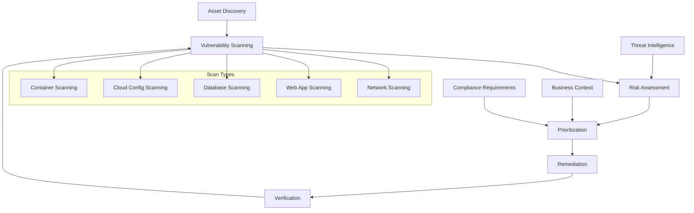
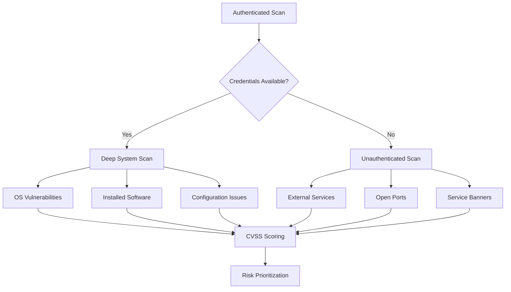
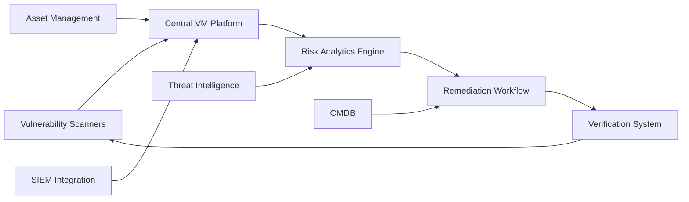
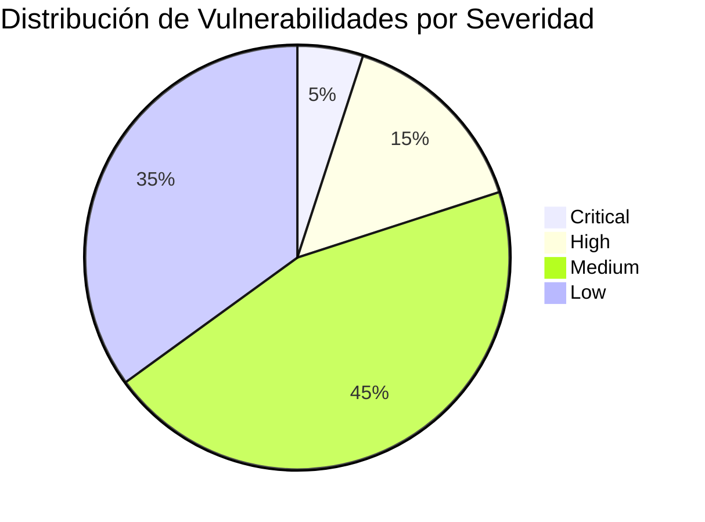
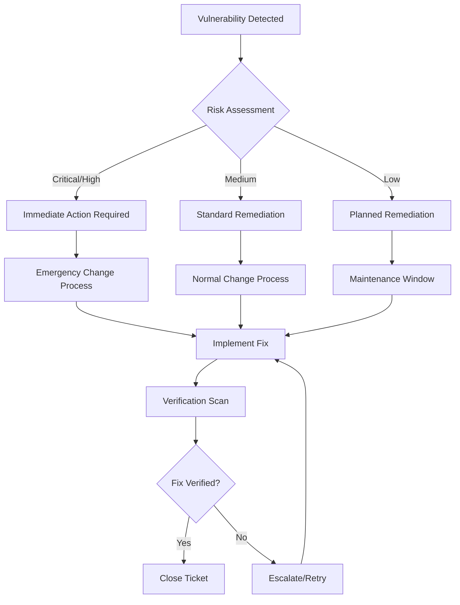

## 📋 Información General

**Documento:** Escaneo Continuo de Vulnerabilidades  
**Versión:** 1.0.0  
**Fecha:** Enero 2025  
**Clasificación:** Confidencial  
**Propietario:** CISO - Oficina de Seguridad de la Información  

## 🎯 Objetivo y Alcance

### Objetivo
Establecer un programa integral de escaneo continuo de vulnerabilidades para la identificación proactiva, evaluación y remediación de debilidades de seguridad en la infraestructura tecnológica de DivisionCero.

### Alcance
Esta política abarca:
- **Infraestructura de red**: Routers, switches, firewalls, balanceadores
- **Sistemas operativos**: Servidores Windows/Linux, endpoints corporativos
- **Aplicaciones**: Web applications, APIs, servicios cloud
- **Bases de datos**: Sistemas de gestión de datos críticos
- **Dispositivos IoT**: Equipos conectados en el entorno empresarial
- **Servicios cloud**: AWS, Azure, GCP y servicios SaaS

## 🏛️ Marco Normativo

### Referencias Regulatorias
- **ISO/IEC 27001:2022** - Gestión de Seguridad de la Información
- **NIST Cybersecurity Framework** - Función "Identificar" (ID.RA)
- **ISO/IEC 27002** - Controles de Seguridad de la Información
- **OWASP ASVS** - Application Security Verification Standard
- **SANS Critical Security Controls** - Control 7 (Continuous Vulnerability Management)

### Estándares Técnicos
- **CVSS v3.1** - Common Vulnerability Scoring System
- **CVE** - Common Vulnerabilities and Exposures
- **CPE** - Common Platform Enumeration
- **OVAL** - Open Vulnerability and Assessment Language
- **SCAP** - Security Content Automation Protocol

## 🏗️ Arquitectura del Programa

### Modelo de Escaneo Continuo


### Componentes Tecnológicos

#### Plataformas de Escaneo Empresarial
- **Tenable Nessus Professional**
- **Rapid7 InsightVM**
- **Qualys VMDR**
- **Greenbone OpenVAS** (Open Source)

#### Herramientas Especializadas
```yaml
Specialized_Tools:
  Web_Applications:
    - OWASP ZAP
    - Burp Suite Professional
    - Acunetix
    - Checkmarx SAST
  
  Cloud_Security:
    - AWS Inspector
    - Azure Security Center
    - Google Security Command Center
    - Prowler (Multi-cloud)
  
  Container_Security:
    - Twistlock/Prisma Cloud
    - Aqua Security
    - Clair (Open Source)
    - Trivy
  
  Database_Security:
    - IBM Guardium
    - Imperva SecureSphere
    - DBProtect
```

## 📊 Matriz de Frecuencia de Escaneos

### Infraestructura Core
| Tipo de Sistema | Frecuencia de Escaneo | Herramienta Principal | SLA Remediation |
|----------------|---------------------|---------------------|----------------|
| **Servidores críticos** | Diario | Nessus/OpenVAS | menos de 24h (Critical) |
| **Servidores de producción** | Semanal | Rapid7 InsightVM | menos de 72h (High) |
| **Workstations** | Quincenal | Nessus Agent | menos de 7 días (Medium) |
| **Dispositivos de red** | Semanal | Nmap + Nessus | menos de 48h (High) |
| **Sistemas de desarrollo** | Mensual | OpenVAS | menos de 30 días |

### Aplicaciones y Servicios
| Categoría | Escaneo Automatizado | Escaneo Manual | Herramientas |
|-----------|-------------------|----------------|-------------|
| **Web Apps críticas** | Diario (DAST) | Mensual (SAST) | OWASP ZAP, SonarQube |
| **APIs públicas** | Cada commit | Semanal | Postman, OWASP ZAP |
| **Microservicios** | CI/CD Pipeline | Quincenal | Snyk, Twistlock |
| **Bases de datos** | Semanal | Trimestral | Nessus, DBProtect |

## 🔍 Metodología de Escaneo

### Fases del Proceso de Escaneo

#### Fase 1: Descubrimiento de Activos (Asset Discovery)
```yaml
Discovery_Process:
  Network_Discovery:
    - techniques: ["ping_sweep", "port_scan", "service_detection"]
    - tools: ["nmap", "masscan", "zmap"]
    - frequency: "daily"
    - scope: "all_network_segments"
  
  Cloud_Discovery:
    - aws: ["ec2_instances", "rds_databases", "s3_buckets", "lambda_functions"]
    - azure: ["virtual_machines", "storage_accounts", "app_services"]
    - gcp: ["compute_instances", "cloud_sql", "cloud_storage"]
    - frequency: "hourly"
  
  Application_Discovery:
    - web_crawling: true
    - api_enumeration: true
    - subdomain_discovery: true
    - technology_stack_identification: true
```

#### Fase 2: Clasificación y Contexto
- **Criticidad del activo** (Critical, High, Medium, Low)
- **Entorno** (Production, Staging, Development, Test)
- **Propietario del sistema** (Business owner, Technical owner)
- **Datos sensibles** (PCI, PII, PHI, Confidencial)
- **Exposición externa** (Internet-facing, Internal, Isolated)

#### Fase 3: Escaneo de Vulnerabilidades


### Tipos de Escaneo Implementados

#### 1. Escaneo de Red (Network Scanning)
- **Descubrimiento de hosts activos**
- **Mapeo de puertos y servicios**
- **Detección de sistemas operativos**
- **Identificación de vulnerabilidades de red**

#### 2. Escaneo de Aplicaciones Web (Web Application Scanning)
```yaml
WebApp_Scanning:
  OWASP_Top10_Coverage:
    - injection_attacks: ["sql_injection", "nosql_injection", "ldap_injection"]
    - broken_authentication: ["session_management", "credential_stuffing"]
    - sensitive_data_exposure: ["ssl_configuration", "data_transmission"]
    - xml_external_entities: ["xxe_attacks", "xml_parsing"]
    - broken_access_control: ["privilege_escalation", "idor"]
    - security_misconfiguration: ["default_credentials", "verbose_errors"]
    - cross_site_scripting: ["stored_xss", "reflected_xss", "dom_xss"]
    - insecure_deserialization: ["object_injection", "deserialization_attacks"]
    - known_vulnerabilities: ["outdated_components", "cve_matching"]
    - insufficient_logging: ["audit_trail", "monitoring_gaps"]
```

#### 3. Escaneo de Base de Datos
- **Configuraciones de seguridad**
- **Usuarios y privilegios**
- **Parches y actualizaciones**
- **Cifrado de datos**

#### 4. Escaneo de Configuración Cloud
```json
{
  "cloud_security_checks": {
    "aws": {
      "s3_buckets": ["public_access", "encryption", "versioning", "logging"],
      "ec2_instances": ["security_groups", "patches", "encryption", "monitoring"],
      "iam": ["policies", "roles", "users", "mfa_enforcement"],
      "vpc": ["flow_logs", "nacls", "security_groups", "routing"]
    },
    "azure": {
      "storage_accounts": ["public_access", "encryption", "backup", "monitoring"],
      "virtual_machines": ["nsg_rules", "disk_encryption", "updates", "monitoring"],
      "active_directory": ["conditional_access", "mfa", "privileged_accounts"],
      "key_vault": ["access_policies", "soft_delete", "purge_protection"]
    }
  }
}
```

## ⚠️ Sistema de Clasificación de Vulnerabilidades

### Matriz CVSS v3.1
| CVSS Score | Severity Level | Response Time | Business Impact |
|------------|----------------|---------------|-----------------|
| **9.0 - 10.0** | Critical | menos de 4 horas | Negocio en riesgo |
| **7.0 - 8.9** | High | menos de 24 horas | Impacto significativo |
| **4.0 - 6.9** | Medium | menos de 7 días | Impacto moderado |
| **0.1 - 3.9** | Low | menos de 30 días | Impacto mínimo |

### Factores de Priorización
```yaml
Prioritization_Factors:
  technical_factors:
    - cvss_score: 40%
    - exploitability: 20%
    - asset_criticality: 15%
    - exposure_level: 15%
  
  business_factors:
    - data_sensitivity: 30%
    - business_criticality: 25%
    - compliance_impact: 25%
    - customer_impact: 20%
  
  threat_landscape:
    - active_exploits: "high_priority"
    - threat_intelligence: "medium_priority"
    - attack_trends: "low_priority"
```

### Categorías de Vulnerabilidades

#### Vulnerabilidades de Infraestructura
- **Missing security patches**
- **Weak authentication mechanisms**
- **Insecure network protocols**
- **Default credentials**
- **Unnecessary services**

#### Vulnerabilidades de Aplicación
- **Input validation failures**
- **Authentication bypass**
- **Authorization flaws**
- **Session management issues**
- **Cryptographic weaknesses**

#### Vulnerabilidades de Configuración
- **Security misconfiguration**
- **Excessive permissions**
- **Insecure defaults**
- **Missing security controls**
- **Weak encryption settings**

## 🛠️ Herramientas y Tecnologías

### Stack Tecnológico Principal

#### Plataforma Central de Vulnerabilidades


#### Herramientas por Categoría
```yaml
Enterprise_Tools:
  Network_Scanning:
    primary: "Nessus Professional"
    secondary: "OpenVAS"
    specialized: ["nmap", "masscan", "zmap"]
  
  Web_Application:
    dynamic: ["OWASP ZAP", "Burp Suite Pro", "Acunetix"]
    static: ["SonarQube", "Checkmarx", "Veracode"]
    interactive: ["Contrast Security", "Seeker"]
  
  Cloud_Security:
    aws: ["AWS Inspector", "Prowler", "Scout Suite"]
    azure: ["Azure Security Center", "CloudSploit"]
    gcp: ["Google Security Scanner", "Forseti Security"]
    multi_cloud: ["Dome9", "CloudCheckr", "Evident.io"]
  
  Container_Security:
    runtime: ["Twistlock", "Aqua Security", "Sysdig Secure"]
    static: ["Clair", "Anchore", "Trivy"]
    registry: ["Docker Security Scanning", "Quay Security"]
```

### Automatización y Orquestación

#### CI/CD Integration
```yaml
Pipeline_Integration:
  pre_commit:
    - static_analysis: ["SonarQube", "ESLint Security"]
    - dependency_check: ["OWASP Dependency Check", "Snyk"]
    - secrets_detection: ["GitLeaks", "TruffleHog"]
  
  build_stage:
    - container_scanning: ["Trivy", "Clair"]
    - infrastructure_as_code: ["Checkov", "Terrascan"]
    - compliance_checks: ["InSpec", "Chef Compliance"]
  
  deployment_stage:
    - dynamic_scanning: ["OWASP ZAP", "Nuclei"]
    - penetration_testing: ["Metasploit", "custom_scripts"]
    - configuration_validation: ["Nessus", "OpenVAS"]
```

## 📈 Métricas y Reporting

### KPIs Operacionales
- **Time to Discovery (TTD)**: menos de 24 horas para nuevos activos
- **Scan Coverage**: más de 95% de activos críticos
- **Scan Frequency Compliance**: 100% adherencia a calendario
- **False Positive Rate**: menos de 10% de alertas

### KPIs de Eficacia
- **Mean Time to Remediation (MTTR)**: 
  - Critical: menos de 4 horas
  - High: menos de 24 horas  
  - Medium: menos de 7 días
  - Low: menos de 30 días

### Métricas de Negocio
- **Vulnerability Aging**: Promedio de días desde descubrimiento
- **Risk Trend**: Tendencia mensual del riesgo total
- **Remediation Rate**: Porcentaje de vulnerabilidades remediadas mensualmente
- **Cost per Vulnerability**: Costo promedio de remediación

### Dashboard Ejecutivo


### Reportes Automatizados

#### Reporte Diario (SOC/Operations)
- **Nuevas vulnerabilidades críticas**
- **Estado de remediación en progreso**
- **Alertas de escaneo fallido**
- **Sistemas sin escanear**

#### Reporte Semanal (Management)
- **Tendencias de vulnerabilidades**
- **Top 10 vulnerabilidades por impacto**
- **Progreso de remediación**
- **Excepciones y riesgos aceptados**

#### Reporte Mensual (Ejecutivo)
- **Métricas de seguridad**
- **ROI del programa**
- **Comparación con benchmarks**
- **Roadmap de mejoras**

## 🔧 Proceso de Remediación

### Workflow de Remediación


### Estrategias de Remediación

#### Remediación Técnica
- **Patch Management**: Aplicación de parches de seguridad
- **Configuration Changes**: Ajustes de configuración segura
- **System Upgrades**: Actualización de versiones vulnerables
- **Service Decommissioning**: Eliminación de servicios no necesarios

#### Controles Compensatorios
```yaml
Compensating_Controls:
  network_level:
    - firewall_rules: "Block vulnerable service access"
    - network_segmentation: "Isolate vulnerable systems"
    - ids_ips: "Monitor for exploit attempts"
  
  application_level:
    - web_application_firewall: "Filter malicious requests"
    - api_gateway: "Rate limiting and validation"
    - authentication: "Additional authentication factors"
  
  operational_level:
    - monitoring: "Enhanced logging and alerting"
    - access_control: "Restricted administrative access"
    - incident_response: "Rapid response procedures"
```

### Gestión de Excepciones

#### Criterios para Aceptación de Riesgo
- **Costo de remediación excede impacto del riesgo**
- **Sistema legacy crítico sin alternativas**
- **Remediación requiere tiempo de inactividad inaceptable**
- **Controles compensatorios efectivos en lugar**

#### Proceso de Aprobación
1. **Risk Owner** - Propietario del sistema solicita excepción
2. **Security Team** - Evalúa riesgo y controles compensatorios
3. **Risk Committee** - Aprueba/rechaza basado en appetite de riesgo
4. **Executive Sponsor** - Aprobación final para riesgos altos

## 🔄 Integración con Otros Procesos

### Incident Response
- **Automatic ticket creation** para vulnerabilidades críticas
- **Integration con SIEM** para correlación de eventos
- **Threat intelligence feeds** para contextualización
- **Forensic evidence preservation** durante investigaciones

### Change Management
```yaml
Change_Integration:
  standard_changes:
    - security_patches: "pre_approved_list"
    - configuration_updates: "security_baseline_compliance"
    - vulnerability_fixes: "expedited_approval_process"
  
  emergency_changes:
    - zero_day_exploits: "immediate_implementation_authority"
    - active_attacks: "security_team_authorization"
    - critical_infrastructure: "ciso_approval_required"
```

### Compliance Management
- **Regulatory mapping**: Vulnerabilidades a requisitos normativos
- **Audit evidence**: Documentación automática de controles
- **Exception tracking**: Gestión de desviaciones aprobadas
- **Certification support**: Evidencia para ISO 27001, SOC 2, etc.

## 👥 Roles y Responsabilidades

### Equipo de Gestión de Vulnerabilidades
- **Vulnerability Manager**: Liderazgo del programa, métricas, estrategia
- **Security Analysts**: Escaneo, análisis, triage de vulnerabilidades
- **Remediation Specialists**: Coordinación técnica de soluciones
- **Risk Analysts**: Evaluación de riesgo, priorización, excepciones

### Equipos de Soporte
- **IT Operations**: Implementación de parches, cambios de configuración
- **Development Teams**: Remediación de vulnerabilidades de aplicaciones
- **Cloud Engineers**: Configuración segura de servicios cloud
- **Network Team**: Segmentación, controles de red, monitoreo

### Responsabilidades por Rol
```yaml
Responsibilities:
  vulnerability_manager:
    - program_strategy: "Define scanning strategy and priorities"
    - metrics_reporting: "Executive and operational reporting"
    - tool_management: "Evaluate and manage scanning tools"
    - process_improvement: "Continuous optimization"
  
  security_analysts:
    - vulnerability_triage: "Initial assessment and classification"
    - false_positive_analysis: "Validate scan results"
    - threat_contextualization: "Apply threat intelligence"
    - remediation_guidance: "Technical recommendations"
  
  system_owners:
    - remediation_execution: "Implement security fixes"
    - system_maintenance: "Keep systems updated and secure"
    - exception_requests: "Request risk acceptance when needed"
    - compliance_reporting: "Report on remediation status"
```

## 📋 Cumplimiento y Auditoría

### Controles de Auditoría
- **Scan logs retention**: 2 años mínimo
- **Remediation evidence**: Documentación completa de soluciones
- **Exception approvals**: Rastro de aprobaciones de riesgos
- **Compliance mapping**: Vulnerabilidades a controles regulatorios

### Reportes de Cumplimiento
```yaml
Compliance_Reports:
  iso_27001:
    - control_a12_6_1: "Vulnerability management"
    - control_a14_2_3: "Application security testing"
    - evidence: ["scan_reports", "remediation_tracking", "metrics"]
  
  pci_dss:
    - requirement_11_2: "Quarterly vulnerability scans"
    - requirement_11_3: "Penetration testing"
    - evidence: ["asv_reports", "internal_scans", "pen_test_reports"]
  
  nist_csf:
    - identify_ra: "Risk assessment processes"
    - detect_cm: "Continuous monitoring"
    - evidence: ["vulnerability_assessments", "risk_registers"]
```

### Métricas de Cumplimiento
- **Scan Frequency Compliance**: 100% adherencia a política
- **Remediation SLA Compliance**: Porcentaje dentro de SLA por severidad
- **Coverage Compliance**: Porcentaje de activos escaneados
- **Documentation Compliance**: Completitud de registros de auditoría

## 🔄 Mejora Continua

### Ciclo de Optimización
- **Mensual**: Análisis de métricas, ajuste de thresholds
- **Trimestral**: Revisión de herramientas, actualización de procesos
- **Semestral**: Evaluación de efectividad, benchmark con industria
- **Anual**: Revisión estratégica, planning de inversiones

### Evolución del Programa
```yaml
Program_Evolution:
  2025_goals:
    - ai_assisted_prioritization: "Machine learning para priorización"
    - automated_remediation: "Parches automáticos para sistemas no críticos"
    - cloud_native_scanning: "Integración completa multi-cloud"
    - threat_hunting_integration: "Hunting proactivo basado en vulns"
  
  2026_vision:
    - predictive_analytics: "Predicción de vulnerabilidades emergentes"
    - zero_touch_remediation: "Remediación completamente automatizada"
    - continuous_compliance: "Compliance en tiempo real"
    - business_risk_alignment: "Métricas alineadas a objetivos de negocio"
```

---

## 📚 Referencias y Documentos Relacionados

### Políticas Relacionadas
- [Política de Gestión de Vulnerabilidades](politica-gestion-vulnerabilidades)
- [Política de Gestión de Parches](gestion-parches-hardening)
- [Plan de Respuesta a Incidentes](plan-respuesta-incidentes)
- [Matriz de Riesgos de Ciberseguridad](matriz-riesgos-ciberseguridad)

### Marcos de Referencia
- **OWASP Testing Guide** - Web Application Security Testing
- **NIST SP 800-40** - Guide to Enterprise Patch Management
- **SANS Top 20 Critical Security Controls**
- **CIS Controls** - Critical Security Controls for Effective Cyber Defense

### Herramientas y Recursos
- **CVE Database** - Common Vulnerabilities and Exposures
- **NVD** - National Vulnerability Database
- **CVSS Calculator** - Common Vulnerability Scoring System
- **OWASP Top 10** - Most Critical Web Application Security Risks

---

**Documento aprobado por:**  
**CISO - Oficina de Seguridad de la Información**  
**Fecha:** Enero 2025  
**Próxima revisión:** Enero 2026
