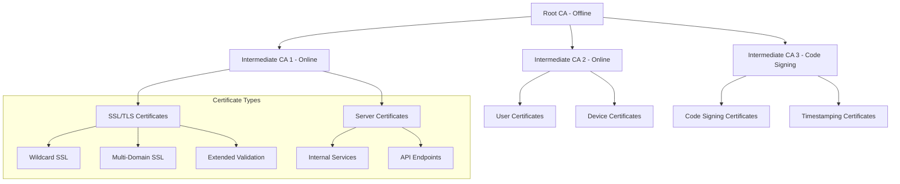
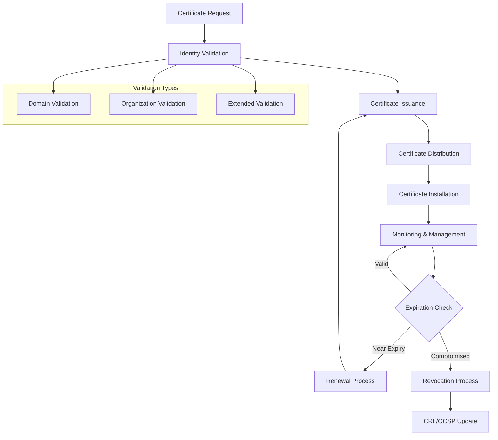
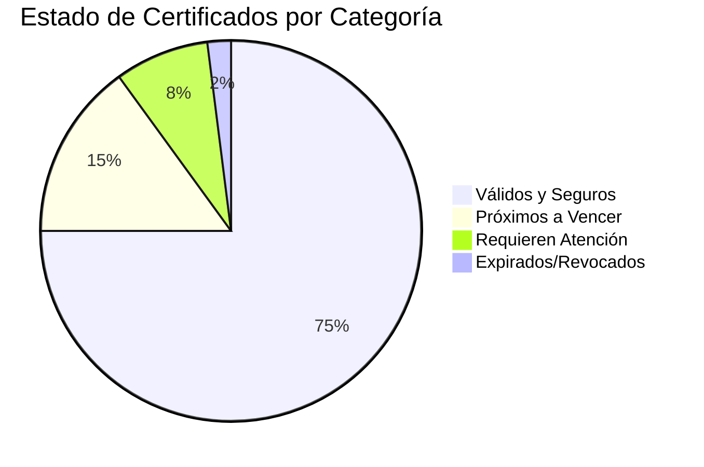
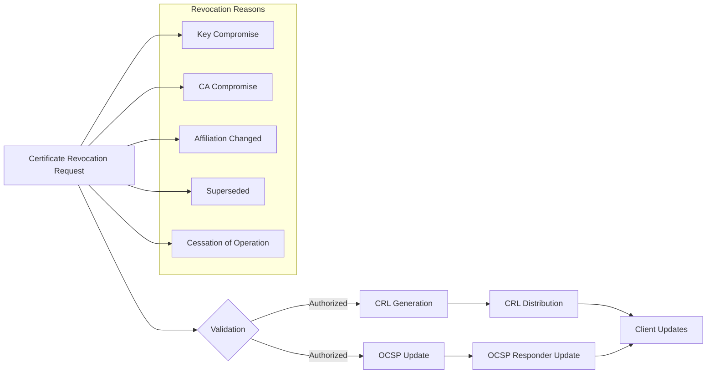
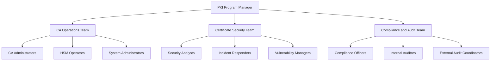

## 📋 Información General

**Documento:** Gestión de Certificados Digitales  
**Versión:** 1.0.0  
**Fecha:** Enero 2025  
**Clasificación:** Confidencial  
**Propietario:** CISO - Oficina de Seguridad de la Información  

## 🎯 Objetivo y Alcance

### Objetivo
Establecer un marco integral para la gestión del ciclo de vida completo de certificados digitales, garantizando la autenticidad, integridad y disponibilidad de los servicios digitales de DivisionCero mediante prácticas seguras de emisión, distribución, renovación y revocación de certificados.

### Alcance
Esta política cubre:
- **Certificados SSL/TLS**: Sitios web, APIs, servicios web externos e internos
- **Certificados de Código**: Firma de software, aplicaciones, scripts automatizados
- **Certificados de Cliente**: Autenticación de usuarios, dispositivos, servicios
- **Certificados de Servidor**: Servicios internos, middleware, comunicaciones inter-sistema
- **Certificados de CA**: Autoridades certificadoras internas y externas
- **Certificados IoT/Device**: Dispositivos conectados, sensores, sistemas embebidos

## 🏛️ Marco Normativo

### Referencias Regulatorias
- **RFC 5280** - Internet X.509 Public Key Infrastructure Certificate and CRL Profile
- **NIST SP 800-57** - Recommendations for Key Management
- **ISO/IEC 27001:2022** - Information Security Management Systems
- **WebTrust for CAs** - Trust Service Principles and Criteria for Certification Authorities
- **Common Criteria (CC)** - Security Requirements for IT Security Evaluation

### Estándares Técnicos
- **X.509 v3** - Standard for Public Key Infrastructure
- **PKCS Standards** - Public-Key Cryptography Standards
- **RFC 6960** - Online Certificate Status Protocol (OCSP)
- **RFC 5019** - Lightweight OCSP Profile
- **CA/Browser Forum Baseline Requirements** - Certificate Authority Guidelines

## 🏗️ Arquitectura PKI (Public Key Infrastructure)

### Jerarquía de Certificación


### Componentes de la Infraestructura PKI

#### Certificate Authority (CA) Tiers
```yaml
PKI_Infrastructure:
  root_ca:
    security_level: "FIPS 140-2 Level 3 HSM"
    availability: "Air-gapped, offline storage"
    key_size: "4096-bit RSA or P-384 ECC"
    validity_period: "20 years"
    location: "Secure vault facility"
    
  intermediate_cas:
    ssl_tls_ca:
      security_level: "FIPS 140-2 Level 2 HSM"
      availability: "Online, high availability cluster"
      key_size: "2048-bit RSA or P-256 ECC"
      validity_period: "10 years"
      purpose: "SSL/TLS certificates for web services"
    
    code_signing_ca:
      security_level: "FIPS 140-2 Level 3 HSM"
      availability: "Offline, secure access only"
      key_size: "3072-bit RSA or P-384 ECC"
      validity_period: "7 years"
      purpose: "Code signing and timestamping"
    
    device_ca:
      security_level: "FIPS 140-2 Level 2 HSM"
      availability: "Online, restricted access"
      key_size: "2048-bit RSA or P-256 ECC"
      validity_period: "5 years"
      purpose: "IoT devices and client authentication"
```

## 📊 Matriz de Tipos de Certificados

### Clasificación por Uso y Criticidad

| Tipo de Certificado | Propósito | Algoritmo Recomendado | Validez Máxima | Nivel de Validación | Renovación Automática |
|---------------------|-----------|----------------------|----------------|-------------------|---------------------|
| **Extended Validation (EV)** | Sitios públicos críticos | RSA-2048/ECC-P256 | 12 meses | Organization + Domain | No |
| **Organization Validated (OV)** | Sitios corporativos | RSA-2048/ECC-P256 | 12 meses | Organization + Domain | Sí |
| **Domain Validated (DV)** | Servicios internos | RSA-2048/ECC-P256 | 90 días | Domain only | Sí |
| **Wildcard SSL** | Subdominios múltiples | RSA-2048/ECC-P256 | 12 meses | Domain + Wildcard | Sí |
| **Code Signing** | Firma de software | RSA-3072/ECC-P384 | 36 meses | Organization + EV | No |
| **Client Authentication** | Usuarios/Dispositivos | RSA-2048/ECC-P256 | 24 meses | Identity verification | Sí |
| **Server Authentication** | Servicios internos | RSA-2048/ECC-P256 | 12 meses | Server identity | Sí |

### Políticas de Emisión por Tipo

#### SSL/TLS Certificates
```yaml
SSL_TLS_Policies:
  domain_validation:
    validation_methods: ["HTTP-01", "DNS-01", "TLS-ALPN-01"]
    automation_support: true
    max_validity: "90 days"
    renewal_threshold: "30 days before expiration"
    
  organization_validation:
    validation_requirements:
      - business_registration_verification
      - authorized_representative_confirmation
      - domain_control_validation
      - telephone_verification
    automation_support: false
    max_validity: "12 months"
    renewal_threshold: "60 days before expiration"
  
  extended_validation:
    validation_requirements:
      - legal_entity_verification
      - physical_presence_confirmation
      - operational_existence_validation
      - domain_authorization_verification
      - final_cross_correlation_check
    automation_support: false
    max_validity: "12 months"
    manual_renewal_required: true
```

## 🔐 Gestión del Ciclo de Vida de Certificados

### Fases del Ciclo de Vida


### Proceso de Solicitud y Emisión

#### Certificate Request Workflow
```yaml
Certificate_Request_Process:
  initiation:
    requestor_authentication: "Multi-factor authentication required"
    business_justification: "Detailed use case documentation"
    security_review: "Security team approval for sensitive certificates"
    
  validation_phase:
    domain_validation:
      methods: ["DNS TXT record", "HTTP file validation", "Email validation"]
      automation: "ACME protocol support"
      validation_time: "5-10 minutes"
    
    organization_validation:
      document_verification: "Business registration documents"
      phone_verification: "Callback to registered business number"
      authorized_representative: "Signed letter from company officer"
      validation_time: "1-3 business days"
    
    extended_validation:
      legal_opinion_letter: "Attorney verification if required"
      site_visit: "Physical verification for high-value certificates"
      comprehensive_validation: "Full organizational due diligence"
      validation_time: "5-7 business days"
  
  issuance_phase:
    key_generation: "On HSM or secure key ceremony"
    certificate_creation: "Automated CA signing process"
    quality_assurance: "Automated validation of certificate fields"
    distribution: "Secure delivery to authorized recipients"
```

### Renovación Automatizada

#### ACME Protocol Integration
```yaml
ACME_Configuration:
  supported_challenges:
    - type: "http-01"
      description: "HTTP challenge for domain validation"
      automation_level: "full"
      use_cases: ["web_servers", "load_balancers"]
    
    - type: "dns-01"
      description: "DNS TXT record challenge"
      automation_level: "full"
      use_cases: ["wildcard_certificates", "internal_services"]
    
    - type: "tls-alpn-01"
      description: "TLS with ALPN challenge"
      automation_level: "full"
      use_cases: ["automated_systems", "containers"]
  
  certificate_lifecycle:
    initial_validity: "90 days"
    renewal_threshold: "30 days before expiration"
    retry_intervals: [1, 6, 24, 48, 72] # hours
    failure_escalation: "Manual intervention after 5 failures"
    
  integration_points:
    - platform: "Kubernetes"
      tool: "cert-manager"
      automation: "full"
    - platform: "Apache/Nginx"
      tool: "Certbot"
      automation: "cron-based"
    - platform: "Load Balancers"
      tool: "Custom scripts"
      automation: "API-driven"
```

## 🛠️ Herramientas de Gestión de Certificados

### Plataformas Enterprise Certificate Management

#### Certificate Management Solutions
```yaml
Enterprise_Tools:
  venafi_platform:
    capabilities:
      - certificate_discovery: "Network scanning and inventory"
      - lifecycle_management: "Automated renewal and deployment"
      - compliance_monitoring: "Policy enforcement and reporting"
      - security_analytics: "Certificate usage analytics"
    integration: "API and agent-based"
    
  digicert_certcentral:
    capabilities:
      - multi_ca_support: "Integration with multiple CAs"
      - bulk_operations: "Mass certificate management"
      - approval_workflows: "Custom approval processes"
      - reporting_analytics: "Comprehensive certificate reporting"
    integration: "REST API and web interface"
  
  sectigo_certificate_manager:
    capabilities:
      - automated_validation: "Streamlined validation processes"
      - certificate_templates: "Standardized certificate profiles"
      - integration_apis: "Third-party system integration"
      - compliance_reporting: "Regulatory compliance reports"
    integration: "API and SCEP protocols"
```

#### Open Source Solutions
- **OpenCA**: Complete PKI solution with web interface
- **CFSSL**: CloudFlare's PKI toolkit for certificate management
- **Step CA**: Small step CA for internal certificate management
- **Boulder**: Let's Encrypt ACME-compatible CA implementation
- **XCA**: X Certificate and key management GUI application

### Monitoring and Discovery Tools

#### Certificate Discovery and Monitoring
```yaml
Monitoring_Tools:
  certificate_discovery:
    - nmap_ssl_scripts: "Network-based certificate discovery"
    - ssl_observatory: "Certificate transparency log monitoring"
    - certificate_transparency_monitors: "Public certificate monitoring"
    - internal_network_scanners: "Asset discovery tools"
  
  expiration_monitoring:
    - nagios_check_ssl: "SSL certificate expiration checks"
    - zabbix_ssl_monitoring: "Certificate monitoring templates"
    - prometheus_ssl_exporter: "Metrics collection for certificates"
    - custom_python_scripts: "Automated certificate checking"
  
  compliance_monitoring:
    - ssl_labs_api: "External SSL configuration assessment"
    - testssl_sh: "Comprehensive SSL/TLS testing"
    - mozilla_observatory: "Security configuration scanning"
    - qualys_ssl_pulse: "Certificate security analytics"
```

## 📈 Métricas y Monitoreo

### Key Performance Indicators (KPIs)

#### Métricas Operacionales
| Métrica | Objetivo | Método de Medición | Frecuencia |
|---------|----------|-------------------|------------|
| **Certificate Uptime** | más de 99.9% | SSL monitoring tools | Continuo |
| **Renewal Success Rate** | más de 98% | Automated renewal logs | Diario |
| **Time to Issue** | menos de 4 horas (DV) | CA response time tracking | Por solicitud |
| **Discovery Coverage** | más de 95% assets | Network scanning results | Semanal |
| **Expiration Incidents** | 0 expired certificates in production | Monitoring alerts | Diario |

#### Métricas de Seguridad
```yaml
Security_Metrics:
  cryptographic_strength:
    - weak_algorithms_detected: "target: 0"
    - deprecated_protocols: "target: 0"
    - key_size_compliance: "target: >95%"
    - cipher_suite_strength: "target: A+ grade"
  
  certificate_hygiene:
    - duplicate_certificates: "trending downward"
    - unused_certificates: "target: <5% of inventory"
    - shadow_it_certificates: "target: <1% discovery rate"
    - revocation_response_time: "target: <4 hours"
  
  compliance_metrics:
    - policy_adherence_rate: "target: >98%"
    - audit_findings: "target: <3 per year"
    - vulnerability_remediation_time: "target: <72 hours"
    - certificate_transparency_compliance: "target: 100%"
```

### Dashboard de Gestión de Certificados


### Alertas y Notificaciones

#### Sistema de Alertas Escalonado
```yaml
Alert_Configuration:
  certificate_expiration:
    90_days_warning: "Email to certificate owner"
    60_days_warning: "Email to owner + manager notification"
    30_days_critical: "Ticket creation + SMS alerts"
    7_days_urgent: "Phone calls + executive notification"
    
  security_events:
    weak_crypto_detected: "Immediate security team alert"
    certificate_transparency_anomaly: "SOC investigation triggered"
    unauthorized_certificate_issuance: "CISO notification + investigation"
    ca_compromise_indicators: "Emergency response activation"
  
  operational_events:
    renewal_failure: "Automated retry + notification after 3 failures"
    validation_errors: "Technical team notification"
    ca_service_unavailable: "Service degradation alert"
    compliance_violations: "Compliance team notification"
```

## 🔧 Gestión de Revocación

### Certificate Revocation Infrastructure

#### Revocation Mechanisms


#### Revocation Process
```yaml
Revocation_Process:
  immediate_revocation_triggers:
    - private_key_compromise: "Emergency revocation within 1 hour"
    - ca_key_compromise: "Mass revocation of all certificates"
    - security_breach_detected: "Precautionary revocation"
    - employee_termination: "Personal certificate revocation"
  
  standard_revocation_process:
    authorization_required: "Certificate owner or authorized administrator"
    documentation: "Reason for revocation and supporting evidence"
    approval_workflow: "Security team review for critical certificates"
    execution_timeline: "Within 24 hours of approval"
  
  revocation_distribution:
    crl_update_frequency: "Every 24 hours or on-demand"
    ocsp_response_validity: "7 days maximum"
    crl_distribution_points: "Multiple geographically distributed endpoints"
    ocsp_responder_availability: "99.9% uptime SLA"
```

### Emergency Revocation Procedures

#### Incident Response Integration
- **Compromise Detection**: Integration with SIEM and threat intelligence
- **Rapid Response**: Automated revocation for confirmed compromises
- **Communication**: Stakeholder notification and impact assessment
- **Recovery Planning**: Re-issuance strategy and timeline

## 👥 Roles y Responsabilidades

### Certificate Authority Operations Team

#### Organizational Structure


#### Responsabilidades por Rol
```yaml
Role_Responsibilities:
  pki_program_manager:
    strategic_planning: "PKI strategy and roadmap development"
    vendor_management: "CA relationships and contract management"
    policy_development: "Certificate policies and practices"
    stakeholder_coordination: "Cross-functional PKI governance"
  
  ca_operations_team:
    certificate_issuance: "Process certificate requests and issuance"
    system_maintenance: "CA infrastructure maintenance and updates"
    monitoring: "24/7 monitoring of CA systems and services"
    incident_response: "First-level response to CA incidents"
  
  certificate_security_team:
    threat_monitoring: "Monitor for certificate-related threats"
    vulnerability_management: "Assess and remediate PKI vulnerabilities"
    security_assessments: "Regular security evaluations of PKI"
    incident_investigation: "Deep investigation of security incidents"
  
  certificate_owners:
    request_management: "Submit certificate requests with proper justification"
    lifecycle_management: "Monitor certificate health and renewal"
    security_compliance: "Ensure proper certificate usage and protection"
    incident_reporting: "Report suspected compromise or issues"
```

### Competencias y Certificaciones

#### Required Training and Certifications
- **PKI Fundamentals**: All team members - Annual
- **CA Operations Training**: CA operators - Bi-annual
- **HSM Management**: HSM operators - Annual certification
- **Incident Response**: Security team - Quarterly exercises
- **Compliance Training**: All roles - Annual regulatory update

## 📋 Cumplimiento y Auditoría

### Regulatory Compliance Requirements

#### Industry-Specific Compliance
```yaml
Compliance_Framework:
  ca_browser_forum:
    baseline_requirements: "Certificate authority baseline requirements"
    extended_validation: "EV certificate guidelines"
    code_signing: "Code signing certificate requirements"
    audit_requirements: "Annual WebTrust or ETSI audits"
  
  industry_regulations:
    pci_dss: "Payment card industry certificate requirements"
    hipaa: "Healthcare certificate security requirements"
    sox: "Financial reporting certificate controls"
    gdpr: "Data protection certificate requirements"
  
  government_standards:
    fips_140_2: "Cryptographic module requirements"
    common_criteria: "Security evaluation criteria"
    fisma: "Federal information security requirements"
    fedramp: "Federal cloud security requirements"
```

### Audit Evidence and Documentation

#### Required Documentation
- **Certificate Policy (CP)**: High-level certificate policy document
- **Certificate Practice Statement (CPS)**: Detailed operational practices
- **Key Ceremony Records**: Root CA key generation documentation
- **Audit Logs**: Comprehensive logging of all CA operations
- **Incident Reports**: Security incident documentation
- **Training Records**: Staff certification and training evidence

### Audit Schedule and Activities
```yaml
Audit_Schedule:
  external_audits:
    webtrust_audit: "Annual third-party audit for public CAs"
    compliance_audit: "Industry-specific compliance audits"
    penetration_testing: "Annual PKI infrastructure testing"
    
  internal_audits:
    quarterly_reviews: "Internal compliance and security reviews"
    monthly_assessments: "Operational procedure verification"
    continuous_monitoring: "Automated compliance monitoring"
    
  audit_activities:
    ca_system_review: "CA software and hardware security assessment"
    procedure_validation: "Verification of documented procedures"
    personnel_interviews: "Staff competency and compliance validation"
    evidence_sampling: "Random sampling of certificates and processes"
```

## 🔄 Mejora Continua y Evolución

### Technology Roadmap 2025-2027

#### 2025 - Modernization Phase
```yaml
2025_objectives:
  automation_enhancement:
    - acme_protocol_expansion: "Expand ACME support to all certificate types"
    - certificate_discovery_automation: "Automated certificate inventory management"
    - renewal_optimization: "Zero-touch renewal for 90% of certificates"
    - monitoring_improvement: "Real-time certificate health monitoring"
  
  security_enhancements:
    - quantum_readiness_assessment: "Evaluate post-quantum cryptography"
    - certificate_transparency_full_coverage: "100% CT log coverage"
    - enhanced_key_protection: "Upgrade to FIPS 140-2 Level 3 HSMs"
    - threat_intelligence_integration: "Certificate threat intel feeds"
```

#### 2026 - Innovation Phase
- **Machine Learning**: ML-powered certificate anomaly detection
- **Blockchain Integration**: Blockchain-based certificate transparency
- **Zero-Trust Architecture**: Certificate-based zero-trust implementation
- **Cloud-Native PKI**: Kubernetes-native certificate management

#### 2027 - Post-Quantum Preparation
- **Post-Quantum Cryptography**: Migration planning and testing
- **Hybrid Certificates**: Classical + PQ algorithm certificates
- **Algorithm Agility**: Framework for cryptographic algorithm transitions
- **Quantum-Safe PKI**: Full post-quantum PKI implementation

### Performance Optimization Initiatives

| Initiative | Description | Timeline | Expected Benefit |
|------------|-------------|----------|-----------------|
| **Certificate Automation** | Increase automation coverage to 95% | Q2 2025 | Reduce manual effort by 80% |
| **HSM Clustering** | Implement HSM high availability | Q3 2025 | 99.99% CA availability |
| **Global Distribution** | Deploy geographically distributed CAs | Q4 2025 | Reduce certificate issuance latency |
| **AI-Powered Monitoring** | Implement predictive certificate analytics | Q1 2026 | Prevent 95% of expiration incidents |

---

## 📚 Referencias y Documentos Relacionados

### Políticas Relacionadas
- [Inventario y Ciclo de Vida de Llaves Criptográficas](inventario-ciclo-vida-llaves)
- [Mecanismos de Cifrado](mecanismos-cifrado)
- [Política de Cifrado de Datos](politica-cifrado-datos)
- [Política de Control de Acceso](politica-control-acceso)

### Marcos de Referencia
- **RFC 5280** - Internet X.509 Public Key Infrastructure
- **NIST SP 800-57** - Recommendations for Key Management
- **WebTrust for CAs** - Trust Service Principles and Criteria
- **CA/Browser Forum Baseline Requirements**

### Herramientas y Recursos
- **Certificate Transparency Logs** - Public certificate monitoring
- **SSL Labs Server Test** - SSL configuration assessment
- **Mozilla Observatory** - Security configuration analysis
- **ACME Protocol Specification** - Automated certificate management

---

**Documento aprobado por:**  
**CISO - Oficina de Seguridad de la Información**  
**Fecha:** Enero 2025  
**Próxima revisión:** Enero 2026
