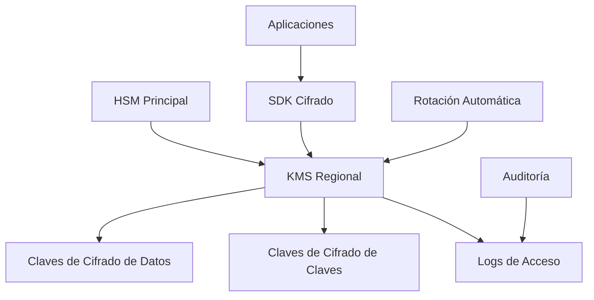

## 1. Objetivo y Alcance

### 1.1 Objetivo
Establecer los mecanismos de cifrado obligatorios para proteger la confidencialidad e integridad de los datos de DivisionCero, tanto en reposo como en tránsito, asegurando el cumplimiento de estándares de seguridad y regulaciones aplicables.

### 1.2 Alcance
Este documento aplica a:
- Todos los sistemas de información de DivisionCero
- Bases de datos y sistemas de almacenamiento
- Comunicaciones de red internas y externas
- Aplicaciones SaaS desarrolladas internamente
- Servicios en la nube (AWS, Azure, GCP)
- Dispositivos móviles y endpoints

## 2. Marco Regulatorio y Normativo

### 2.1 Estándares de Referencia
- **ISO 27001:2022** - Controles A.10.1.1, A.10.1.2
- **NIST Cybersecurity Framework** - PR.DS-1, PR.DS-2
- **PCI DSS v4.0** - Requisitos 3 y 4
- **GDPR** - Artículo 32 (Seguridad del tratamiento)
- **FIPS 140-2** - Estándares criptográficos

## 3. Clasificación y Requisitos de Cifrado

### 3.1 Datos Clasificados

| Clasificación | Cifrado en Reposo | Cifrado en Tránsito | Gestión de Claves |
|---------------|-------------------|---------------------|-------------------|
| **Públicos** | Opcional | TLS 1.2+ | Gestión básica |
| **Internos** | AES-256 | TLS 1.3 | HSM/KMS |
| **Confidenciales** | AES-256 + ECC | TLS 1.3 + mTLS | HSM obligatorio |
| **Críticos** | AES-256 + PQC* | TLS 1.3 + mTLS + PFS | HSM + Split knowledge |

*PQC: Post-Quantum Cryptography (preparación futura)

## 4. Cifrado en Reposo

### 4.1 Requisitos Generales
- **Algoritmos aprobados**: AES-256, ChaCha20-Poly1305
- **Modos de operación**: GCM, CCM para autenticación
- **Gestión de claves**: Rotación automática cada 12 meses
- **Separación**: Claves y datos almacenados por separado

### 4.2 Implementación por Tipo de Almacenamiento

#### 4.2.1 Bases de Datos
```sql
-- Ejemplo configuración PostgreSQL
-- Transparent Data Encryption (TDE)
ALTER SYSTEM SET shared_preload_libraries = 'pg_tde';
ALTER SYSTEM SET pg_tde.keyring_configuration = 'aws-kms';
```

#### 4.2.2 Sistemas de Archivos
- **Linux**: dm-crypt + LUKS2
- **Windows**: BitLocker con TPM 2.0
- **Servidores**: Cifrado a nivel de volumen

#### 4.2.3 Almacenamiento en la Nube
```yaml
# AWS S3 Bucket Encryption
aws_s3_bucket_server_side_encryption_configuration:
  rule:
    apply_server_side_encryption_by_default:
      sse_algorithm: "aws:kms"
      kms_master_key_id: "arn:aws:kms:region:account:key/key-id"
```

### 4.3 Configuración de Aplicaciones SaaS

#### 4.3.1 Base de Datos Principal (CRM/ERP)
```javascript
// Configuración de cifrado a nivel de aplicación
const crypto = require('crypto');
const algorithm = 'aes-256-gcm';

function encryptData(text, key) {
  const iv = crypto.randomBytes(16);
  const cipher = crypto.createCipher(algorithm, key, iv);
  
  let encrypted = cipher.update(text, 'utf8', 'hex');
  encrypted += cipher.final('hex');
  
  const authTag = cipher.getAuthTag();
  return {
    encrypted,
    iv: iv.toString('hex'),
    authTag: authTag.toString('hex')
  };
}
```

## 5. Cifrado en Tránsito

### 5.1 Protocolos Aprobados

#### 5.1.1 Comunicaciones Web
- **TLS 1.3** (obligatorio para nuevos sistemas)
- **TLS 1.2** (permitido hasta diciembre 2024)
- **Cipher suites aprobadas**:
  - TLS_AES_256_GCM_SHA384
  - TLS_CHACHA20_POLY1305_SHA256
  - TLS_AES_128_GCM_SHA256

#### 5.1.2 Configuración Nginx
```nginx
# Configuración segura TLS
ssl_protocols TLSv1.2 TLSv1.3;
ssl_ciphers ECDHE-RSA-AES256-GCM-SHA384:ECDHE-RSA-CHACHA20-POLY1305;
ssl_prefer_server_ciphers off;
ssl_session_timeout 1d;
ssl_session_cache shared:SSL:50m;
ssl_stapling on;
ssl_stapling_verify on;

# HSTS
add_header Strict-Transport-Security "max-age=63072000" always;
```

### 5.2 Comunicaciones Internas

#### 5.2.1 APIs y Microservicios
- **mTLS** obligatorio para comunicación entre servicios
- **JWT** con RS256/ES256 para autenticación
- **Perfect Forward Secrecy** habilitado

#### 5.2.2 VPN Corporativa
- **IPSec** con IKEv2
- **Algoritmos**: AES-256 + SHA-256
- **DH Group**: Group 19 (256-bit ECC) o superior

## 6. Gestión de Claves Criptográficas

### 6.1 Arquitectura de KMS



### 6.2 Ciclo de Vida de Claves

| Fase | Descripción | Responsable | Frecuencia |
|------|-------------|-------------|------------|
| **Generación** | Creación con HSM | Equipo Seguridad | Por demanda |
| **Distribución** | Entrega segura | Automatizada | Inmediata |
| **Almacenamiento** | HSM/KMS seguro | Infraestructura | Continua |
| **Rotación** | Cambio automático | Sistema | 12 meses |
| **Revocación** | Invalidación | CISO/Admin | Inmediata |
| **Destrucción** | Eliminación segura | Automatizada | Post-retención |

### 6.3 Configuración AWS KMS
```json
{
  "Version": "2012-10-17",
  "Statement": [
    {
      "Sid": "DivisionCeroKMSPolicy",
      "Effect": "Allow",
      "Principal": {
        "AWS": "arn:aws:iam::ACCOUNT:role/DivisionCero-EncryptionRole"
      },
      "Action": [
        "kms:Encrypt",
        "kms:Decrypt",
        "kms:ReEncrypt*",
        "kms:GenerateDataKey*",
        "kms:DescribeKey"
      ],
      "Resource": "*",
      "Condition": {
        "StringEquals": {
          "kms:EncryptionContext:Department": "Engineering"
        }
      }
    }
  ]
}
```

## 7. Algoritmos y Configuraciones Específicas

### 7.1 Algoritmos Aprobados

#### 7.1.1 Cifrado Simétrico
- **AES-256**: Datos en reposo y comunicaciones
- **ChaCha20-Poly1305**: Alternativa móvil/IoT
- **AES-128**: Solo para datos no sensibles

#### 7.1.2 Cifrado Asimétrico
- **RSA-2048**: Mínimo aceptable (fase out 2025)
- **RSA-4096**: Recomendado para nuevos sistemas
- **ECC P-256**: Eficiencia computacional
- **ECC P-384**: Datos críticos

### 7.2 Funciones Hash
- **SHA-256**: Estándar para integridad
- **SHA-3**: Sistemas de alta seguridad
- **BLAKE2b**: Aplicaciones de alto rendimiento

## 8. Implementación por Dominio Tecnológico

### 8.1 Aplicaciones Web (React/Node.js)
```javascript
// Configuración crypto-js para frontend
import CryptoJS from 'crypto-js';

const encryptionConfig = {
  keySize: 256 / 32,
  ivSize: 128 / 32,
  mode: CryptoJS.mode.GCM,
  padding: CryptoJS.pad.NoPadding
};

function encryptSensitiveData(data, passphrase) {
  const salt = CryptoJS.lib.WordArray.random(256 / 8);
  const key = CryptoJS.PBKDF2(passphrase, salt, {
    keySize: encryptionConfig.keySize,
    iterations: 100000
  });
  
  const iv = CryptoJS.lib.WordArray.random(encryptionConfig.ivSize);
  const encrypted = CryptoJS.AES.encrypt(data, key, {
    iv: iv,
    mode: encryptionConfig.mode
  });
  
  return {
    salt: salt.toString(CryptoJS.enc.Hex),
    iv: iv.toString(CryptoJS.enc.Hex),
    encrypted: encrypted.toString()
  };
}
```

### 8.2 Bases de Datos (PostgreSQL)
```sql
-- Extensión de cifrado pgcrypto
CREATE EXTENSION IF NOT EXISTS pgcrypto;

-- Tabla con campos cifrados
CREATE TABLE usuarios_datos_sensibles (
    id SERIAL PRIMARY KEY,
    email VARCHAR(255),
    documento_cifrado BYTEA,
    telefono_cifrado BYTEA,
    created_at TIMESTAMP DEFAULT CURRENT_TIMESTAMP
);

-- Función para insertar datos cifrados
CREATE OR REPLACE FUNCTION insertar_usuario_seguro(
    p_email VARCHAR(255),
    p_documento TEXT,
    p_telefono TEXT,
    p_clave TEXT
)
RETURNS INTEGER AS $$
DECLARE
    nuevo_id INTEGER;
BEGIN
    INSERT INTO usuarios_datos_sensibles (
        email,
        documento_cifrado,
        telefono_cifrado
    )
    VALUES (
        p_email,
        pgp_sym_encrypt(p_documento, p_clave),
        pgp_sym_encrypt(p_telefono, p_clave)
    )
    RETURNING id INTO nuevo_id;
    
    RETURN nuevo_id;
END;
$$ LANGUAGE plpgsql;
```

### 8.3 Microservicios (Docker/Kubernetes)
```yaml
# Configuración de secretos cifrados en K8s
apiVersion: v1
kind: Secret
metadata:
  name: divisioncero-encryption-keys
  namespace: production
type: Opaque
data:
  database-key: <base64-encoded-key>
  api-secret: <base64-encoded-secret>
---
apiVersion: apps/v1
kind: Deployment
metadata:
  name: divisioncero-api
spec:
  template:
    spec:
      containers:
      - name: api
        image: divisioncero/api:latest
        env:
        - name: ENCRYPTION_KEY
          valueFrom:
            secretKeyRef:
              name: divisioncero-encryption-keys
              key: database-key
        volumeMounts:
        - name: tls-certs
          mountPath: /etc/tls
          readOnly: true
      volumes:
      - name: tls-certs
        secret:
          secretName: divisioncero-tls-certs
```

## 9. Monitoreo y Alertas

### 9.1 Métricas de Seguridad Criptográfica
- **Uso de algoritmos prohibidos**: Alerta crítica
- **Claves próximas a expirar**: 30 días antes
- **Fallos de cifrado/descifrado**: Alerta inmediata
- **Accesos anómalos a KMS**: Investigación automática

### 9.2 Dashboard de Monitoreo
```javascript
// Métricas Prometheus para cifrado
const prometheus = require('prom-client');

const encryptionMetrics = {
  operationsTotal: new prometheus.Counter({
    name: 'encryption_operations_total',
    help: 'Total encryption operations',
    labelNames: ['operation', 'algorithm', 'status']
  }),
  
  keyRotationGauge: new prometheus.Gauge({
    name: 'encryption_key_age_days',
    help: 'Age of encryption keys in days',
    labelNames: ['key_id', 'key_type']
  }),
  
  tlsConnectionsGauge: new prometheus.Gauge({
    name: 'tls_connections_active',
    help: 'Active TLS connections by version',
    labelNames: ['tls_version', 'cipher_suite']
  })
};
```

## 10. Procedimientos Operacionales

### 10.1 Rotación de Claves
```bash
#!/bin/bash
# Script de rotación de claves automatizada

set -euo pipefail

ENVIRONMENT=${1:-staging}
KMS_KEY_ID="arn:aws:kms:us-east-1:ACCOUNT:key/KEY-ID"

echo "Iniciando rotación de claves para entorno: $ENVIRONMENT"

# 1. Crear nueva versión de clave
aws kms create-key \
  --policy file://kms-policy.json \
  --description "DivisionCero $ENVIRONMENT encryption key $(date +%Y%m%d)" \
  --key-usage ENCRYPT_DECRYPT \
  --key-spec SYMMETRIC_DEFAULT

# 2. Actualizar alias
NEW_KEY_ID=$(aws kms list-keys --query "Keys[0].KeyId" --output text)
aws kms update-alias \
  --alias-name "alias/divisioncero-$ENVIRONMENT" \
  --target-key-id "$NEW_KEY_ID"

# 3. Notificar a equipos
curl -X POST "$SLACK_WEBHOOK" \
  -H 'Content-type: application/json' \
  --data "{\"text\":\"🔐 Rotación de claves completada para $ENVIRONMENT\"}"

echo "Rotación completada. Nueva clave: $NEW_KEY_ID"
```

### 10.2 Verificación de Conformidad
```python
#!/usr/bin/env python3
"""
Script de verificación de conformidad criptográfica
"""

import ssl
import socket
import subprocess
import json
from datetime import datetime

def verificar_tls_endpoint(hostname, port=443):
    """Verifica la configuración TLS de un endpoint"""
    context = ssl.create_default_context()
    
    try:
        with socket.create_connection((hostname, port), timeout=10) as sock:
            with context.wrap_socket(sock, server_hostname=hostname) as ssock:
                cipher = ssock.cipher()
                cert = ssock.getpeercert()
                
                return {
                    'hostname': hostname,
                    'tls_version': ssock.version(),
                    'cipher_suite': cipher[0] if cipher else None,
                    'certificate_expires': cert.get('notAfter'),
                    'compliant': cipher[0] in APPROVED_CIPHERS if cipher else False
                }
    except Exception as e:
        return {
            'hostname': hostname,
            'error': str(e),
            'compliant': False
        }

def verificar_base_datos():
    """Verifica configuración de cifrado en BD"""
    try:
        result = subprocess.run([
            'psql', '-h', 'localhost', '-U', 'postgres',
            '-c', 'SHOW ssl;'
        ], capture_output=True, text=True)
        
        return {
            'ssl_enabled': 'on' in result.stdout,
            'compliant': 'on' in result.stdout
        }
    except Exception as e:
        return {'error': str(e), 'compliant': False}

# Constantes de conformidad
APPROVED_CIPHERS = [
    'TLS_AES_256_GCM_SHA384',
    'TLS_CHACHA20_POLY1305_SHA256',
    'ECDHE-RSA-AES256-GCM-SHA384'
]

if __name__ == "__main__":
    endpoints = [
        'api.divisioncero.com',
        'app.divisioncero.com',
        'admin.divisioncero.com'
    ]
    
    report = {
        'timestamp': datetime.now().isoformat(),
        'endpoints': [],
        'database': verificar_base_datos()
    }
    
    for endpoint in endpoints:
        report['endpoints'].append(verificar_tls_endpoint(endpoint))
    
    print(json.dumps(report, indent=2))
```

## 11. Cumplimiento y Auditoría

### 11.1 Controles de Auditoría
- **Trimestral**: Revisión de configuraciones de cifrado
- **Semestral**: Penetration testing de implementaciones
- **Anual**: Auditoría externa de gestión de claves
- **Continuo**: Monitoreo automatizado de compliance

### 11.2 Documentación de Evidencias
```yaml
# Template de evidencia de cumplimiento
evidencia_cifrado:
  fecha: "2024-03-20"
  auditor: "equipo-seguridad@divisioncero.com"
  alcance:
    - "Aplicaciones web principales"
    - "Bases de datos productivas"
    - "Comunicaciones inter-servicios"
  
  hallazgos:
    - control: "A.10.1.1 - Política de uso de controles criptográficos"
      estado: "CUMPLE"
      evidencia: "Documento mecanismos-cifrado.mdx v2.1.0"
    
    - control: "A.10.1.2 - Gestión de llaves"
      estado: "CUMPLE"
      evidencia: "AWS KMS configurado con rotación automática"
  
  excepciones:
    - sistema: "Sistema legacy CRM v1.0"
      justificacion: "Migración programada Q2 2024"
      plan_mitigacion: "Segmentación de red + monitoreo adicional"
```

## 12. Plan de Migración Post-Quantum

### 12.1 Preparación PQC
En preparación para la era post-quantum, DivisionCero está evaluando:

- **CRYSTALS-Kyber**: Encapsulación de claves
- **CRYSTALS-Dilithium**: Firmas digitales
- **SPHINCS+**: Firmas sin estructuras matemáticas

### 12.2 Cronograma de Adopción
- **2024 Q3**: Evaluación de librerías PQC
- **2024 Q4**: Implementación híbrida (clásico + PQC)
- **2025 Q2**: Migración gradual sistemas críticos
- **2026**: Adopción completa estándares NIST

## 13. Roles y Responsabilidades

| Rol | Responsabilidades Criptográficas |
|-----|-----------------------------------|
| **CISO** | Aprobación de políticas, supervisión general |
| **Arquitecto de Seguridad** | Diseño de soluciones, estándares técnicos |
| **DevSecOps** | Implementación, automatización, CI/CD |
| **Administradores de Sistema** | Configuración de infraestructura |
| **Desarrolladores** | Implementación en aplicaciones |
| **Auditores Internos** | Verificación de cumplimiento |

## 14. Contactos y Escalamiento

### 14.1 Equipo de Criptografía
- **Líder Técnico**: crypto-lead@divisioncero.com
- **Escalamiento 24/7**: security-ops@divisioncero.com
- **Incidentes Críticos**: +57-300-CRYPTO (Whatsapp)

### 14.2 Matriz de Escalamiento

| Severidad | Tiempo Respuesta | Contacto |
|-----------|------------------|----------|
| **Crítica** | 15 minutos | CISO + CTO |
| **Alta** | 2 horas | Líder Seguridad |
| **Media** | 8 horas | Equipo DevSecOps |
| **Baja** | 24 horas | Ticket Jira |
