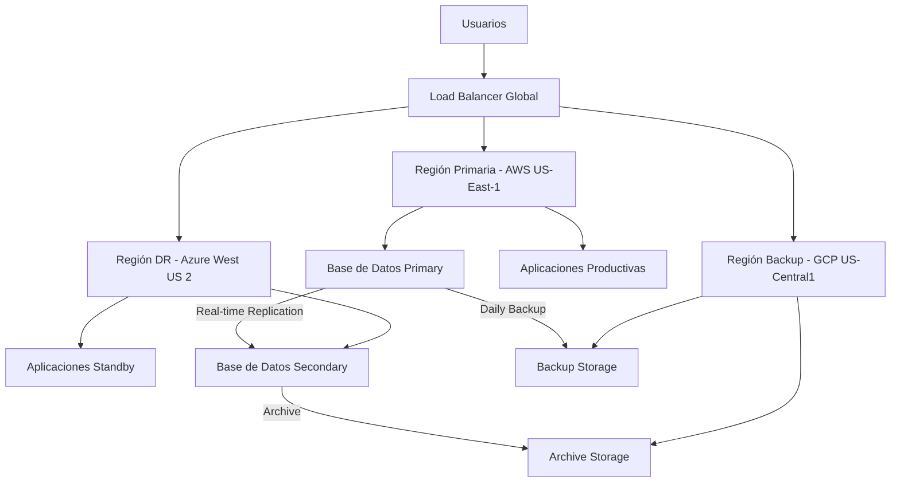
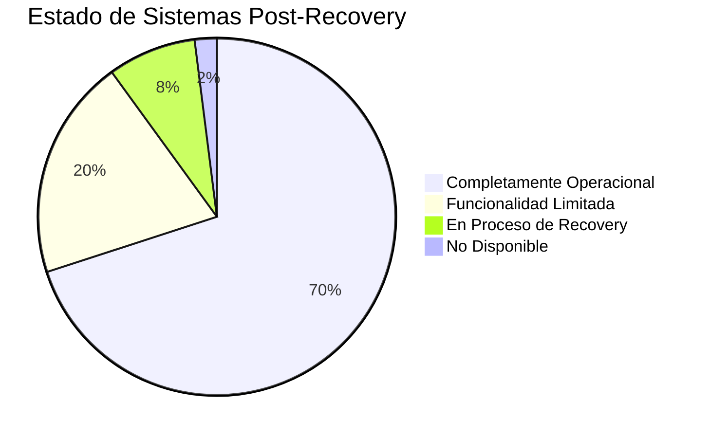

## 📋 Información General

**Documento:** Plan de Recuperación ante Desastres (DRP)  
**Código:** CCN-DRP-001  
**Versión:** 1.0.0  
**Fecha:** Enero 2025  
**Clasificación:** Confidencial  
**Audiencia:** Equipos Técnicos, Crisis Management Team, Ejecutivos de DivisionCero

## 🎯 Propósito

Establecer procedimientos específicos y técnicos para la recuperación rápida y efectiva de la infraestructura tecnológica crítica de DivisionCero ante eventos disruptivos, minimizando el tiempo de inactividad y asegurando la restauración de servicios dentro de los objetivos establecidos (RTO/RPO).

## 🏢 Alcance

Este plan cubre:
- **Infraestructura Cloud**: AWS, Azure, Google Cloud Platform
- **Centros de Datos**: Instalaciones primarias y de respaldo
- **Sistemas Críticos**: Plataforma SaaS, bases de datos, servicios de autenticación
- **Redes y Comunicaciones**: Conectividad, VPN, CDN
- **Datos y Almacenamiento**: Backups, replicación, integridad
- **Aplicaciones de Negocio**: ERP, CRM, sistemas de facturación
- **Servicios de Terceros**: Proveedores críticos y dependencias externas

## 📚 Definiciones

- **Disaster Recovery Plan (DRP):** Plan técnico específico para restaurar sistemas de TI
- **Recovery Time Objective (RTO):** Tiempo máximo tolerable para restaurar un sistema
- **Recovery Point Objective (RPO):** Pérdida máxima aceptable de datos medida en tiempo
- **Hot Site:** Sitio de respaldo completamente equipado y operativo
- **Warm Site:** Sitio parcialmente equipado que requiere configuración adicional
- **Cold Site:** Instalación básica sin equipamiento preconfigurado
- **Failover:** Proceso de transferir operaciones a sistemas de respaldo
- **Failback:** Proceso de retornar operaciones a sistemas primarios

## 🛡️ Estrategia de Recuperación

### 📊 Clasificación de Sistemas por Criticidad

#### Sistemas Críticos (Tier 1) - RTO: ≤ 4 horas, RPO: ≤ 1 hora
- **Plataforma SaaS Principal**
  - Aplicaciones web de clientes
  - APIs de integración
  - Servicios de autenticación (SSO)
  
- **Base de Datos Transaccionales**
  - PostgreSQL cluster principal
  - Redis cache distribuido
  - Elasticsearch logs críticos

- **Servicios de Pago**
  - Gateway de pagos
  - Procesamiento de transacciones
  - Sistemas de facturación

#### Sistemas Importantes (Tier 2) - RTO: ≤ 24 horas, RPO: ≤ 4 horas
- **Portal de Administración**
  - Dashboard administrativo
  - Herramientas de monitoreo
  - Sistemas de soporte al cliente

- **Infraestructura de Soporte**
  - Sistemas de CI/CD
  - Repositorios de código
  - Herramientas de desarrollo

#### Sistemas de Soporte (Tier 3) - RTO: ≤ 72 horas, RPO: ≤ 24 horas
- **Sistemas Corporativos**
  - ERP y contabilidad
  - Recursos humanos
  - Gestión documental

### 🏗️ Arquitectura de Recuperación

#### Configuración Multi-Cloud


#### Estrategias por Tipo de Sistema

##### Bases de Datos
- **PostgreSQL**: Configuración Primary-Secondary con replicación streaming
- **Redis**: Cluster distribuido con particionamiento y replicación
- **Elasticsearch**: Cluster multi-nodo con índices replicados
- **Backup Strategy**: Backups incrementales cada hora, completos diarios

##### Aplicaciones Web
- **Containerización**: Docker containers con Kubernetes orchestration
- **Auto-scaling**: Escalamiento automático basado en demanda
- **Circuit Breakers**: Protección contra fallos en cascada
- **Health Checks**: Monitoreo continuo de salud de servicios

##### Almacenamiento
- **Primary Storage**: SSD de alto rendimiento con RAID 10
- **Secondary Storage**: Replicación asíncrona a sitio DR
- **Backup Storage**: Almacenamiento en múltiples zonas geográficas
- **Archive Storage**: Almacenamiento a largo plazo con políticas de retención

## 👥 Roles y Responsabilidades

### 🚨 Disaster Recovery Team

#### DR Commander (CTO)
- Liderizar la respuesta técnica de recuperación
- Autorizar cambios en infraestructura durante emergencias
- Coordinar con Crisis Management Team sobre estado técnico
- Tomar decisiones sobre escalamiento y recursos adicionales

#### Infrastructure Lead (Infrastructure Manager)
- Ejecutar procedimientos de failover de infraestructura
- Monitorear estado de sistemas durante recuperación
- Coordinar con proveedores cloud y terceros
- Reportar métricas de recuperación y disponibilidad

#### Database Administrator (DBA Lead)
- Ejecutar recuperación de bases de datos
- Validar integridad de datos post-recuperación
- Gestionar procesos de backup y restore
- Monitorear performance de bases de datos en DR

#### Security Lead (CISO)
- Validar controles de seguridad en ambiente DR
- Monitorear por actividades maliciosas durante DR
- Asegurar compliance de medidas de seguridad
- Coordinar respuesta si el desastre es causado por ciberataque

#### Application Teams (Development Leads)
- Validar funcionalidad de aplicaciones en ambiente DR
- Ejecutar smoke tests y pruebas de funcionalidad
- Identificar y reportar problemas de aplicaciones
- Implementar fixes críticos durante recuperación

#### Communications Coordinator
- Mantener comunicación con equipos técnicos
- Proveer updates de estado a management y clientes
- Coordinar con equipos de soporte al cliente
- Documentar timeline y decisiones técnicas

## 📋 Procedimientos de Recuperación

### 🔥 Declaración de Desastre

#### Criterios de Activación DRP

##### Nivel 1 - Incident Minor
- **Trigger**: Un sistema no crítico está caído < 4 horas
- **Response**: Equipo técnico local
- **Escalation**: Team Lead + Infrastructure Manager

##### Nivel 2 - Incident Mayor  
- **Trigger**: Sistema crítico degradado o múltiples sistemas afectados
- **Response**: DR Team parcial
- **Escalation**: CTO + Infrastructure + Database teams

##### Nivel 3 - Disaster Declaration
- **Trigger**: Pérdida total de sitio primario o múltiples sistemas críticos > 4 horas
- **Response**: Full DR Team + Crisis Management
- **Escalation**: CEO + Executive team

#### Proceso de Declaración
1. **Evaluación Inicial (30 minutos)**
   - Assessment de impacto y scope
   - Determinación de causa raíz si es posible
   - Evaluación de duración estimada

2. **Notificación y Activación (15 minutos)**
   - Alertar al DR Team según nivel
   - Activar centro de comando DR
   - Iniciar comunicaciones internas

3. **Confirmación Ejecutiva (15 minutos)**
   - Aprobación de CTO para niveles 2-3
   - Autorización de gastos extraordinarios
   - Activación de contratos de emergencia

### 🔄 Secuencia de Recuperación

#### Fase 1: Preparación y Assessment (1 hora)
```yaml
Phase_1_Activities:
  initial_assessment:
    duration: "30 minutes"
    activities:
      - damage_assessment: "Evaluar extent del daño"
      - resource_inventory: "Verificar disponibilidad de recursos DR"
      - team_assembly: "Ensamblar DR Team completo"
      - communication_setup: "Establecer war room y comunicaciones"
  
  planning_and_prioritization:
    duration: "30 minutes" 
    activities:
      - recovery_strategy_selection: "Seleccionar estrategia de recuperación"
      - resource_allocation: "Asignar teams a sistemas por prioridad"
      - timeline_establishment: "Establecer milestone y checkpoints"
      - stakeholder_notification: "Notificar a stakeholders clave"
```

#### Fase 2: Recovery de Sistemas Críticos (4 horas)
1. **Infraestructura Base (30 minutos)**
   - Activar ambiente DR en región secundaria
   - Configurar redes y conectividad
   - Validar accesos y seguridad

2. **Bases de Datos (2 horas)**
   - Promote secondary database a primary
   - Validar integridad de datos
   - Ejecutar smoke tests de funcionalidad

3. **Aplicaciones Core (1.5 horas)**
   - Deploy de aplicaciones en infraestructura DR
   - Configurar load balancers y DNS
   - Ejecutar health checks y validaciones

#### Fase 3: Validación y Testing (2 horas)
1. **Testing Funcional (1 hora)**
   - Ejecutar test suites automatizados
   - Validar flujos críticos de negocio
   - Confirmar integración con sistemas externos

2. **Performance Testing (30 minutos)**
   - Validar performance bajo carga normal
   - Confirmar escalabilidad de ambiente DR
   - Monitorear métricas de latencia y throughput

3. **User Acceptance (30 minutos)**
   - Pruebas con usuarios business clave
   - Validación de UX y funcionalidad
   - Sign-off de business stakeholders

#### Fase 4: Rollout Completo (1 hora)
1. **DNS Switchover (15 minutos)**
   - Actualizar DNS para dirigir tráfico a DR
   - Configurar TTLs para cambios rápidos
   - Monitorear propagación de DNS

2. **Traffic Migration (30 minutos)**
   - Migración gradual de tráfico
   - Monitoreo de errores y performance
   - Rollback preparado si es necesario

3. **Full Operation (15 minutos)**
   - Confirmación de operación normal
   - Activación de monitoreo completo
   - Comunicación a usuarios y clientes

### 📞 Procedimientos de Comunicación

#### Comunicación Interna
```yaml
Internal_Communications:
  dr_team:
    channels: ["Dedicated Slack channel", "Microsoft Teams", "Conference bridge"]
    frequency: "Every 30 minutes during active recovery"
    content: "Technical status, blockers, next steps"
  
  executive_updates:
    channels: ["Executive Slack", "Email updates", "Phone calls"]
    frequency: "Every hour during recovery"
    content: "High-level status, timeline, customer impact"
  
  company_wide:
    channels: ["All-hands email", "Intranet banner", "Team announcements"]
    frequency: "Every 2 hours or at major milestones"
    content: "Situation overview, actions being taken, expectations"
```

#### Comunicación Externa
```yaml
External_Communications:
  customers:
    channels: ["Status page", "Email notifications", "In-app banners"]
    timeline: "Within 30 minutes of disaster declaration"
    content: "Service status, estimated resolution, workarounds"
  
  partners_vendors:
    channels: ["Direct phone calls", "Partner portals", "Email"]
    timeline: "Within 1 hour if their services are affected"
    content: "Impact assessment, required actions, coordination needs"
  
  regulatory:
    channels: ["Official notifications", "Compliance portals"]
    timeline: "As required by regulation (typically 24-72 hours)"
    content: "Incident details, customer impact, remediation actions"
```

## 🛠️ Herramientas y Tecnologías

### 📊 Plataformas de Monitoreo
- **Infrastructure Monitoring**: Datadog, New Relic
- **Application Performance**: AppDynamics, Dynatrace  
- **Log Management**: Splunk, ELK Stack
- **Alerting**: PagerDuty, Opsgenie
- **Status Page**: StatusPage.io, Atlassian Statuspage

### 🔧 Herramientas de Automatización
- **Infrastructure as Code**: Terraform, CloudFormation
- **Configuration Management**: Ansible, Puppet
- **Container Orchestration**: Kubernetes, Docker Swarm
- **CI/CD Pipelines**: Jenkins, GitLab CI, Azure DevOps
- **Backup Solutions**: Veeam, Commvault, AWS Backup

### 📱 Aplicaciones de Crisis
- **Communication**: Slack, Microsoft Teams, Zoom
- **Incident Management**: Jira Service Management, ServiceNow
- **Documentation**: Confluence, SharePoint, Google Docs
- **Remote Access**: VPN, Bastion hosts, Jump servers

## 📊 Métricas y Objetivos

### 🎯 Objetivos de Recuperación 2025

| Sistema | RTO Objetivo | RPO Objetivo | Disponibilidad Objetivo |
|---------|--------------|--------------|-------------------------|
| **Plataforma SaaS** | 4 horas | 1 hora | 99.9% |
| **Base de Datos Principal** | 2 horas | 30 minutos | 99.95% |
| **Servicios de Pago** | 1 hora | 15 minutos | 99.99% |
| **Portal Admin** | 8 horas | 4 horas | 99.5% |
| **Sistemas Corporativos** | 48 horas | 24 horas | 99.0% |

### 📈 KPIs de Disaster Recovery

#### Métricas Técnicas
- **Mean Time to Recovery (MTTR)**: Tiempo promedio de recuperación
- **Recovery Success Rate**: % de recoveries exitosos
- **Data Loss Measurement**: Cantidad de datos perdidos vs RPO
- **Failover Time**: Tiempo para ejecutar failover automático/manual

#### Métricas de Negocio
- **Customer Impact**: % de clientes afectados y duración
- **Revenue Impact**: Pérdida de ingresos durante interrupción
- **SLA Compliance**: % de cumplimiento de SLAs durante DR
- **Reputation Impact**: Menciones negativas en medios/redes sociales

### 📊 Dashboard de Recovery


## 🔧 Procedimientos de Testing

### 🧪 Programa de Testing DR

#### Testing Trimestral
- **Backup Verification**: Validación de integridad de backups
- **Failover Testing**: Pruebas de conmutación automática
- **Network Connectivity**: Validación de rutas de comunicación
- **Recovery Documentation**: Review y actualización de procedimientos

#### Testing Semestral
- **Partial DR Exercise**: Recuperación de sistemas no críticos
- **Communication Drills**: Pruebas de protocolos de comunicación
- **Vendor Coordination**: Validación de respuesta de proveedores
- **Performance Testing**: Validación de performance en ambiente DR

#### Testing Anual
- **Full DR Exercise**: Simulación completa de desastre
- **Multi-Site Failover**: Testing de múltiples regiones
- **Extended Outage**: Simulación de interrupción prolongada
- **Third-Party Assessment**: Evaluación externa de preparación DR

### 📋 Checklist de Testing

#### Pre-Test
- [ ] Notificar a stakeholders sobre testing schedule
- [ ] Preparar ambiente de testing y herramientas
- [ ] Revisar procedimientos y documentación actualizada
- [ ] Ensamblar team de testing y asignar roles

#### Durante Testing
- [ ] Documentar todas las acciones y tiempos
- [ ] Monitorear métricas de performance y availability
- [ ] Identificar gaps o problemas en procedimientos
- [ ] Mantener comunicación regular con stakeholders

#### Post-Test
- [ ] Compilar resultados y lecciones aprendidas
- [ ] Actualizar documentación y procedimientos
- [ ] Crear action items para improvements identificados
- [ ] Reportar resultados a management y stakeholders

## 🔄 Procedimientos de Failback

### 🏠 Retorno a Operación Normal

#### Planificación de Failback
1. **Assessment de Sitio Primario**
   - Validar que causa raíz ha sido corregida
   - Confirmar disponibilidad total de infraestructura
   - Ejecutar testing de funcionalidad completa

2. **Sincronización de Datos**
   - Sincronizar cambios desde ambiente DR a primario
   - Validar integridad y consistencia de datos
   - Preparar rollback plan en caso de problemas

3. **Scheduling de Failback**
   - Programar durante ventana de mantenimiento
   - Coordinar con stakeholders y usuarios
   - Preparar comunicaciones y notificaciones

#### Ejecución de Failback
```yaml
Failback_Sequence:
  phase_1_preparation:
    duration: "2 hours"
    activities:
      - final_data_sync: "Sincronización final de datos"
      - readiness_validation: "Validación de preparación de sitio primario"
      - rollback_preparation: "Preparación de plan de rollback"
  
  phase_2_cutover:
    duration: "1 hour"
    activities:
      - traffic_redirection: "Redirigir tráfico a sitio primario"
      - dns_updates: "Actualizar DNS a configuración original"
      - monitoring_activation: "Activar monitoreo completo"
  
  phase_3_validation:
    duration: "1 hour"
    activities:
      - functionality_testing: "Testing de funcionalidad completa"
      - performance_validation: "Validación de performance normal"
      - user_acceptance: "Confirmación de operación normal"
```

#### Post-Failback
- **Monitoring Intensificado**: 48 horas de monitoreo adicional
- **Performance Baseline**: Reestablecimiento de métricas normales
- **Documentation Update**: Actualización de lecciones aprendidas
- **Team Debrief**: Reunión de retrospectiva con DR Team

## 📖 Entrenamiento y Competencias

### 👨‍🎓 Programa de Entrenamiento DR

#### Entrenamiento General (Anual)
- **DR Awareness**: Conocimiento básico de planes DR para todos
- **Emergency Procedures**: Procedimientos de emergencia y contactos
- **Communication Protocols**: Canales y métodos de comunicación
- **Role Responsibilities**: Responsabilidades específicas por rol

#### Entrenamiento Técnico (Trimestral)
- **Recovery Procedures**: Procedimientos técnicos detallados
- **Tool Proficiency**: Capacitación en herramientas específicas
- **Troubleshooting**: Resolución de problemas comunes
- **Performance Optimization**: Optimización durante recovery

#### Certificaciones Especializadas
- **Disaster Recovery Professional (DRP)**: Para DR Team leads
- **Cloud Platform Certifications**: AWS, Azure, GCP específicas
- **Vendor-Specific Training**: Herramientas y plataformas específicas
- **Crisis Management**: Liderazgo durante crisis para managers

### 📚 Recursos de Entrenamiento
- **DR Playbooks**: Guías paso a paso para cada procedimiento
- **Video Training**: Grabaciones de procedimientos y simulaciones
- **Hands-On Labs**: Ambientes de práctica para procedimientos
- **Documentation Portal**: Portal centralizado con toda la documentación

## 📋 Cumplimiento y Auditoría

### 🔍 Requisitos de Compliance

#### Frameworks de Referencia
- **ISO 22301**: Business Continuity Management Systems
- **ISO/IEC 27031**: ICT readiness for business continuity
- **NIST SP 800-34**: Contingency Planning Guide
- **SOC 2 Type II**: Availability and system processing integrity

#### Evidencia de Cumplimiento
- **Testing Documentation**: Registros de todas las pruebas DR
- **Recovery Metrics**: Datos de performance y cumplimiento de RTO/RPO
- **Training Records**: Evidencia de entrenamiento del personal
- **Incident Logs**: Documentación de activaciones reales del plan

### 📝 Auditorías DR
- **Frequency**: Auditoría anual del programa DR
- **Scope**: Planes, procedimientos, testing y documentación
- **External Assessment**: Evaluación por terceros cada 2 años
- **Continuous Monitoring**: Evaluación continua de preparación

## 🔄 Mantenimiento y Mejora

### 📅 Ciclo de Actualización

#### Monthly Reviews
- Review de métricas de disponibilidad y performance
- Actualización de inventarios de sistemas y dependencias
- Review de cambios en infraestructura que afecten DR
- Validación de contactos y escalation procedures

#### Quarterly Updates
- Actualización de documentación de procedimientos
- Review y actualización de RTO/RPO objetivos
- Assessment de nuevas tecnologías y herramientas
- Training refresher para DR Team

#### Annual Assessment
- Evaluación completa del programa DR
- Review de strategy y alignment con business needs
- Budget planning para siguiente año
- Strategic planning y roadmap updates

### 🎯 Plan de Mejora Continua

#### 2025 Objectives
- **Automation Enhancement**: Automatizar 80% de recovery procedures
- **Cloud Optimization**: Optimizar costos de infraestructura DR
- **AI Integration**: Implementar ML para predictive failure detection
- **Documentation**: Digitalizar y centralizar toda la documentación DR

#### Innovation Roadmap
- **Zero-Touch Recovery**: Recovery completamente automatizado
- **Predictive DR**: Predicción de fallos antes de que ocurran
- **Intelligent Orchestration**: Orquestación inteligente de recovery
- **Real-Time Optimization**: Optimización dinámica basada en condiciones

## 📚 Referencias y Estándares

### 📖 Documentos Relacionados
- [Política de Continuidad del Negocio](politica-continuidad-negocio)
- [Plan de Continuidad Operacional](plan-continuidad-operacional)  
- [Estrategia de Pruebas BCP/DRP](estrategia-pruebas-bcp-drp)
- [Procedimientos de Contingencia ante Desastres](procedimientos-contingencia-desastres)
- [Plan de Respuesta a Incidentes](plan-respuesta-incidentes)

### 🌐 Marcos de Referencia
- **NIST SP 800-34**: Contingency Planning Guide for Federal Information Systems
- **ISO/IEC 27031:2011**: ICT readiness for business continuity
- **ITIL 4**: IT Service Continuity Management
- **COBIT 2019**: Governance and Management of Enterprise IT

### 🔗 Recursos Externos
- **Disaster Recovery Institute (DRI)**: Professional standards and certifications
- **Business Continuity Institute (BCI)**: Best practices and guidelines
- **SANS Institute**: Security and DR training resources
- **Cloud Provider Documentation**: AWS, Azure, GCP DR guides

## 📝 Control de Versiones

| Versión | Fecha | Cambios | Autor |
|---------|-------|---------|-------|
| 1.0.0 | Enero 2025 | Versión inicial - Plan completo de recuperación ante desastres | DR Team + CISO |

---

**Próxima Revisión:** Julio 2025  
**Aprobado por:** [CTO] - [Fecha]  
**Clasificación:** Confidencial - Uso Interno DivisionCero
