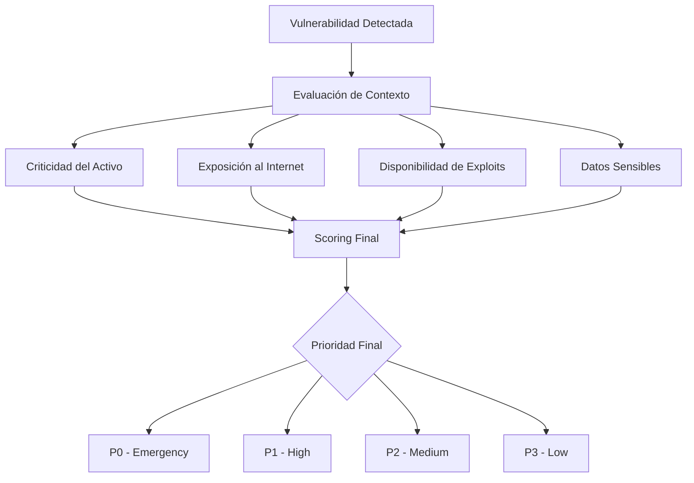
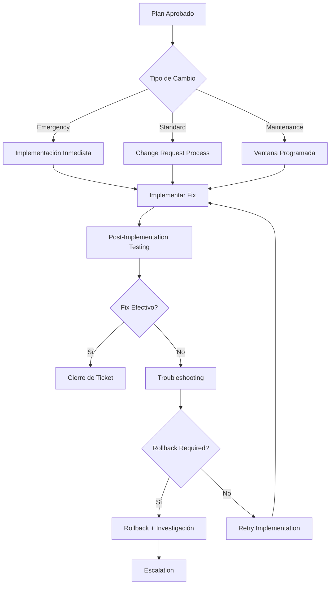
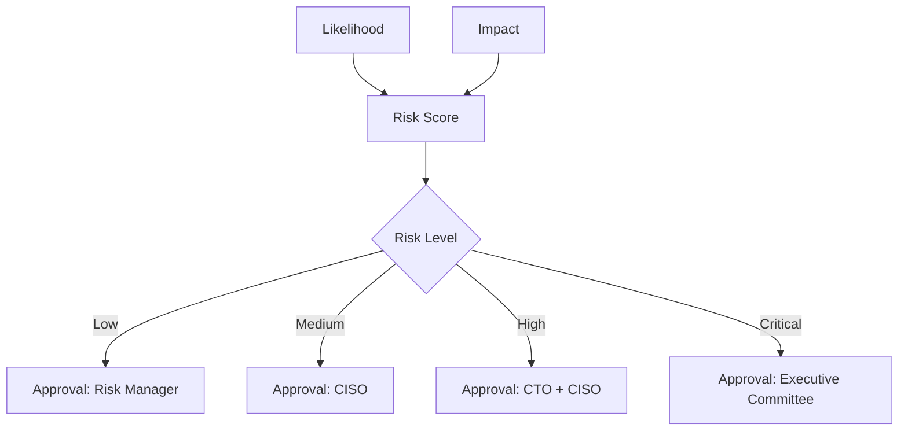
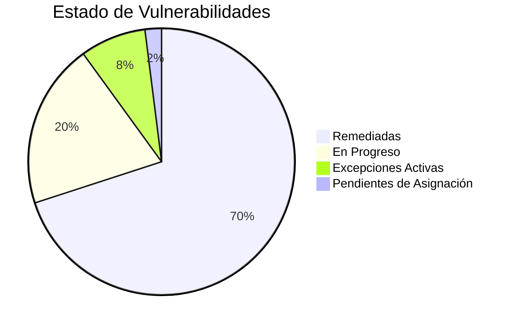
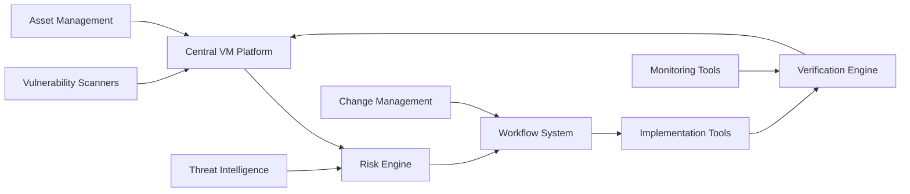

## 📋 Información General

**Documento:** Plan de Remediación y Excepciones Justificadas  
**Código:** ADR-PLA-002  
**Versión:** 1.0.0  
**Fecha:** Enero 2025  
**Clasificación:** Confidencial  
**Audiencia:** Equipos de Seguridad, SOC, Infraestructura, Desarrollo y Risk Management de DivisionCero

## 🎯 Propósito

Establecer un marco sistemático para la remediación efectiva de vulnerabilidades y la gestión formal de excepciones cuando la remediación inmediata no es viable. Este plan define procesos, criterios y responsabilidades para asegurar que todas las vulnerabilidades sean tratadas de manera apropiada, ya sea a través de remediación directa o mediante controles compensatorios documentados.

## 🏢 Alcance

Este plan aplica a:
- **Vulnerabilidades Identificadas**: Resultados de escaneos automatizados y evaluaciones manuales
- **Sistemas en Scope**: Infraestructura, aplicaciones, bases de datos, servicios cloud
- **Todos los Entornos**: Producción, staging, desarrollo, testing
- **Vulnerabilidades de Terceros**: Componentes, bibliotecas y servicios externos
- **Configuraciones Inseguras**: Desviaciones de baselines de seguridad
- **Excepciones Temporales y Permanentes**: Aceptación formal de riesgos residuales

## 📚 Definiciones

- **Remediación:** Proceso de corregir o mitigar una vulnerabilidad identificada
- **Excepción:** Aceptación formal de riesgo cuando la remediación no es viable
- **Control Compensatorio:** Medida de seguridad alternativa que reduce el riesgo
- **SLA de Remediación:** Tiempo máximo aceptable para corregir una vulnerabilidad
- **Risk Owner:** Persona responsable de aceptar el riesgo de una excepción
- **False Positive:** Detección incorrecta de vulnerabilidad que no existe realmente

## 🛡️ Estrategia de Remediación

### 📊 Clasificación de Vulnerabilidades

#### Matriz de Priorización
| Criticidad | CVSS Score | SLA Remediación | Tratamiento Requerido |
|------------|------------|-----------------|----------------------|
| **Crítica** | 9.0 - 10.0 | ≤ 4 horas | Inmediato + War Room |
| **Alta** | 7.0 - 8.9 | ≤ 24 horas | Expedito + Comunicación |
| **Media** | 4.0 - 6.9 | ≤ 7 días | Standard + Planificación |
| **Baja** | 0.1 - 3.9 | ≤ 30 días | Maintenance Window |

#### Factores de Contexto


### 🔧 Tipos de Remediación

#### Remediación Directa
- **Patch Management**: Aplicación de parches oficiales del vendor
- **Configuration Changes**: Modificación de configuraciones inseguras
- **Software Updates**: Actualización a versiones seguras
- **Code Fixes**: Corrección de vulnerabilidades en código propio
- **Service Decommissioning**: Eliminación de servicios innecesarios

#### Remediación Alternativa
- **Controles Compensatorios**: Medidas que reducen el riesgo efectivo
- **Network Segmentation**: Aislamiento de sistemas vulnerables
- **Access Controls**: Restricción de acceso a recursos afectados
- **Monitoring Enhancement**: Incremento de detección y alerting
- **Procedural Controls**: Controles operacionales y de proceso

## 👥 Roles y Responsabilidades

### 🔒 Vulnerability Management Team

#### Vulnerability Manager (Security Team)
- Coordinar el proceso general de remediación
- Priorizar vulnerabilidades según criticidad y contexto
- Escalar excepciones que requieren aprobación ejecutiva
- Reportar métricas y estado a management

#### Security Analysts (SOC Team)
- Validar vulnerabilidades y eliminar falsos positivos
- Realizar evaluación inicial de riesgo y contexto
- Proporcionar guidance técnico para remediación
- Monitorear compliance con SLAs de remediación

#### Risk Analysts (Risk Management)
- Evaluar solicitudes de excepción
- Calcular impacto financiero de riesgos residuales
- Recomendar controles compensatorios
- Mantener registro de excepciones activas

### 🛠️ Equipos de Implementación

#### Infrastructure Team
- Aplicar parches en sistemas de infraestructura
- Implementar cambios de configuración de seguridad
- Coordinar ventanas de mantenimiento
- Validar efectividad de remediación

#### Development Teams
- Corregir vulnerabilidades en aplicaciones
- Actualizar dependencias y bibliotecas
- Implementar fixes en código fuente
- Ejecutar testing de regresión post-fix

#### Cloud Engineering
- Remediar configuraciones cloud inseguras
- Aplicar security best practices en servicios cloud
- Implementar controles de seguridad automatizados
- Mantener compliance con security benchmarks

### 🏢 Risk Owners
- Aceptar riesgo residual para excepciones
- Aprobar controles compensatorios propuestos
- Proveer justificación de negocio para excepciones
- Revisar periódicamente excepciones activas

## 📋 Proceso de Remediación

### 🚀 Workflow de Remediación Estándar

#### Fase 1: Triage y Validación (0-2 horas)
```yaml
Triage_Process:
  vulnerability_validation:
    - false_positive_check: "Validate scan results"
    - technical_analysis: "Confirm exploitability"
    - asset_verification: "Confirm affected systems"
    - impact_assessment: "Evaluate business impact"
  
  initial_categorization:
    - cvss_scoring: "Apply base CVSS score"
    - environmental_factors: "Add environmental metrics"
    - threat_intelligence: "Check for active exploits"
    - business_context: "Apply business criticality"
```

#### Fase 2: Asignación y Planificación (2-4 horas)
1. **Asignación de Responsable**
   - Identificar team owner del sistema afectado
   - Asignar ticket en sistema de tracking
   - Establecer comunicación directa

2. **Evaluación Técnica**
   - Determinar approach de remediación
   - Evaluar dependencias y prerrequisitos
   - Estimar effort y timeline

3. **Plan de Remediación**
   - Seleccionar estrategia óptima
   - Coordinar resources necesarios
   - Planificar testing y validación

#### Fase 3: Implementación (Variable según SLA)


#### Fase 4: Verificación y Cierre (1-24 horas post-fix)
1. **Verification Scanning**
   - Re-scan automático del activo
   - Validación manual si es necesario
   - Confirmación de eliminación de vulnerabilidad

2. **Impact Validation**
   - Verificar que el sistema funciona correctamente
   - Confirmar que no hay impactos negativos
   - Validar que controles de seguridad funcionan

3. **Documentation & Closure**
   - Documentar acciones tomadas
   - Actualizar asset inventory si es necesario
   - Cerrar tickets relacionados

### ⚡ Proceso de Remediación de Emergencia

#### Vulnerabilidades Críticas (P0)
```yaml
Emergency_Response:
  activation_criteria:
    - cvss_score: "≥ 9.0"
    - active_exploits: "publicly_available"
    - internet_exposure: "external_facing"
    - critical_assets: "production_systems"
  
  response_timeline:
    - initial_response: "15 minutes"
    - war_room_activation: "30 minutes"
    - mitigation_plan: "2 hours"
    - implementation_start: "4 hours"
  
  escalation_path:
    - l1: "SOC Analyst"
    - l2: "Security Manager"
    - l3: "CISO"
    - l4: "CTO/CEO"
```

#### War Room Procedures
1. **Convocatoria Inmediata**
   - CISO, CTO, Security Team, System Owners
   - Dedicated Slack channel: #security-emergency
   - Conference bridge activado

2. **Evaluación Rápida**
   - Confirmar scope e impacto
   - Evaluar opciones de contención
   - Decidir approach de remediación

3. **Comunicación de Crisis**
   - Status updates cada 30 minutos
   - Executive briefing cada 2 horas
   - Customer communication si es necesario

## 🚫 Gestión de Excepciones

### 📝 Criterios para Excepciones

#### Excepciones Técnicas Justificadas
- **Sistemas Legacy**: Sin soporte del vendor o fin de vida
- **Incompatibilidad**: Fix causa inestabilidad crítica del sistema
- **Dependencias**: Remediación requiere cambios en sistemas de terceros
- **Complejidad**: Costo de remediación excede significativamente el riesgo

#### Excepciones de Negocio
- **Downtime Crítico**: Ventana de mantenimiento inaceptable
- **Procesos Críticos**: Impacto en operaciones de revenue
- **Compliance**: Remediación podría violar otros requerimientos
- **Customer Impact**: Afectación significativa a experiencia del cliente

### 📋 Proceso de Solicitud de Excepción

#### Fase 1: Preparación de Solicitud
```yaml
Exception_Request:
  required_information:
    - vulnerability_details: ["CVE", "CVSS_score", "affected_systems"]
    - business_justification: "Why remediation cannot be performed"
    - risk_assessment: "Detailed analysis of residual risk"
    - compensating_controls: "Alternative measures to reduce risk"
    - time_frame: "Duration of exception requested"
    - review_schedule: "When exception will be reassessed"
  
  supporting_evidence:
    - technical_analysis: "Detailed technical assessment"
    - vendor_communications: "Evidence of vendor limitations"
    - cost_benefit_analysis: "Financial impact analysis"
    - alternative_assessments: "Other options considered"
```

#### Fase 2: Evaluación de Riesgo
1. **Technical Risk Assessment**
   - Likelihood de explotación
   - Impact potencial en confidencialidad, integridad, disponibilidad
   - Efectividad de controles compensatorios
   - Context de threat landscape

2. **Business Risk Assessment**
   - Impacto financiero potencial
   - Riesgo reputacional
   - Implicaciones de compliance
   - Costo de oportunidad

3. **Risk Scoring Matrix**


#### Fase 3: Controles Compensatorios

##### Network Level Controls
- **Firewall Rules**: Bloqueo de acceso a servicios vulnerables
- **Network Segmentation**: Aislamiento de sistemas vulnerables
- **IDS/IPS**: Monitoreo de intentos de explotación
- **VPN Requirements**: Acceso solo a través de canales seguros

##### Application Level Controls
- **Web Application Firewall**: Filtrado de requests maliciosos
- **API Gateway**: Rate limiting y validación de entrada
- **Authentication Enhancement**: Factores adicionales de autenticación
- **Input Validation**: Controles adicionales de validación

##### Operational Controls
```yaml
Operational_Controls:
  monitoring:
    - enhanced_logging: "Increased log detail and retention"
    - real_time_alerts: "Immediate notification of suspicious activity"
    - threat_hunting: "Proactive searching for indicators of compromise"
  
  access_control:
    - privilege_restriction: "Reduced administrative access"
    - just_in_time_access: "Temporary access for specific tasks"
    - audit_trail: "Complete logging of administrative actions"
  
  incident_response:
    - playbook_updates: "Specific procedures for vulnerable systems"
    - response_time_reduction: "Faster response for affected systems"
    - escalation_procedures: "Clear escalation path for incidents"
```

### ⏰ Tipos de Excepciones

#### Excepciones Temporales (≤ 90 días)
- **Propósito**: Permitir tiempo adicional para remediación planificada
- **Renovación**: Máximo una renovación de 90 días adicionales
- **Monitoreo**: Review cada 30 días del estado
- **Auto-expiry**: Revocación automática al vencimiento

#### Excepciones Permanentes (> 90 días)
- **Criterios**: Solo para sistemas legacy o limitaciones técnicas
- **Approval**: Requerida aprobación de Executive Risk Committee
- **Review**: Revisión trimestral de justificación y controles
- **Documentation**: Documentación detallada en risk register

#### Excepciones de Emergency (≤ 30 días)
- **Uso**: Durante incident response o crisis de negocio
- **Approval**: CISO puede aprobar sin committee review
- **Follow-up**: Review formal dentro de 48 horas
- **Conversion**: Debe convertirse a temporal o permanent

## 📊 Métricas y Reporting

### 🎯 KPIs de Remediación

#### Métricas de Efectividad
- **Mean Time to Remediation (MTTR)**: Por criticidad de vulnerabilidad
- **SLA Compliance Rate**: % de vulnerabilidades remediadas dentro de SLA
- **First-Time Fix Rate**: % de remediaciones exitosas en primer intento
- **Recurrence Rate**: % de vulnerabilidades que reaparecen

#### Métricas de Excepciones
- **Exception Rate**: % de vulnerabilidades con excepción vs total
- **Exception Duration**: Tiempo promedio de excepciones activas
- **Compensating Control Effectiveness**: Incidentes en sistemas con excepciones
- **Exception Conversion Rate**: % de excepciones que se convierten en fixes

### 📈 Dashboard de Remediación


### 📋 Reportes Automatizados

#### Reporte Diario (Operations)
- Nuevas vulnerabilidades críticas y altas
- Vulnerabilidades próximas a vencer SLA
- Estado de remediación en progreso
- Alertas de sistemas con excepciones

#### Reporte Semanal (Management)
- Tendencias de remediación
- Compliance con SLAs por team
- Top 10 vulnerabilidades por impacto
- Estado de excepciones activas

#### Reporte Mensual (Executive)
- Métricas de programa de vulnerabilidades
- ROI de esfuerzos de remediación
- Risk posture y tendencias
- Recomendaciones de mejora

## 🔧 Herramientas y Automatización

### 🛠️ Plataforma de Gestión

#### Vulnerability Management Platform
- **Tenable.io / Qualys VMDR**: Scanning y tracking principal
- **Jira Service Management**: Ticketing y workflow management
- **ServiceNow Security Operations**: Enterprise workflow platform
- **Custom Dashboard**: Métricas en tiempo real

#### Automation Tools
```yaml
Automation_Stack:
  patch_management:
    - windows: "Microsoft WSUS / SCCM"
    - linux: "Red Hat Satellite / Ansible"
    - cloud: "AWS Systems Manager / Azure Update Management"
  
  configuration_management:
    - infrastructure: "Ansible / Puppet / Chef"
    - applications: "Custom scripts / Jenkins"
    - cloud: "Terraform / CloudFormation"
  
  verification:
    - scanning: "Automated re-scan post-remediation"
    - testing: "Automated functional testing"
    - monitoring: "Health checks and alerts"
```

### 📊 Integration Framework


## 🏆 Mejores Prácticas

### 🔒 Remediación Efectiva
- **Risk-Based Prioritization**: Priorizar basado en riesgo real, no solo CVSS
- **Automated Testing**: Testing automático de patches antes de producción
- **Rollback Planning**: Siempre tener plan de rollback preparado
- **Communication**: Mantener stakeholders informados del progreso

### 📚 Gestión de Excepciones
- **Comprehensive Documentation**: Documentar completamente justificación y controles
- **Regular Review**: Revisar excepciones periódicamente para validar vigencia
- **Sunset Planning**: Tener roadmap para eventual remediación
- **Monitor Effectiveness**: Verificar que controles compensatorios funcionan

### 🤖 Automatización Inteligente
- **Automated Patching**: Para sistemas no críticos con patches de bajo riesgo
- **Orchestrated Workflows**: Automatizar handoffs entre equipos
- **Intelligent Routing**: Asignar automáticamente basado en tipo de sistema
- **Feedback Loops**: Aprender de remediaciones pasadas

## 📋 Cumplimiento y Auditoría

### 🔍 Evidencia de Cumplimiento

#### Documentation Requirements
- **Vulnerability Records**: Historia completa de detección a cierre
- **Remediation Evidence**: Prueba de implementación y testing
- **Exception Approvals**: Documentación formal de aceptación de riesgo
- **Control Testing**: Evidencia de efectividad de controles compensatorios

#### Audit Trail Components
```yaml
Audit_Trail:
  vulnerability_lifecycle:
    - detection_timestamp: "When vulnerability was first detected"
    - assignment_records: "Who was assigned and when"
    - remediation_actions: "Detailed log of remediation steps"
    - verification_results: "Proof of successful remediation"
  
  exception_management:
    - request_documentation: "Original exception request with justification"
    - approval_workflow: "Chain of approvals with timestamps"
    - control_implementation: "Evidence of compensating controls"
    - review_history: "Regular reviews and status updates"
```

### 📊 Compliance Frameworks

#### ISO 27001 Alignment
- **A.12.6.1**: Vulnerability management procedures
- **A.14.2.3**: Application security testing
- **A.16.1.1**: Incident response procedures
- **A.18.2.3**: Technical compliance review

#### SOC 2 Type II
- **CC6.1**: Logical access controls
- **CC7.1**: System monitoring controls
- **CC8.1**: Change management controls
- **CC9.1**: Risk assessment procedures

#### NIST Cybersecurity Framework
- **ID.RA**: Risk assessment processes
- **PR.IP**: Information protection processes
- **DE.CM**: Continuous monitoring
- **RS.MI**: Response mitigation

## 🔄 Mejora Continua

### 📅 Ciclo de Optimización

#### Revisiones Operacionales
- **Diarias**: Métricas de performance y SLA compliance
- **Semanales**: Análisis de tendencias y bottlenecks
- **Mensuales**: Evaluación de efectividad de procesos
- **Trimestrales**: Review de herramientas y tecnologías

#### Mejoras del Programa
```yaml
Improvement_Areas:
  process_optimization:
    - workflow_efficiency: "Streamline handoffs between teams"
    - automation_expansion: "Identify new automation opportunities"
    - tool_integration: "Better integration between platforms"
  
  capability_enhancement:
    - team_training: "Enhance technical skills of teams"
    - tool_capabilities: "Upgrade or replace ineffective tools"
    - process_maturity: "Move toward more predictive approaches"
  
  strategic_alignment:
    - business_alignment: "Better align with business objectives"
    - risk_appetite: "Adjust processes to match risk tolerance"
    - compliance_evolution: "Adapt to changing regulatory requirements"
```

### 🎯 Roadmap 2025-2027

#### 2025 Goals
- **Automation**: 80% de patches no críticos automatizados
- **Mean Time to Remediation**: Reducir MTTR en 50%
- **Exception Rate**: Mantener excepciones < 5% del total
- **SLA Compliance**: Lograr 95% compliance con SLAs

#### 2026 Vision
- **Predictive Analytics**: ML para predecir vulnerabilidades
- **Self-Healing Systems**: Remediación automática sin intervención
- **Real-Time Risk**: Scoring de riesgo en tiempo real
- **Integrated Compliance**: Compliance automático en workflows

#### 2027 Evolution
- **AI-Driven Prioritization**: IA para priorización inteligente
- **Zero-Touch Remediation**: Eliminación de intervención manual
- **Continuous Compliance**: Compliance verificado continuamente
- **Business Risk Integration**: Métricas alineadas a objetivos de negocio

## 📚 Referencias y Estándares

### 📖 Documentos Relacionados
- [Política de Gestión de Vulnerabilidades](politica-gestion-vulnerabilidades)
- [Escaneo Continuo de Vulnerabilidades](escaneo-continuo-vulnerabilidades)
- [Política de Gestión de Cambios](politica-gestion-cambios)
- [Matriz de Riesgos de Ciberseguridad](matriz-riesgos-ciberseguridad)
- [Plan de Respuesta a Incidentes](plan-respuesta-incidentes)

### 🌐 Marcos de Referencia
- **NIST SP 800-40**: Guide to Enterprise Patch Management
- **ISO/IEC 27002**: Code of Practice for Information Security Controls
- **SANS Critical Security Controls**: Control 7 - Continuous Vulnerability Management
- **OWASP Testing Guide**: Web Application Security Testing

### 🔗 Recursos Externos
- **CVE Database**: Common Vulnerabilities and Exposures
- **NVD**: National Vulnerability Database
- **FIRST CVSS**: Common Vulnerability Scoring System
- **CIS Controls**: Center for Internet Security Critical Controls

## 📝 Control de Versiones

| Versión | Fecha | Cambios | Autor |
|---------|-------|---------|-------|
| 1.0.0 | Enero 2025 | Versión inicial - Plan completo de remediación y excepciones | Security Team + Risk Management |

---

**Próxima Revisión:** Julio 2025  
**Aprobado por:** [CISO] - [Fecha]  
**Clasificación:** Confidencial - Uso Interno DivisionCero
