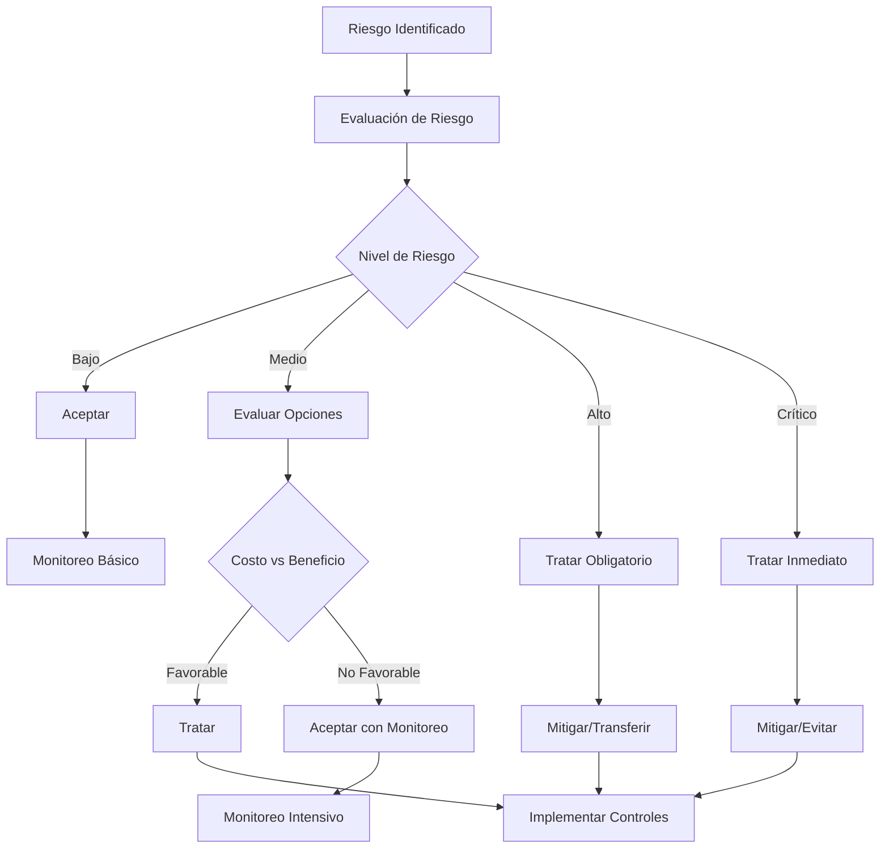
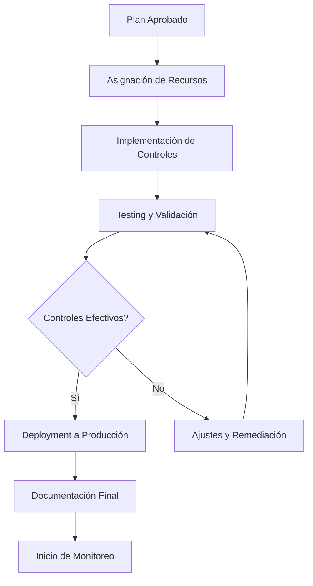
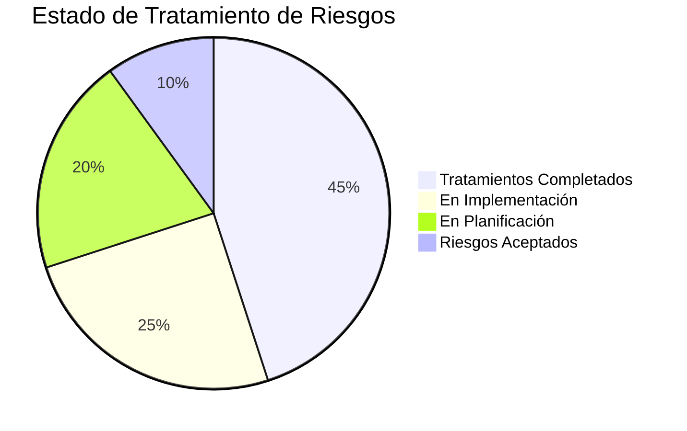
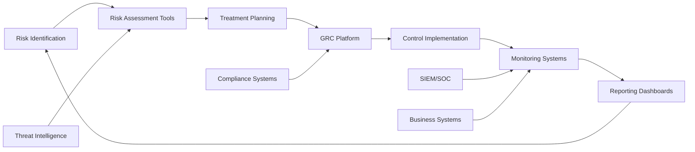

## 📋 Información General

**Documento:** Plan de Tratamiento de Riesgos  
**Código:** COR-PLA-003  
**Versión:** 1.0.0  
**Fecha:** Enero 2025  
**Clasificación:** Confidencial  
**Audiencia:** Executive Team, Risk Management, Gerentes de Área y CISO de DivisionCero

## 🎯 Propósito

Establecer un marco sistemático para el tratamiento efectivo de riesgos identificados en DivisionCero, definiendo estrategias, criterios de decisión y procesos para gestionar los riesgos de manera que se alineen con el appetite de riesgo organizacional y los objetivos estratégicos del negocio.

## 🏢 Alcance

Este plan aplica a:
- **Riesgos Estratégicos**: Amenazas a objetivos de negocio de largo plazo
- **Riesgos Operacionales**: Riesgos en procesos y operaciones diarias
- **Riesgos de Ciberseguridad**: Amenazas tecnológicas y de información
- **Riesgos Financieros**: Exposiciones que afectan la estabilidad financiera
- **Riesgos Regulatorios**: Incumplimientos normativos y legales
- **Riesgos de Terceros**: Exposiciones através de proveedores y socios
- **Riesgos Emergentes**: Nuevas amenazas del entorno empresarial

## 📚 Definiciones

- **Tratamiento de Riesgo:** Proceso de selección e implementación de medidas para modificar el riesgo
- **Appetite de Riesgo:** Nivel de riesgo que la organización está dispuesta a aceptar
- **Tolerancia al Riesgo:** Variación aceptable alrededor del appetite de riesgo
- **Riesgo Residual:** Riesgo que permanece después del tratamiento
- **Control:** Medida que modifica el riesgo (preventivo, detectivo, correctivo)
- **Risk Owner:** Persona con responsabilidad y autoridad para gestionar un riesgo

## 🛡️ Estrategias de Tratamiento

### 📊 Marco de Decisión de Tratamiento



### 🔧 Opciones de Tratamiento

#### 1. Evitar (Avoid)
- **Definición**: Eliminación de la actividad que genera el riesgo
- **Criterios de Aplicación**: 
  - Riesgo crítico con alta probabilidad
  - Costo de control > beneficio de la actividad
  - Actividad no esencial para el negocio
- **Ejemplos**:
  - Discontinuar servicios en geografías de alto riesgo
  - Eliminar funcionalidades inseguras de aplicaciones
  - Cancelar proyectos con riesgo regulatorio inmanejable

#### 2. Mitigar (Mitigate)
- **Definición**: Reducir la probabilidad o impacto del riesgo
- **Criterios de Aplicación**:
  - Riesgo alto o medio con ROI positivo de controles
  - Actividad crítica para el negocio
  - Controles técnicamente viables
- **Tipos de Controles**:
  - **Preventivos**: Evitan que ocurra el evento de riesgo
  - **Detectivos**: Identifican cuando ocurre el evento
  - **Correctivos**: Minimizan el impacto después del evento

#### 3. Transferir (Transfer)
- **Definición**: Compartir o trasladar el riesgo a terceros
- **Criterios de Aplicación**:
  - Riesgo con impacto financiero significativo
  - Terceros especializados disponibles
  - Costo de transferencia < costo potencial del riesgo
- **Mecanismos**:
  - **Seguros**: Cobertura contra pérdidas específicas
  - **Contratos**: Cláusulas de responsabilidad e indemnización
  - **Outsourcing**: Transferencia de actividades riesgosas

#### 4. Aceptar (Accept)
- **Definición**: Mantener el riesgo sin tratamiento adicional
- **Criterios de Aplicación**:
  - Riesgo dentro del appetite organizacional
  - Costo de tratamiento > beneficio esperado
  - Riesgo inherente al modelo de negocio
- **Requisitos**:
  - Aprobación formal del Risk Owner
  - Monitoreo continuo del riesgo
  - Plan de contingencia si se materializa

## 👥 Roles y Responsabilidades

### 🏢 Risk Governance Structure

#### Chief Executive Officer (CEO)
- Establecer el appetite y tolerancia al riesgo organizacional
- Aprobar el Plan de Tratamiento de Riesgos
- Tomar decisiones sobre riesgos estratégicos críticos
- Comunicar la cultura de riesgo a toda la organización

#### Chief Risk Officer (CRO) / Risk Manager
- Liderar el proceso de tratamiento de riesgos
- Facilitar la evaluación y priorización de opciones de tratamiento
- Monitorear la efectividad de los tratamientos implementados
- Reportar el estado de riesgos al Executive Team

#### Risk Committee
- Revisar y aprobar tratamientos para riesgos altos y críticos
- Evaluar la efectividad del programa de gestión de riesgos
- Asegurar alineación entre tratamientos y objetivos estratégicos
- Escalar decisiones complejas al Board/CEO

### 👤 Risk Owners (Dueños de Riesgo)

#### Responsabilidades Principales
- **Identificar y evaluar** riesgos en su área de responsabilidad
- **Proponer tratamientos** apropiados basados en análisis costo-beneficio
- **Implementar controles** aprobados dentro de timelines establecidos
- **Monitorear efectividad** de controles y riesgo residual
- **Reportar cambios** en el perfil de riesgo de manera oportuna

#### Por Área de Negocio
```yaml
Risk_Ownership:
  technology_risks:
    owner: "Chief Technology Officer (CTO)"
    backup: "VP Engineering"
    scope: ["infrastructure", "applications", "data", "cloud_services"]
  
  security_risks:
    owner: "Chief Information Security Officer (CISO)"
    backup: "Security Manager"
    scope: ["cybersecurity", "data_protection", "compliance", "incidents"]
  
  financial_risks:
    owner: "Chief Financial Officer (CFO)"
    backup: "Finance Director"
    scope: ["credit", "liquidity", "market", "operational_finance"]
  
  operational_risks:
    owner: "Chief Operating Officer (COO)"
    backup: "Operations Manager"
    scope: ["processes", "supply_chain", "human_resources", "facilities"]
  
  legal_compliance_risks:
    owner: "General Counsel"
    backup: "Compliance Manager"
    scope: ["regulatory", "contractual", "litigation", "intellectual_property"]
```

## 📋 Proceso de Tratamiento

### 🚀 Workflow de Tratamiento de Riesgos

#### Fase 1: Análisis y Evaluación (1-2 semanas)
```yaml
Risk_Analysis:
  risk_assessment:
    - current_controls: "Evaluate existing control effectiveness"
    - inherent_risk: "Assess risk without controls"
    - residual_risk: "Calculate risk after current controls"
    - risk_velocity: "Speed at which risk could materialize"
  
  options_analysis:
    - treatment_options: "Evaluate avoid/mitigate/transfer/accept"
    - cost_benefit: "Financial analysis of each option"
    - implementation_feasibility: "Technical and operational viability"
    - timeline_requirements: "Speed of implementation needed"
```

#### Fase 2: Selección de Estrategia (3-5 días)
1. **Evaluación de Opciones**
   - Análisis costo-beneficio detallado
   - Evaluación de capacidades internas
   - Consideración de restricciones temporales y presupuestarias

2. **Decisión de Tratamiento**
   - Aplicación de criterios de decisión
   - Consulta con stakeholders relevantes
   - Aprobación según niveles de autoridad

3. **Plan de Implementación**
   - Definición de controles específicos
   - Asignación de recursos y responsabilidades
   - Establecimiento de timeline y milestones

#### Fase 3: Implementación (Variable según complejidad)


#### Fase 4: Monitoreo y Revisión (Continuo)
- **Monitoreo de Controles**: Verificación continua de funcionamiento
- **Medición de Efectividad**: KPIs y métricas de performance
- **Revisión Periódica**: Evaluación regular de relevancia y eficacia
- **Ajustes y Mejoras**: Optimización basada en lecciones aprendidas

### ⚡ Tratamiento de Riesgos Críticos

#### Proceso Expedito (≤ 72 horas)
1. **Activación Inmediata**
   - Notificación al Risk Committee dentro de 4 horas
   - Asignación de War Room si es necesario
   - Comunicación a stakeholders críticos

2. **Evaluación Acelerada**
   - Assessment de impacto y urgencia
   - Identificación de opciones de contención inmediata
   - Decisión ejecutiva sobre curso de acción

3. **Implementación de Emergencia**
   - Deploy de controles temporales
   - Monitoreo intensivo del riesgo
   - Plan para controles permanentes

## 🎯 Criterios de Decisión

### 📊 Matriz de Appetite de Riesgo

| Categoría de Riesgo | Appetite Level | Tolerancia | Tratamiento Requerido |
|---------------------|----------------|------------|----------------------|
| **Seguridad de Datos** | Muy Bajo | 5% del target | Mitigar obligatorio |
| **Disponibilidad Sistemas** | Bajo | 10% del target | Mitigar recomendado |
| **Riesgo Financiero** | Medio | 15% del target | Evaluar opciones |
| **Riesgo Operacional** | Medio-Alto | 20% del target | Aceptar con monitoreo |
| **Riesgo de Mercado** | Alto | 25% del target | Aceptar |

### 💰 Análisis Costo-Beneficio

#### Factores de Costo
```yaml
Cost_Factors:
  direct_costs:
    - implementation: "Initial setup and deployment"
    - operational: "Ongoing maintenance and operation"
    - personnel: "Additional staff or training required"
    - technology: "Hardware, software, and licensing"
  
  indirect_costs:
    - opportunity: "Resources not available for other projects"
    - complexity: "Increased operational complexity"
    - performance: "Potential impact on system performance"
    - user_experience: "Impact on customer/employee experience"
```

#### Factores de Beneficio
- **Reducción de Pérdida Esperada**: Cálculo actuarial de pérdidas evitadas
- **Mejora de Eficiencia**: Optimización de procesos como efecto secundario
- **Ventaja Competitiva**: Diferenciación en el mercado
- **Cumplimiento Regulatorio**: Evitar multas y sanciones

### 🎯 Umbrales de Decisión

#### Matriz de Autorización
| Nivel de Riesgo | Costo del Tratamiento | Nivel de Aprobación |
|-----------------|----------------------|-------------------|
| **Crítico** | Cualquier monto | CEO |
| **Alto** | > $100,000 | Risk Committee |
| **Alto** | ≤ $100,000 | CRO + Risk Owner |
| **Medio** | > $50,000 | Risk Owner + Manager |
| **Medio** | ≤ $50,000 | Risk Owner |
| **Bajo** | > $25,000 | Risk Owner + Manager |
| **Bajo** | ≤ $25,000 | Risk Owner |

## 🔧 Tipos de Controles

### 🛡️ Controles Preventivos

#### Controles Técnicos
- **Access Controls**: Autenticación multifactor, RBAC, PAM
- **Network Security**: Firewalls, IPS/IDS, network segmentation
- **Encryption**: Data at rest, in transit, and in processing
- **Security Architecture**: Secure design patterns, defense in depth

#### Controles de Proceso
- **Segregation of Duties**: Separación de responsabilidades críticas
- **Approval Workflows**: Procesos de autorización multinivel
- **Training & Awareness**: Capacitación continua del personal
- **Vendor Management**: Due diligence y gestión de terceros

### 🔍 Controles Detectivos

#### Monitoreo Tecnológico
```yaml
Detective_Controls:
  security_monitoring:
    - siem_integration: "Security Information and Event Management"
    - threat_detection: "Advanced threat detection systems"
    - vulnerability_scanning: "Continuous vulnerability assessment"
    - log_analysis: "Automated log analysis and correlation"
  
  business_monitoring:
    - transaction_monitoring: "Real-time transaction analysis"
    - performance_metrics: "KPI monitoring and alerting"
    - audit_trails: "Comprehensive activity logging"
    - exception_reporting: "Automated exception detection"
```

#### Controles de Supervisión
- **Management Reviews**: Revisiones periódicas de métricas y KPIs
- **Internal Audits**: Auditorías internas de controles y procesos
- **Third-Party Assessments**: Evaluaciones externas independientes
- **Whistleblower Programs**: Canales seguros para reportar irregularidades

### 🔧 Controles Correctivos

#### Respuesta a Incidentes
- **Incident Response Plans**: Procedimientos estructurados de respuesta
- **Business Continuity**: Planes para mantener operaciones críticas
- **Disaster Recovery**: Procedimientos de recuperación de sistemas
- **Crisis Communication**: Protocolos de comunicación en crisis

#### Remediación y Recovery
- **Automated Recovery**: Sistemas auto-reparables
- **Backup and Restore**: Procedimientos de respaldo y restauración
- **Forensic Capabilities**: Capacidades de investigación digital
- **Legal Response**: Procedimientos legales y regulatorios

## 📊 Métricas y KPIs

### 🎯 KPIs de Efectividad del Tratamiento

#### Métricas Cuantitativas
- **Risk Reduction Ratio**: % de reducción en riesgo residual
- **Control Effectiveness**: % de controles operando según diseño
- **Treatment ROI**: Retorno de inversión en tratamientos
- **Time to Treatment**: Tiempo promedio de implementación

#### Métricas Cualitativas
- **Stakeholder Satisfaction**: Satisfacción con proceso de tratamiento
- **Control Maturity**: Nivel de madurez de controles implementados
- **Risk Culture**: Indicadores de cultura de riesgo organizacional
- **Compliance Level**: Nivel de adherencia a políticas y procedimientos

### 📈 Dashboard de Risk Treatment



### 📋 Reportes de Management

#### Reporte Mensual del CRO
- **Risk Treatment Status**: Estado de tratamientos en curso
- **Newly Identified Risks**: Nuevos riesgos requiriendo tratamiento
- **Treatment Effectiveness**: Métricas de efectividad de controles
- **Budget and Resource Utilization**: Uso de presupuesto y recursos

#### Reporte Trimestral al Risk Committee
- **Strategic Risk Portfolio**: Estado de riesgos estratégicos
- **Treatment Program Performance**: Performance general del programa
- **Emerging Risks**: Nuevas amenazas y oportunidades de tratamiento
- **Regulatory and Compliance Updates**: Cambios normativos relevantes

## 🔧 Herramientas y Tecnologías

### 🛠️ Plataformas de Gestión

#### Governance, Risk & Compliance (GRC)
- **ServiceNow GRC**: Plataforma integrada de GRC
- **MetricStream**: Gestión integral de riesgos empresariales
- **IBM OpenPages**: Risk management y regulatory compliance
- **Microsoft Purview**: Compliance y governance de datos

#### Risk Assessment Tools
```yaml
Risk_Tools:
  quantitative_analysis:
    - monte_carlo: "Simulación de escenarios probabilísticos"
    - value_at_risk: "Cálculo de VaR para riesgos financieros"
    - decision_trees: "Análisis de decisiones complejas"
  
  qualitative_analysis:
    - risk_matrices: "Matrices de probabilidad e impacto"
    - scenario_analysis: "Análisis de escenarios what-if"
    - expert_judgment: "Sistemas de captura de juicio experto"
  
  monitoring_tools:
    - kri_dashboards: "Dashboards de indicadores de riesgo"
    - automated_alerts: "Alertas automáticas por umbrales"
    - trend_analysis: "Análisis de tendencias históricas"
```

### 📊 Integration Framework


## 🏆 Mejores Prácticas

### 🔒 Tratamiento Efectivo
- **Risk-Based Approach**: Priorizar según riesgo real, no solo compliance
- **Continuous Monitoring**: Monitoreo continuo de efectividad de controles
- **Stakeholder Engagement**: Involucrar a business owners en decisiones
- **Cost Optimization**: Balance óptimo entre costo y reducción de riesgo

### 📚 Gestión del Programa
- **Regular Reviews**: Revisión periódica de appetite y estrategias
- **Lessons Learned**: Captura y aplicación de lecciones aprendidas
- **Benchmarking**: Comparación con mejores prácticas de industria
- **Innovation**: Adopción de nuevas tecnologías y metodologías

### 🤖 Automatización Inteligente
- **Automated Controls**: Controles técnicos automatizados donde sea posible
- **Intelligent Alerting**: Alertas inteligentes con reducción de ruido
- **Predictive Analytics**: Analytics predictivo para riesgos emergentes
- **Integration**: Integración seamless entre sistemas de riesgo

## 📋 Cumplimiento y Auditoría

### 🔍 Evidencia de Cumplimiento

#### Documentation Requirements
- **Treatment Plans**: Planes detallados para cada riesgo significativo
- **Control Design**: Documentación de diseño y operación de controles
- **Effectiveness Testing**: Evidencia de testing de efectividad
- **Management Approvals**: Aprobaciones formales de tratamientos

#### Audit Trail Components
```yaml
Audit_Evidence:
  risk_treatment_lifecycle:
    - risk_identification: "Documentation of risk discovery"
    - treatment_selection: "Rationale for treatment choice"
    - implementation_records: "Evidence of control deployment"
    - monitoring_results: "Ongoing effectiveness monitoring"
  
  governance_evidence:
    - committee_minutes: "Risk committee decisions and rationale"
    - approval_workflows: "Formal approval processes"
    - policy_compliance: "Adherence to risk management policies"
    - regulatory_alignment: "Compliance with applicable regulations"
```

### 📊 Compliance Frameworks

#### Enterprise Risk Management
- **COSO ERM**: Committee of Sponsoring Organizations framework
- **ISO 31000**: International standard for risk management
- **NIST RMF**: Risk Management Framework for information systems
- **COBIT 2019**: Governance and management of enterprise IT

#### Industry-Specific
- **SOX Section 404**: Internal controls over financial reporting
- **Basel III**: Banking regulatory framework for risk management
- **Solvency II**: Insurance risk management regulation
- **GDPR**: Data protection and privacy risk management

## 🔄 Mejora Continua

### 📅 Ciclo de Optimización

#### Revisiones Periódicas
- **Mensual**: Métricas operacionales y KRIs
- **Trimestral**: Efectividad de controles y tratamientos
- **Semestral**: Appetite de riesgo y estrategias de tratamiento
- **Anual**: Revisión completa del programa y metodologías

#### Evolución del Programa
```yaml
Improvement_Areas:
  methodology_enhancement:
    - quantitative_modeling: "Mejor modelado cuantitativo de riesgos"
    - scenario_planning: "Escenarios más sofisticados y realistas"
    - predictive_capabilities: "Capacidades predictivas avanzadas"
  
  technology_advancement:
    - ai_ml_integration: "Inteligencia artificial y machine learning"
    - automation_expansion: "Mayor automatización de procesos"
    - real_time_monitoring: "Monitoreo en tiempo real de riesgos"
  
  organizational_maturity:
    - risk_culture: "Fortalecimiento de cultura de riesgo"
    - competency_development: "Desarrollo de competencias especializadas"
    - strategic_integration: "Mayor integración con estrategia de negocio"
```

### 🎯 Roadmap 2025-2027

#### 2025 Goals
- **Automation**: 70% de controles técnicos automatizados
- **Response Time**: Reducir tiempo de tratamiento en 40%
- **Risk Reduction**: Lograr 25% de reducción en riesgo residual
- **ROI**: Demostrar ROI positivo en 90% de tratamientos

#### 2026 Vision
- **Predictive Risk**: Modelos predictivos para riesgos emergentes
- **Integrated GRC**: Plataforma GRC completamente integrada
- **Real-Time Decisions**: Decisiones de tratamiento en tiempo real
- **Advanced Analytics**: Analytics avanzado para optimización

#### 2027 Evolution
- **AI-Driven Treatment**: IA para recomendaciones automáticas
- **Dynamic Controls**: Controles que se adaptan automáticamente
- **Continuous Optimization**: Optimización continua automática
- **Business Integration**: Integración completa con procesos de negocio

## 📚 Referencias y Estándares

### 📖 Documentos Relacionados
- [Matriz de Riesgos de Ciberseguridad](matriz-riesgos-ciberseguridad)
- [Política de Gestión de Riesgos](matriz-riesgos-seguridad-informacion)
- [Plan de Respuesta a Incidentes](plan-respuesta-incidentes)
- [Política de Continuidad del Negocio](politica-continuidad-negocio)
- [Política de Cumplimiento Regulatorio](politica-cumplimiento-regulatorio-legal)

### 🌐 Marcos de Referencia
- **COSO ERM**: Enterprise Risk Management - Integrating with Strategy and Performance
- **ISO 31000:2018**: Risk Management - Guidelines
- **NIST SP 800-39**: Managing Information Security Risk
- **FAIR**: Factor Analysis of Information Risk

### 🔗 Recursos Externos
- **Risk Management Society (RIMS)**: Professional risk management resources
- **Institute of Risk Management (IRM)**: Risk management best practices
- **ISACA**: Governance and risk management for IT
- **Global Association of Risk Professionals (GARP)**: Risk management education

## 📝 Control de Versiones

| Versión | Fecha | Cambios | Autor |
|---------|-------|---------|-------|
| 1.0.0 | Enero 2025 | Versión inicial - Plan completo de tratamiento de riesgos | Risk Management Team + Executive Sponsors |

---

**Próxima Revisión:** Julio 2025  
**Aprobado por:** [CEO] - [Fecha]  
**Clasificación:** Confidencial - Uso Interno DivisionCero
