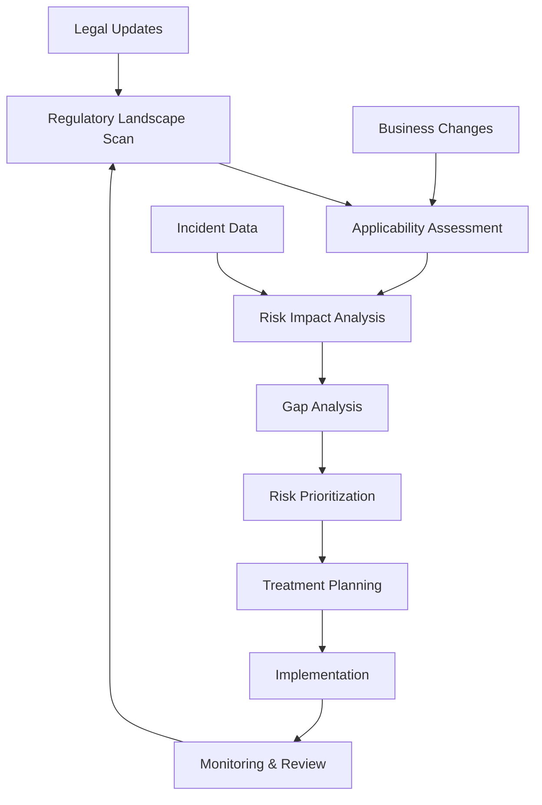
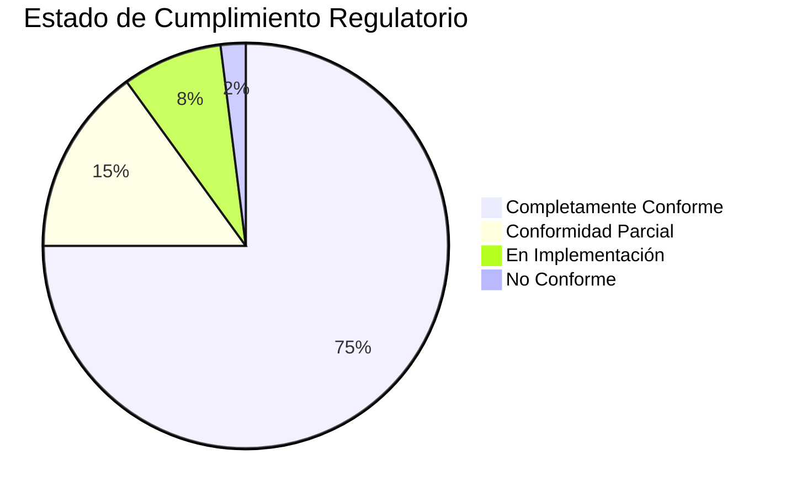
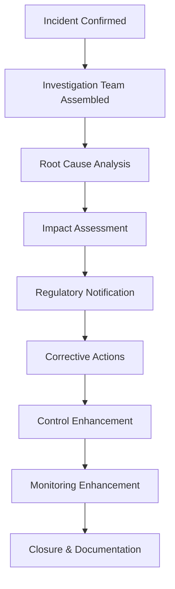
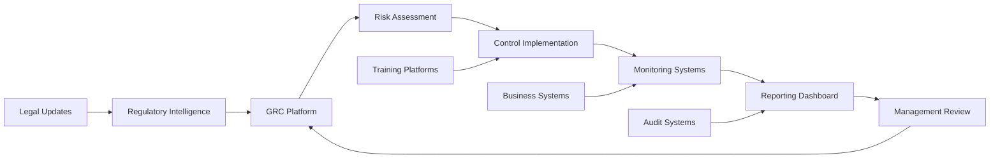

## 📋 Información General

**Documento:** Política de Cumplimiento Regulatorio y Legal  
**Código:** COR-POL-004  
**Versión:** 1.0.0  
**Fecha:** Enero 2025  
**Clasificación:** Confidencial  
**Audiencia:** Todos los empleados, Executive Team, Legal & Compliance, y Stakeholders de DivisionCero

## 🎯 Propósito

Establecer un marco integral para asegurar el cumplimiento de todas las obligaciones regulatorias, legales y contractuales aplicables a DivisionCero, minimizando riesgos de incumplimiento y fortaleciendo la posición competitiva de la empresa mediante una cultura de cumplimiento proactiva y eficaz.

## 🏢 Alcance

Esta política aplica a:
- **Todas las operaciones** de DivisionCero en todas las jurisdicciones
- **Empleados, contratistas y consultores** en cualquier capacidad
- **Proveedores y socios** que manejen datos o procesos regulados
- **Productos y servicios** ofrecidos por la organización
- **Operaciones internacionales** y transferencias transfronterizas de datos
- **Adquisiciones, fusiones** y joint ventures que involucren a DivisionCero

## 📚 Definiciones

- **Compliance:** Cumplimiento de leyes, regulaciones, estándares y políticas aplicables
- **Regulación:** Regla o directiva emitida por una autoridad gubernamental
- **Due Diligence:** Investigación exhaustiva de riesgos legales y regulatorios
- **Breach:** Violación o incumplimiento de una obligación legal o regulatoria
- **Remediation:** Acciones correctivas para resolver incumplimientos identificados
- **Compliance Officer:** Persona responsable de supervisar cumplimiento organizacional

## 🛡️ Marco Regulatorio

### 🌐 Jurisdicciones y Regulaciones Aplicables

#### Protección de Datos y Privacidad
```yaml
Data_Protection_Regulations:
  global:
    - gdpr: "General Data Protection Regulation (EU)"
    - ccpa: "California Consumer Privacy Act (US)"
    - lgpd: "Lei Geral de Proteção de Dados (Brazil)"
    - pipeda: "Personal Information Protection and Electronic Documents Act (Canada)"
  
  regional:
    - appi: "Act on Protection of Personal Information (Japan)"
    - pdpa: "Personal Data Protection Act (Singapore)"
    - popia: "Protection of Personal Information Act (South Africa)"
    - dpa: "Data Protection Act (UK)"
```

#### Ciberseguridad y Tecnología
- **SOX (Sarbanes-Oxley Act)**: Controles de TI para empresas públicas
- **HIPAA**: Protección de información de salud (si aplicable)
- **PCI DSS**: Estándares de seguridad para industria de pagos
- **ISO 27001**: Estándar internacional de gestión de seguridad
- **SOC 2**: Controles de seguridad para proveedores de servicios

#### Regulaciones Sectoriales
```yaml
Industry_Regulations:
  financial_services:
    - pci_dss: "Payment Card Industry Data Security Standard"
    - aml: "Anti-Money Laundering regulations"
    - kyc: "Know Your Customer requirements"
    - sox: "Sarbanes-Oxley financial controls"
  
  healthcare:
    - hipaa: "Health Insurance Portability and Accountability Act"
    - hitech: "Health Information Technology for Economic and Clinical Health"
    - fda: "Food and Drug Administration regulations"
  
  cloud_services:
    - fedramp: "Federal Risk and Authorization Management Program"
    - itar: "International Traffic in Arms Regulations"
    - ear: "Export Administration Regulations"
```

### 📊 Matriz de Aplicabilidad Regulatoria

| Regulación | Aplicabilidad | Nivel de Riesgo | Responsable Principal |
|------------|---------------|-----------------|----------------------|
| **GDPR** | Alta - Clientes EU | Crítico | Chief Privacy Officer |
| **CCPA** | Alta - Clientes CA | Alto | Legal & Compliance |
| **SOX** | Media - Si público | Alto | CFO |
| **PCI DSS** | Alta - Pagos | Crítico | CISO |
| **ISO 27001** | Alta - Certificación | Medio | CISO |
| **SOC 2** | Alta - B2B | Alto | CTO + CISO |

## 👥 Roles y Responsabilidades

### 🏢 Governance Structure

#### Chief Executive Officer (CEO)
- Establecer el tono de cumplimiento desde la alta dirección
- Aprobar políticas y procedimientos de compliance
- Asegurar recursos adecuados para el programa de cumplimiento
- Asumir responsabilidad final por cumplimiento organizacional

#### Chief Legal Officer / General Counsel
- Liderar la función de cumplimiento legal y regulatorio
- Interpretar requisitos legales y regulatorios aplicables
- Asesorar al management sobre riesgos de compliance
- Coordinar con autoridades regulatorias cuando sea necesario

#### Chief Compliance Officer (CCO)
- Desarrollar e implementar el programa de compliance
- Monitorear cumplimiento continuo de obligaciones
- Conducir investigaciones de incumplimientos
- Reportar estado de compliance al Executive Team y Board

### 🛡️ Compliance Committee

#### Composición del Comité
- **Chair**: Chief Legal Officer
- **Members**: CEO, CFO, CTO, CISO, HR Director, CCO
- **Secretary**: Compliance Manager
- **External Advisor**: External legal counsel (cuando se requiera)

#### Responsabilidades del Comité
```yaml
Committee_Responsibilities:
  strategic_oversight:
    - compliance_strategy: "Define organizational compliance strategy"
    - risk_assessment: "Assess compliance risks and priorities"
    - resource_allocation: "Approve compliance budget and resources"
    - policy_approval: "Review and approve compliance policies"
  
  operational_governance:
    - monitoring_oversight: "Oversee compliance monitoring activities"
    - incident_response: "Manage response to compliance breaches"
    - training_oversight: "Ensure compliance training programs"
    - vendor_compliance: "Oversee third-party compliance requirements"
```

### 👤 Business Unit Responsibilities

#### Line Managers
- Implementar controles de compliance en sus áreas
- Asegurar que personal reciba training apropiado
- Reportar incidentes de compliance potenciales
- Mantener documentación de compliance actualizada

#### Employees
- Conocer y cumplir políticas y procedimientos aplicables
- Completar training obligatorio de compliance
- Reportar violaciones observadas o sospechadas
- Cooperar con investigaciones de compliance

## 📋 Programa de Compliance

### 🚀 Componentes del Programa

#### 1. Compliance Risk Assessment


#### 2. Policies & Procedures
- **Policy Development**: Creación de políticas basadas en requisitos
- **Procedure Documentation**: Procedimientos operacionales detallados
- **Standards & Guidelines**: Estándares técnicos y guías de implementación
- **Regular Updates**: Actualización basada en cambios regulatorios

#### 3. Training & Awareness
```yaml
Training_Program:
  general_compliance:
    - audience: "All employees"
    - frequency: "Annual"
    - content: ["code_of_conduct", "reporting_mechanisms", "key_regulations"]
    - delivery: "Online learning platform"
  
  role_specific:
    - data_handlers: ["gdpr_training", "data_classification", "breach_response"]
    - it_staff: ["security_standards", "incident_response", "audit_procedures"]
    - management: ["compliance_oversight", "risk_management", "escalation"]
  
  specialized_training:
    - compliance_team: "Professional certifications and specialized education"
    - high_risk_roles: "Enhanced training for roles with compliance exposure"
```

#### 4. Monitoring & Testing
- **Continuous Monitoring**: Sistemas automatizados de detección
- **Compliance Audits**: Auditorías internas y externas regulares
- **Control Testing**: Validación periódica de efectividad de controles
- **Performance Metrics**: KPIs y métricas de compliance

### ⚡ Compliance Management Process

#### Fase 1: Identification & Assessment (Continuo)
1. **Regulatory Monitoring**
   - Suscripción a alertas regulatorias
   - Monitoreo de cambios legislativos
   - Participation en asociaciones industriales

2. **Applicability Analysis**
   - Evaluación de aplicabilidad a DivisionCero
   - Assessment de impacto en operaciones
   - Determinación de requisitos específicos

3. **Gap Analysis**
   - Comparación con estado actual
   - Identificación de brechas de compliance
   - Priorización basada en riesgo

#### Fase 2: Implementation Planning (2-4 semanas)
```yaml
Implementation_Planning:
  requirement_analysis:
    - detailed_requirements: "Break down regulatory requirements"
    - control_mapping: "Map to existing controls and gaps"
    - resource_assessment: "Determine resources needed"
  
  project_planning:
    - timeline_development: "Create implementation timeline"
    - resource_allocation: "Assign responsibilities and budget"
    - milestone_definition: "Define key deliverables and checkpoints"
  
  stakeholder_engagement:
    - affected_teams: "Identify and engage affected business units"
    - training_needs: "Assess training and communication needs"
    - change_management: "Plan for organizational change"
```

#### Fase 3: Implementation & Control Deployment
1. **Control Implementation**
   - Deploy de controles técnicos
   - Establecimiento de procesos operacionales
   - Configuración de sistemas de monitoreo

2. **Training Rollout**
   - Capacitación del personal relevante
   - Comunicación de cambios de política
   - Actualización de documentación

3. **Validation Testing**
   - Testing de controles implementados
   - Validación de efectividad
   - Corrección de deficiencias identificadas

#### Fase 4: Ongoing Monitoring & Maintenance
- **Performance Monitoring**: Métricas continuas de compliance
- **Regular Reviews**: Revisiones periódicas de effectiveness
- **Update Management**: Gestión de cambios regulatorios
- **Incident Response**: Respuesta a breaches de compliance

## 🔍 Monitoreo y Control

### 📊 Key Performance Indicators (KPIs)

#### Métricas de Compliance
- **Compliance Rate**: % de requisitos cumplidos completamente
- **Time to Compliance**: Tiempo promedio para implementar nuevos requisitos
- **Training Completion**: % de empleados con training actualizado
- **Audit Findings**: Número y severidad de hallazgos de auditoría

#### Métricas de Riesgo
- **Breach Incidents**: Número de incidentes de compliance reportados
- **Regulatory Actions**: Acciones regulatorias recibidas
- **Fine/Penalty Amount**: Monto de multas y penalidades
- **Remediation Time**: Tiempo promedio de remediación de issues

### 🚨 Sistema de Alertas
```yaml
Alert_System:
  regulatory_changes:
    - source: "Legal intelligence feeds"
    - frequency: "Real-time"
    - recipients: ["Legal team", "Compliance team", "Affected business units"]
  
  compliance_incidents:
    - triggers: ["Control failures", "Policy violations", "Audit findings"]
    - escalation: "Automatic escalation based on severity"
    - response_time: "≤ 24 hours for high severity"
  
  performance_metrics:
    - thresholds: "Pre-defined KPI thresholds"
    - reporting: "Monthly dashboard updates"
    - management_alerts: "Automated alerts for threshold breaches"
```

### 📈 Dashboard de Compliance



## 🚨 Gestión de Incidentes de Compliance

### 📝 Clasificación de Incidentes

#### Severidad de Incidentes
| Nivel | Descripción | Ejemplos | Tiempo de Respuesta |
|-------|-------------|----------|-------------------|
| **Crítico** | Violación que requiere notificación regulatoria | Data breach GDPR, Fraude financiero | ≤ 1 hora |
| **Alto** | Incumplimiento significativo con impacto material | Falla de control SOX, Violation PCI | ≤ 4 horas |
| **Medio** | Incumplimiento con riesgo controlado | Policy violation, Training gap | ≤ 24 horas |
| **Bajo** | Desviación menor sin impacto significativo | Documentation gap, Minor process deviation | ≤ 72 horas |

#### Tipos de Incidentes
```yaml
Incident_Types:
  data_protection:
    - data_breach: "Unauthorized access to personal data"
    - data_loss: "Accidental loss or deletion of protected data"
    - consent_violation: "Processing without proper consent"
    - transfer_violation: "Inappropriate international data transfer"
  
  financial_compliance:
    - sox_control_failure: "Material weakness in internal controls"
    - financial_misstatement: "Error in financial reporting"
    - audit_trail_gap: "Missing or inadequate audit documentation"
  
  operational_compliance:
    - policy_violation: "Employee violation of compliance policies"
    - training_deficiency: "Inadequate compliance training"
    - vendor_non_compliance: "Third-party compliance failure"
```

### 🔧 Proceso de Respuesta a Incidentes

#### Immediate Response (0-4 horas)
1. **Incident Detection & Reporting**
   - Automated detection systems
   - Employee reporting mechanisms
   - External notifications

2. **Initial Assessment**
   - Scope and impact evaluation
   - Regulatory notification requirements
   - Stakeholder notification needs

3. **Containment & Stabilization**
   - Immediate containment actions
   - Prevention of further damage
   - Evidence preservation

#### Investigation & Remediation (4-72 horas)


#### Long-term Remediation & Prevention
- **Process Improvements**: Mejoras basadas en lecciones aprendidas
- **Control Enhancements**: Fortalecimiento de controles existentes
- **Training Updates**: Actualización de programas de capacitación
- **Policy Revisions**: Revisión de políticas y procedimientos

## 📋 Gestión de Terceros

### 🤝 Due Diligence de Proveedores

#### Evaluación de Compliance de Terceros
```yaml
Vendor_Assessment:
  initial_screening:
    - regulatory_requirements: "Identify applicable regulations for vendor"
    - compliance_questionnaire: "Detailed compliance assessment"
    - certification_verification: "Verify relevant certifications"
    - reference_checks: "Validate compliance track record"
  
  ongoing_monitoring:
    - periodic_reviews: "Annual compliance reviews"
    - incident_monitoring: "Monitor for compliance incidents"
    - certification_renewals: "Track certification expiration dates"
    - performance_metrics: "Monitor compliance KPIs"
```

#### Categorización de Proveedores
- **Críticos**: Acceso a datos sensibles o procesos críticos
- **Altos**: Impacto significativo en compliance organizacional
- **Medios**: Impacto moderado, monitoreo estándar
- **Bajos**: Impacto mínimo, revisión básica

### 📜 Contratos y Cláusulas de Compliance

#### Cláusulas Estándar Requeridas
- **Data Protection**: Cláusulas GDPR, CCPA y protección de datos
- **Security Standards**: Requisitos de seguridad y certificaciones
- **Audit Rights**: Derechos de auditoría y inspección
- **Incident Notification**: Obligaciones de notificación de incidentes
- **Compliance Warranties**: Garantías de cumplimiento regulatorio
- **Indemnification**: Protección contra incumplimientos de terceros

## 🔧 Herramientas y Tecnologías

### 🛠️ GRC Platform Stack

#### Governance, Risk & Compliance (GRC) Platforms
- **ServiceNow GRC**: Gestión integrada de compliance
- **MetricStream**: Enterprise GRC y risk management
- **LogicGate**: Risk cloud platform
- **Resolver**: Integrated risk management

#### Compliance-Specific Tools
```yaml
Compliance_Tools:
  data_protection:
    - oneTrust: "Privacy management platform"
    - trustArc: "Privacy compliance automation"
    - securiti: "Data governance and privacy"
  
  financial_compliance:
    - workiva: "SOX compliance and reporting"
    - appZen: "Financial compliance automation"
    - mindbridge: "AI-powered audit and compliance"
  
  security_compliance:
    - rapid7: "Security compliance monitoring"
    - qualys: "Vulnerability and compliance management"
    - tenable: "Cyber exposure platform"
```

#### Monitoring & Analytics
- **Splunk**: Log analysis y compliance monitoring
- **IBM QRadar**: Security intelligence y compliance
- **Tableau**: Compliance dashboard y reporting
- **Power BI**: Business intelligence para compliance metrics

### 📊 Integration Framework


## 🏆 Mejores Prácticas

### 🔒 Compliance Efectivo
- **Proactive Approach**: Anticipar cambios regulatorios antes de implementación
- **Risk-Based Focus**: Priorizar basado en riesgo real de incumplimiento
- **Business Integration**: Integrar compliance en procesos de negocio
- **Continuous Improvement**: Optimización continua basada en performance

### 📚 Gestión del Programa
- **Clear Accountability**: Asignación clara de responsabilidades
- **Regular Communication**: Comunicación frecuente con stakeholders
- **Documentation**: Documentación comprensiva y accesible
- **Training Excellence**: Programas de capacitación efectivos y actualizados

### 🤖 Automatización y Eficiencia
- **Automated Monitoring**: Monitoreo automatizado donde sea posible
- **Workflow Automation**: Automatización de procesos de compliance
- **Intelligent Alerting**: Alertas inteligentes con reducción de ruido
- **Data Analytics**: Analytics avanzado para insights de compliance

## 📊 Auditoría y Certificaciones

### 🔍 Programa de Auditoría

#### Auditorías Internas
- **Frecuencia**: Auditorías anuales de cada área de compliance
- **Scope**: Evaluación de diseño y efectividad operacional
- **Resources**: Equipo interno o co-sourced con external experts
- **Follow-up**: Tracking de remediation de findings

#### Auditorías Externas
```yaml
External_Audits:
  financial_audits:
    - sox_404: "Annual SOX 404 compliance audit"
    - financial_statement: "Annual financial statement audit"
    - internal_controls: "Quarterly internal controls testing"
  
  security_audits:
    - soc2_type2: "Annual SOC 2 Type II audit"
    - iso27001: "Annual ISO 27001 certification audit"
    - pci_dss: "Annual PCI DSS compliance assessment"
  
  privacy_audits:
    - gdpr_compliance: "Annual GDPR compliance assessment"
    - privacy_impact: "Privacy impact assessments for new initiatives"
```

#### Certificaciones Target
- **ISO 27001**: Information Security Management
- **SOC 2 Type II**: Security, Availability, Processing Integrity
- **PCI DSS**: Payment Card Industry Data Security
- **FedRAMP**: Federal Risk and Authorization Management (si aplicable)

### 📋 Evidence Management

#### Documentation Requirements
- **Policy Evidence**: Políticas aprobadas y comunicadas
- **Training Records**: Evidencia de capacitación completada
- **Control Testing**: Resultados de testing de controles
- **Incident Reports**: Documentación de incidentes y remediation

#### Retention Policy
```yaml
Retention_Requirements:
  compliance_documentation:
    - policies_procedures: "7 years after superseded"
    - training_records: "3 years after completion"
    - audit_reports: "7 years after issuance"
    - incident_reports: "7 years after closure"
  
  regulatory_specific:
    - sox_documentation: "7 years (SEC requirement)"
    - gdpr_records: "As long as processing continues + 3 years"
    - pci_documentation: "3 years (PCI DSS requirement)"
```

## 🔄 Mejora Continua

### 📅 Ciclo de Revisión

#### Revisiones Operacionales
- **Diario**: Monitoreo de alertas y métricas críticas
- **Semanal**: Review de incidentes y performance metrics
- **Mensual**: Análisis de tendencias y efectividad de controles
- **Trimestral**: Revisión del programa y strategic adjustments

#### Evolución del Programa
```yaml
Program_Evolution:
  2025_objectives:
    - automation_enhancement: "50% automation of compliance processes"
    - real_time_monitoring: "Real-time compliance monitoring implementation"
    - predictive_analytics: "Predictive compliance risk modeling"
    - integration_improvement: "Better integration with business processes"
  
  2026_vision:
    - ai_driven_compliance: "AI-powered compliance monitoring and prediction"
    - continuous_compliance: "Continuous compliance validation"
    - global_harmonization: "Harmonized global compliance approach"
    - stakeholder_transparency: "Enhanced transparency with regulators"
  
  2027_evolution:
    - autonomous_compliance: "Self-healing compliance systems"
    - regulatory_anticipation: "Proactive regulatory change management"
    - business_value_creation: "Compliance as competitive advantage"
```

### 🎯 Benchmarking y Mejores Prácticas
- **Industry Benchmarking**: Comparación con peers de industria
- **Regulatory Guidance**: Seguimiento de guidance regulatorio actualizado
- **Professional Development**: Continuous learning para compliance teams
- **Technology Innovation**: Adopción de nuevas tecnologías de compliance

## 📚 Referencias y Estándares

### 📖 Documentos Relacionados
- [Política de Seguridad de la Información](politica-seguridad-informacion)
- [Política de Protección de Datos Personales](politica-proteccion-datos-personales)
- [Plan de Tratamiento de Riesgos](plan-tratamiento-riesgos)
- [Política de Gestión de Terceros](politica-evaluacion-terceros)
- [Plan de Respuesta a Incidentes](plan-respuesta-incidentes)

### 🌐 Marcos de Referencia
- **COSO Internal Control**: Framework for internal control systems
- **ISO 19600**: Compliance management systems guidelines
- **ISO 37301**: Compliance management systems requirements
- **COBIT 2019**: Governance and management of enterprise IT

### 🔗 Recursos Regulatorios
- **Federal Register**: US federal regulations and proposed rules
- **EUR-Lex**: European Union law and legislation
- **IAPP**: International Association of Privacy Professionals
- **ISACA**: Information systems audit and control association

## 📝 Control de Versiones

| Versión | Fecha | Cambios | Autor |
|---------|-------|---------|-------|
| 1.0.0 | Enero 2025 | Versión inicial - Política completa de cumplimiento regulatorio y legal | Legal & Compliance Team + Executive Sponsors |

---

**Próxima Revisión:** Julio 2025  
**Aprobado por:** [CEO] - [Fecha]  
**Clasificación:** Confidencial - Uso Interno DivisionCero
