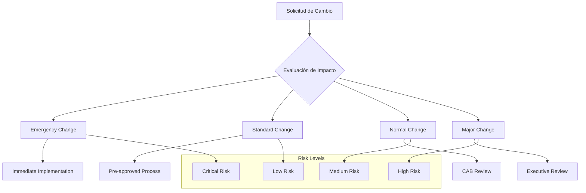
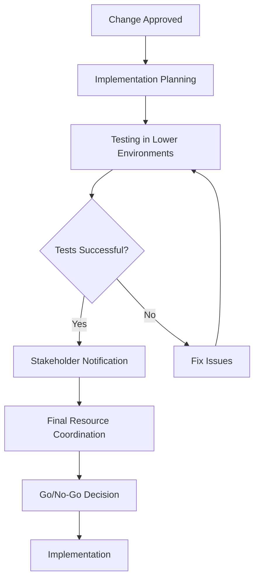
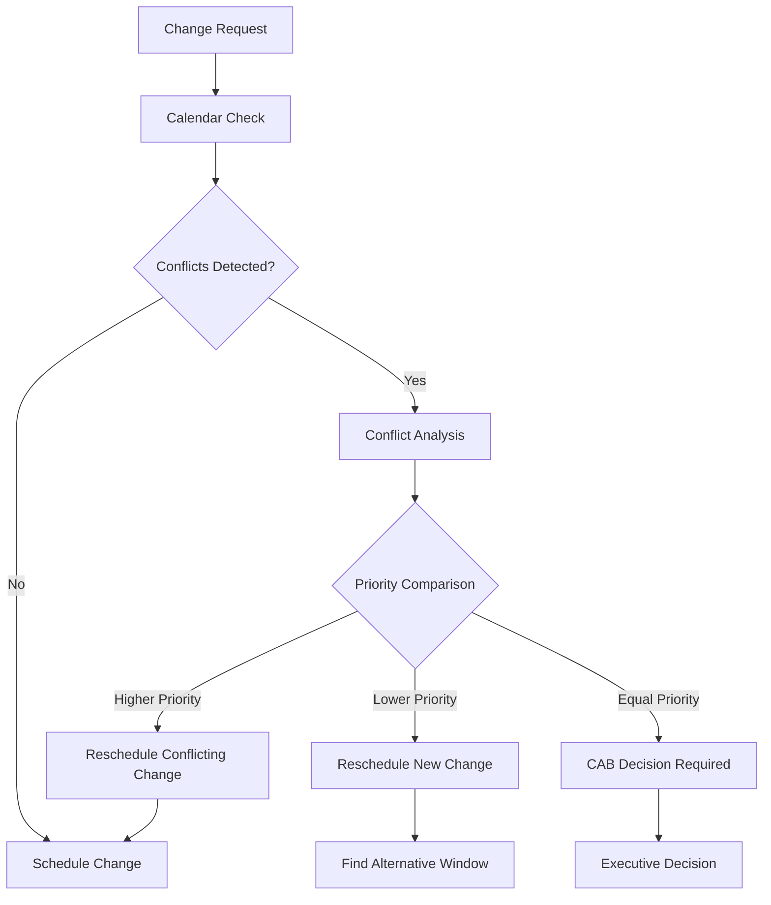
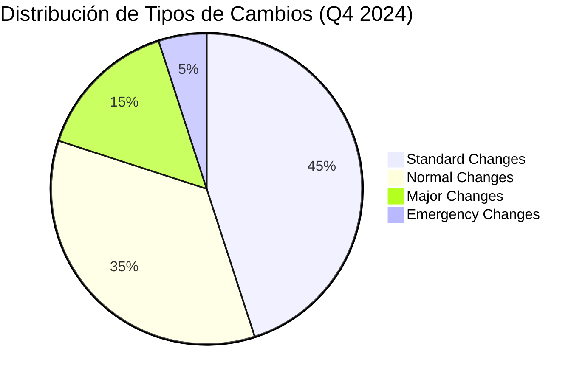

## 📋 Información General

**Documento:** Política de Gestión de Cambios  
**Código:** CCN-POL-002  
**Versión:** 1.0.0  
**Fecha:** Enero 2025  
**Clasificación:** Confidencial  
**Audiencia:** Equipos de TI, Desarrollo, Infraestructura, QA y Change Advisory Board de DivisionCero

## 🎯 Propósito

Establecer un marco estructurado para la gestión de cambios en los sistemas de información de DivisionCero, asegurando que todas las modificaciones sean planificadas, evaluadas, aprobadas, implementadas y revisadas de manera controlada para minimizar riesgos operacionales y mantener la estabilidad de los servicios.

## 🏢 Alcance

Esta política aplica a:
- **Sistemas de Información**: Aplicaciones, bases de datos, middleware
- **Infraestructura Tecnológica**: Servidores, redes, almacenamiento, servicios cloud
- **Software y Aplicaciones**: Código fuente, configuraciones, releases
- **Procesos y Procedimientos**: Cambios en flujos operacionales de TI
- **Personal y Organización**: Cambios en roles, responsabilidades, equipos
- **Terceros y Proveedores**: Cambios que involucren servicios externos
- **Entornos**: Desarrollo, testing, staging, producción

## 📚 Definiciones

- **Cambio:** Adición, modificación o eliminación de cualquier elemento autorizado
- **RFC (Request for Change):** Solicitud formal de cambio documentada
- **CAB (Change Advisory Board):** Comité de evaluación y aprobación de cambios
- **Change Owner:** Persona responsable del éxito del cambio
- **Rollback:** Proceso de reversión a estado anterior al cambio
- **Change Window:** Ventana de tiempo autorizada para implementar cambios
- **PIR (Post Implementation Review):** Revisión posterior a la implementación

## 🛡️ Tipos de Cambios

### 📊 Clasificación por Impacto y Riesgo



### 🔧 Tipos de Cambios por Categoría

#### 1. Emergency Changes (Cambios de Emergencia)
- **Definición**: Cambios que deben implementarse inmediatamente
- **Criterios**: Riesgo inmediato para la seguridad, disponibilidad o integridad
- **Aprobación**: Post-implementación con justificación
- **Ejemplos**:
  - Parches de seguridad críticos
  - Fixes de incidentes críticos en producción
  - Respuesta a ataques de ciberseguridad

#### 2. Standard Changes (Cambios Estándar)
- **Definición**: Cambios rutinarios y de bajo riesgo pre-aprobados
- **Criterios**: Procedimientos bien establecidos y probados
- **Aprobación**: Pre-autorizada con procedimiento documentado
- **Ejemplos**:
  - Instalación de software estándar
  - Creación de cuentas de usuario
  - Actualizaciones de antivirus

#### 3. Normal Changes (Cambios Normales)
- **Definición**: Cambios que requieren evaluación y aprobación del CAB
- **Criterios**: Riesgo medio con impacto moderado
- **Aprobación**: CAB review y autorización formal
- **Ejemplos**:
  - Actualizaciones de aplicaciones
  - Cambios de configuración
  - Migraciones de datos menores

#### 4. Major Changes (Cambios Mayores)
- **Definición**: Cambios de alto impacto que afectan múltiples sistemas
- **Criterios**: Alto riesgo, alta complejidad, múltiples stakeholders
- **Aprobación**: Executive review + CAB + extensive testing
- **Ejemplos**:
  - Migraciones completas de sistemas
  - Nuevas implementaciones de software
  - Cambios de arquitectura

### 📈 Matriz de Clasificación

| Tipo | Impacto | Riesgo | Tiempo de Aprobación | Ventana de Implementación |
|------|---------|--------|---------------------|---------------------------|
| **Emergency** | Alto/Crítico | Alto | Inmediata | 24/7 |
| **Standard** | Bajo | Bajo | Pre-aprobada | Horarios definidos |
| **Normal** | Medio | Medio | 3-5 días | Ventanas programadas |
| **Major** | Alto | Alto | 1-2 semanas | Ventanas planificadas |

## 👥 Roles y Responsabilidades

### 🏢 Change Advisory Board (CAB)

#### Composición del CAB
- **Chair**: Change Manager (IT Operations)
- **Permanent Members**: 
  - CTO o VP Engineering
  - Security Manager (CISO delegate)
  - Infrastructure Manager
  - Application Development Manager
  - QA Manager
- **Variable Members** (según tipo de cambio):
  - Business Representatives
  - External Vendors
  - Subject Matter Experts

#### Responsabilidades del CAB
```yaml
CAB_Responsibilities:
  evaluation_and_approval:
    - risk_assessment: "Evaluate technical and business risks"
    - impact_analysis: "Assess impact on services and users"
    - resource_validation: "Confirm availability of required resources"
    - timeline_review: "Validate proposed implementation schedule"
  
  strategic_oversight:
    - policy_compliance: "Ensure adherence to change management policy"
    - standard_development: "Develop and maintain change standards"
    - process_improvement: "Continuously improve change processes"
    - metrics_review: "Monitor change management performance"
```

### 👤 Roles Específicos

#### Change Manager
- Liderar el proceso de gestión de cambios organizacional
- Facilitar reuniones del CAB y toma de decisiones
- Mantener el calendario maestro de cambios
- Reportar métricas y performance a management
- Asegurar compliance con políticas y procedimientos

#### Change Owner
- Responsable del éxito general del cambio específico
- Coordinar todos los aspectos de planning e implementación
- Comunicar progreso y status a stakeholders
- Asegurar que testing y validación sean adecuados
- Ejecutar rollback si es necesario

#### Technical Lead
- Proporcionar expertise técnico para evaluación del cambio
- Desarrollar plan técnico detallado de implementación
- Supervisar implementación técnica del cambio
- Validar que el cambio funciona según especificaciones
- Documentar configuraciones y procedimientos

#### Business Sponsor
- Proporcionar justificación de negocio para el cambio
- Aprobar impacto en operaciones de negocio
- Comunicar con usuarios finales y stakeholders
- Validar que el cambio cumple requisitos de negocio
- Autorizar go-live desde perspectiva de negocio

## 📋 Proceso de Gestión de Cambios

### 🚀 Workflow Estándar de Cambios

#### Fase 1: Request and Initial Assessment (1-3 días)
```yaml
Request_Phase:
  change_request_creation:
    - rfc_submission: "Submit detailed RFC with business justification"
    - initial_categorization: "Classify change type and priority"
    - impact_assessment: "Preliminary impact and risk evaluation"
    - resource_estimation: "Estimate effort, time, and resources needed"
  
  stakeholder_identification:
    - change_owner_assignment: "Assign responsible change owner"
    - technical_lead_assignment: "Assign technical implementation lead"
    - business_sponsor_identification: "Identify business stakeholder"
    - affected_parties: "Identify all parties affected by change"
```

#### Fase 2: Planning and Authorization (3-7 días)
1. **Detailed Planning**
   - Desarrollo de plan técnico detallado
   - Identificación de dependencias y prerequisitos
   - Definición de criteria de éxito y rollback
   - Coordination con change calendar

2. **Risk Assessment**
   - Análisis de riesgos técnicos y de negocio
   - Evaluación de impacto en otros sistemas
   - Assessment de recursos y timeline
   - Contingency planning

3. **CAB Review and Approval**
   - Presentación formal al CAB
   - Review de documentación y planes
   - Q&A session con change owner
   - Formal approval o rejection decision

#### Fase 3: Implementation Preparation (1-5 días)


#### Fase 4: Implementation and Verification (Variable)
1. **Pre-Implementation Checks**
   - Validation de prerequisites
   - Confirmation de backup/rollback readiness
   - Team readiness assessment
   - Final go/no-go decision

2. **Implementation Execution**
   - Execute según plan documentado
   - Real-time monitoring y progress updates
   - Issue identification y resolution
   - Stakeholder communication durante implementation

3. **Post-Implementation Validation**
   - Functional testing y smoke tests
   - Performance validation
   - User acceptance confirmation
   - Formal sign-off de business sponsor

#### Fase 5: Review and Closure (1-3 días)
- **Post Implementation Review (PIR)**
- **Lessons Learned** documentation
- **Metrics collection** y analysis
- **Change closure** y documentation updates

### ⚡ Emergency Change Process

#### Criteria para Emergency Changes
```yaml
Emergency_Criteria:
  security_incidents:
    - active_cyber_attacks: "Ongoing security breaches or attacks"
    - critical_vulnerabilities: "Zero-day exploits with active threats"
    - data_breach_response: "Immediate actions to prevent data loss"
  
  service_availability:
    - critical_system_outage: "Complete failure of critical business systems"
    - data_corruption: "Risk of significant data loss or corruption"
    - cascading_failures: "Failures that could affect multiple systems"
  
  regulatory_compliance:
    - immediate_compliance_risk: "Risk of regulatory violations"
    - legal_requirements: "Court orders or regulatory mandates"
```

#### Expedited Process
1. **Immediate Assessment (≤ 30 minutes)**
   - Emergency declaration by authorized personnel
   - Rapid risk vs. benefit analysis
   - Identification of minimal viable solution

2. **Accelerated Approval (≤ 1 hour)**
   - Emergency CAB convocation (virtual)
   - Verbal approval con documented rationale
   - Assignment of implementation team

3. **Rapid Implementation (≤ 4 hours)**
   - Minimal testing en isolated environment
   - Implementation con extensive monitoring
   - Real-time rollback readiness

4. **Post-Emergency Review (≤ 24 hours)**
   - Formal documentation de emergency change
   - Lessons learned y process improvements
   - Formal approval retrospectively

## 🔧 Change Calendar y Scheduling

### 📅 Change Windows

#### Production Change Windows
```yaml
Change_Windows:
  low_risk_changes:
    - business_hours: "Monday-Friday 9:00-17:00"
    - restrictions: "No changes during peak usage"
    - approval: "Standard change process"
  
  medium_risk_changes:
    - maintenance_windows: "Saturday 22:00-Sunday 06:00"
    - blackout_periods: "No changes during business critical periods"
    - approval: "CAB approval required"
  
  high_risk_changes:
    - planned_outage_windows: "Pre-scheduled maintenance periods"
    - extended_windows: "Multiple consecutive maintenance windows"
    - approval: "Executive approval + CAB"
```

#### Blackout Periods
- **End of Month/Quarter**: Accounting y financial close periods
- **Peak Business Seasons**: Holiday shopping, tax season, etc.
- **Major Business Events**: Product launches, marketing campaigns
- **Audit Periods**: External audit activities
- **Disaster Recovery Tests**: Scheduled DR testing periods

### 📊 Change Coordination

#### Freeze Periods
- **Code Freeze**: Antes de major releases
- **Infrastructure Freeze**: Durante auditorías críticas
- **Database Freeze**: Durante migraciones o major updates
- **Security Freeze**: Durante incident response

#### Conflict Resolution


## 📊 Métricas y KPIs

### 🎯 Key Performance Indicators

#### Change Success Metrics
- **Change Success Rate**: % de cambios implementados exitosamente
- **Rollback Rate**: % de cambios que requirieron rollback
- **Change Lead Time**: Tiempo promedio desde request hasta implementation
- **Emergency Change Rate**: % de changes clasificados como emergency

#### Quality Metrics
- **Failed Change Rate**: % de cambios que fallaron during implementation
- **Rework Rate**: % de cambios que requirieron retrabajo
- **CAB Efficiency**: Tiempo promedio de CAB decision
- **Schedule Adherence**: % de cambios implementados según schedule

#### Business Impact Metrics
- **Unplanned Outage Reduction**: Reducción en outages causados por cambios
- **User Satisfaction**: Satisfaction scores de usuarios post-change
- **Business Value Delivered**: ROI de cambios implementados
- **Compliance Rate**: % de cambios siguiendo proceso establecido

### 📈 Dashboard de Change Management



### 📋 Reportes y Analytics

#### Weekly Change Report
- Changes scheduled para la siguiente semana
- Changes completed durante semana anterior
- Issues y risks identificados
- Resource utilization y capacity planning

#### Monthly Change Metrics
- Trend analysis de change volume y types
- Success rate y failure analysis
- CAB performance metrics
- Business impact assessment

#### Quarterly Change Review
- Strategic alignment assessment
- Process effectiveness review
- Tool y technology evaluation
- Training needs identification

## 🔧 Herramientas y Tecnologías

### 🛠️ Change Management Platform

#### Primary Tools
- **ServiceNow IT Service Management**: Change management workflow
- **Jira Service Management**: Development change tracking
- **Azure DevOps**: Code change management y CI/CD
- **Ansible Tower**: Infrastructure automation y change execution

#### Integration Ecosystem
```yaml
Tool_Integration:
  itsm_platform:
    - servicenow: "Primary change management system"
    - integration: "LDAP, CMDB, incident management"
    - automation: "Workflow automation and approvals"
  
  development_tools:
    - github: "Source code change tracking"
    - jenkins: "CI/CD pipeline integration"
    - docker: "Container deployment changes"
    - kubernetes: "Orchestration platform changes"
  
  monitoring_tools:
    - datadog: "Change impact monitoring"
    - splunk: "Change event correlation"
    - pagerduty: "Change-related incident alerting"
```

#### Automation Framework
- **Automated Testing**: Unit, integration, y performance tests
- **Deployment Automation**: CI/CD pipelines con approval gates
- **Rollback Automation**: Automated rollback triggers
- **Notification Systems**: Automated stakeholder communications

### 📊 Change Analytics Platform

#### Real-time Dashboards
- Change pipeline visibility
- Resource utilization tracking
- Risk heat maps
- Success/failure trending

#### Predictive Analytics
- Change risk scoring using ML
- Resource demand forecasting
- Optimal change window recommendations
- Failure prediction models

## 🏆 Mejores Prácticas

### 🔒 Change Management Excellence

#### Planning Best Practices
- **Comprehensive Documentation**: Every change fully documented
- **Risk Assessment**: Thorough risk analysis for all changes
- **Testing Strategy**: Multi-environment testing approach
- **Communication Plan**: Clear stakeholder communication

#### Implementation Best Practices
- **Incremental Deployment**: Phased rollout cuando sea posible
- **Monitoring Enhancement**: Increased monitoring during changes
- **Rollback Readiness**: Always have tested rollback plan
- **Validation Criteria**: Clear success/failure criteria

### 📚 Organizational Excellence

#### Process Maturity
- **Continuous Improvement**: Regular process optimization
- **Stakeholder Engagement**: Active business involvement
- **Knowledge Management**: Shared learning y documentation
- **Compliance Focus**: Adherence to regulatory requirements

#### Team Development
- **Skills Development**: Continuous training y certification
- **Cross-functional Collaboration**: Breaking down silos
- **Innovation**: Adopting new tools y methodologies
- **Leadership Development**: Growing change management expertise

### 🤖 Automation y Efficiency

#### Intelligent Automation
- **Smart Routing**: Automatic change categorization
- **Predictive Scheduling**: AI-driven optimal scheduling
- **Automated Testing**: Comprehensive test automation
- **Self-Service Changes**: Empowering users con automated changes

#### Process Optimization
- **Lean Principles**: Eliminating waste in change processes
- **DevOps Integration**: Closer integration con development practices
- **Agile Methodologies**: Adapting agile principles to change management
- **Continuous Delivery**: Enabling more frequent, smaller changes

## 📋 Compliance y Auditoría

### 🔍 Audit Requirements

#### Documentation Standards
- **Change Records**: Complete audit trail de all changes
- **Approval Evidence**: Documented approvals y authorizations
- **Test Results**: Evidence de testing y validation
- **Issue Tracking**: Documentation de problems y resolutions

#### Regulatory Compliance
```yaml
Compliance_Requirements:
  sox_compliance:
    - change_controls: "Documented change control procedures"
    - segregation_duties: "Proper separation of duties"
    - audit_trail: "Complete audit trail maintenance"
  
  iso_27001:
    - information_security: "Security considerations in all changes"
    - risk_management: "Risk assessment integration"
    - incident_management: "Change-incident correlation"
  
  itil_framework:
    - process_maturity: "ITIL-aligned change processes"
    - service_management: "Integration with service management"
    - continual_improvement: "Ongoing process optimization"
```

#### Evidence Management
- **Retention Policy**: 7 years for audit evidence
- **Access Controls**: Restricted access to audit records
- **Integrity Protection**: Tamper-evident audit trails
- **Regular Reviews**: Periodic audit readiness assessments

## 🔄 Mejora Continua

### 📅 Review Cycles

#### Operational Reviews
- **Daily**: Change queue review y priority adjustment
- **Weekly**: CAB effectiveness y process adherence
- **Monthly**: Metrics analysis y trend identification
- **Quarterly**: Strategic alignment y process optimization

#### Strategic Evolution
```yaml
Evolution_Roadmap:
  2025_objectives:
    - automation_enhancement: "60% of standard changes automated"
    - predictive_analytics: "ML-powered risk assessment"
    - self_service_expansion: "Expanded self-service capabilities"
    - devops_integration: "Seamless DevOps integration"
  
  2026_vision:
    - intelligent_change_management: "AI-driven change orchestration"
    - continuous_deployment: "24/7 automated deployment capabilities"
    - business_alignment: "Business-driven change prioritization"
    - zero_touch_changes: "Minimal human intervention for routine changes"
  
  2027_evolution:
    - autonomous_change_management: "Self-managing change ecosystem"
    - predictive_maintenance: "Proactive change recommendations"
    - business_value_optimization: "Change prioritization by business value"
```

### 🎯 Innovation Areas

#### Emerging Technologies
- **Artificial Intelligence**: Change risk prediction y optimization
- **Machine Learning**: Pattern recognition y automated categorization
- **IoT Integration**: Real-time infrastructure change monitoring
- **Blockchain**: Immutable change audit trails

#### Process Innovation
- **Microchanges**: Extremely granular change management
- **Change as Code**: Infrastructure y configuration as code
- **Continuous Change**: Always-on change capability
- **Intelligent Routing**: Context-aware change routing

## 📚 Referencias y Estándares

### 📖 Documentos Relacionados
- [Política de Continuidad del Negocio](politica-continuidad-negocio)
- [Plan de Recuperación ante Desastres](plan-recuperacion-desastres)
- [Política de Desarrollo Seguro](politica-desarrollo-seguro)
- [Plan de Respuesta a Incidentes](plan-respuesta-incidentes)
- [Proceso de Control de Versiones](proceso-control-versiones)

### 🌐 Marcos de Referencia
- **ITIL 4**: IT Infrastructure Library - Change Control
- **COBIT 2019**: Control Objectives for Information Technologies
- **ISO/IEC 20000**: IT Service Management System Requirements
- **NIST SP 800-128**: Guide for Security-Focused Configuration Management

### 🔗 Recursos Externos
- **Change Management Institute**: Professional change management resources
- **ITIL Foundation**: Service management best practices
- **Project Management Institute**: Change management methodologies
- **DevOps Institute**: Modern change management approaches

## 📝 Control de Versiones

| Versión | Fecha | Cambios | Autor |
|---------|-------|---------|-------|
| 1.0.0 | Enero 2025 | Versión inicial - Política completa de gestión de cambios | Change Management Team + IT Leadership |

---

**Próxima Revisión:** Julio 2025  
**Aprobado por:** [CTO] - [Fecha]  
**Clasificación:** Confidencial - Uso Interno DivisionCero
