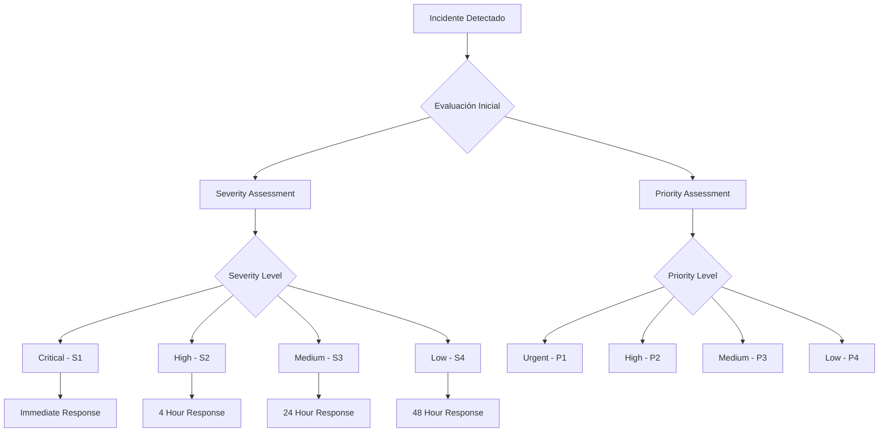
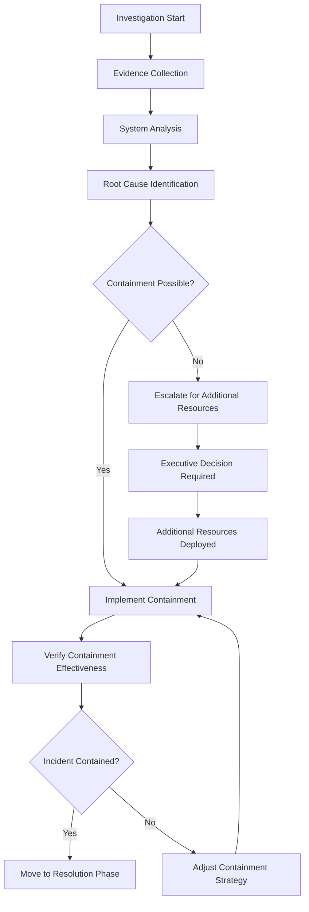
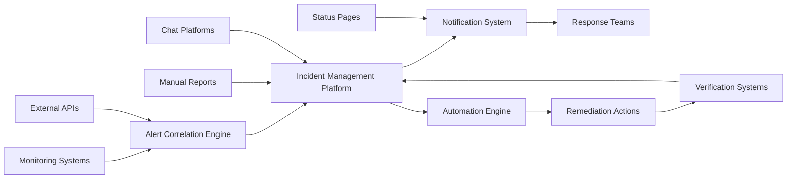
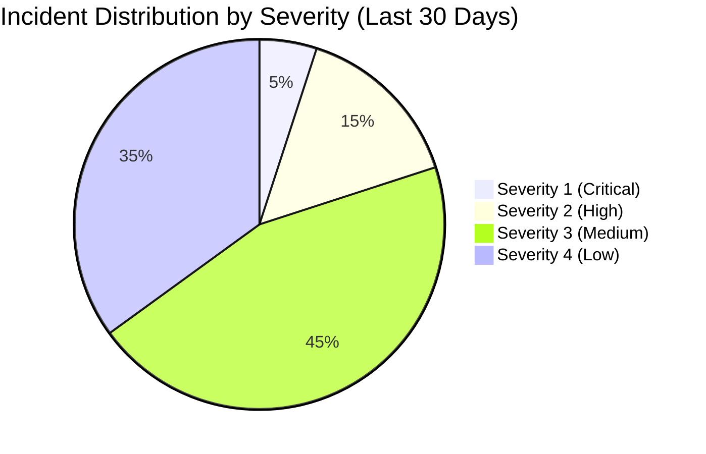

## 📋 Información General

**Documento:** Política de Gestión de Incidentes  
**Código:** ADR-POL-003  
**Versión:** 1.0.0  
**Fecha:** Enero 2025  
**Clasificación:** Confidencial  
**Audiencia:** Equipos de TI, SOC, Security Team, Incident Response Team y Management de DivisionCero

## 🎯 Propósito

Establecer un marco estructurado y efectivo para la detección, evaluación, respuesta y resolución de incidentes de seguridad y operacionales en DivisionCero, minimizando el impacto en el negocio, protegiendo los activos críticos y asegurando la continuidad de las operaciones.

## 🏢 Alcance

Esta política aplica a:
- **Incidentes de Ciberseguridad**: Ataques, malware, accesos no autorizados, data breaches
- **Incidentes Operacionales**: Fallos de sistemas, interrupciones de servicio, errores de configuración
- **Incidentes de Disponibilidad**: Caídas de servicios, problemas de performance, capacity issues
- **Incidentes de Integridad**: Corrupción de datos, modificaciones no autorizadas
- **Incidentes de Privacidad**: Violaciones de datos personales, incumplimientos GDPR/CCPA
- **Incidentes de Terceros**: Problemas con proveedores que afecten los servicios de DivisionCero
- **Todos los Entornos**: Producción, staging, desarrollo, servicios cloud

## 📚 Definiciones

- **Incidente:** Evento no planificado que interrumpe o reduce la calidad de un servicio
- **Incidente de Seguridad:** Evento que compromete la confidencialidad, integridad o disponibilidad
- **Severity:** Nivel de impacto del incidente en las operaciones de negocio
- **Priority:** Urgencia con la que debe resolverse el incidente
- **Escalation:** Proceso de transferir incidente a nivel superior de autoridad
- **MTTR:** Mean Time To Resolution - tiempo promedio de resolución
- **War Room:** Centro de comando para manejo de incidentes críticos

## 🛡️ Clasificación de Incidentes

### 📊 Matriz de Severidad y Prioridad



### 🔥 Niveles de Severidad

#### Severidad 1 (Critical)
- **Definición**: Interrupción completa de servicios críticos de negocio
- **Impacto**: 
  - > 50% de usuarios afectados
  - Pérdida significativa de revenue
  - Riesgo de seguridad crítico
- **Ejemplos**:
  - Plataforma SaaS completamente inaccesible
  - Data breach confirmado con exposición de datos
  - Ataque cibernético en curso
- **SLA de Respuesta**: 15 minutos
- **SLA de Resolución**: 4 horas

#### Severidad 2 (High)
- **Definición**: Impacto significativo en servicios importantes
- **Impacto**:
  - 20-50% de usuarios afectados
  - Funcionalidades críticas degradadas
  - Riesgo de escalación a S1
- **Ejemplos**:
  - Performance degradado significativamente
  - Funcionalidades principales no disponibles
  - Sospecha de incidente de seguridad
- **SLA de Respuesta**: 1 hora
- **SLA de Resolución**: 24 horas

#### Severidad 3 (Medium)
- **Definición**: Impacto moderado en operaciones normales
- **Impacto**:
  - < 20% de usuarios afectados
  - Funcionalidades secundarias afectadas
  - Workarounds disponibles
- **Ejemplos**:
  - Problemas de performance menores
  - Errores en funcionalidades no críticas
  - Issues de integración con terceros
- **SLA de Respuesta**: 4 horas
- **SLA de Resolución**: 72 horas

#### Severidad 4 (Low)
- **Definición**: Impacto mínimo en operaciones de usuario
- **Impacto**:
  - Usuarios individuales o casos específicos
  - No afecta operaciones críticas
  - Solicitudes de mejora o cambios menores
- **Ejemplos**:
  - Bugs menores en UI/UX
  - Problemas de documentación
  - Solicitudes de configuración
- **SLA de Respuesta**: 24 horas
- **SLA de Resolución**: 5 días laborales

### 🎯 Matriz de Priorización

| Severidad | Business Hours | After Hours | Weekends | Holiday |
|-----------|----------------|-------------|----------|---------|
| **Critical** | P1 | P1 | P1 | P1 |
| **High** | P1 | P2 | P2 | P3 |
| **Medium** | P2 | P3 | P3 | P4 |
| **Low** | P3 | P4 | P4 | P4 |

## 👥 Roles y Responsabilidades

### 🚨 Incident Response Team (IRT)

#### Incident Commander (IC)
- **Responsabilidades**:
  - Liderar la respuesta general al incidente
  - Tomar decisiones estratégicas durante la crisis
  - Coordinar comunicaciones con stakeholders
  - Autorizar escalaciones y recursos adicionales
- **Criterios de Activación**: Incidentes S1, S2 con impacto significativo
- **Rotación**: 24/7 on-call rotation entre Senior Engineers

#### Technical Lead
- **Responsabilidades**:
  - Dirigir investigación técnica del incidente
  - Coordinar esfuerzos de remediación técnica
  - Evaluar y implementar soluciones
  - Documentar hallazgos técnicos
- **Especialización**: Por área (Infrastructure, Security, Applications)
- **Escalation**: Subject Matter Experts según necesidad

#### Communications Manager
- **Responsabilidades**:
  - Gestionar comunicaciones internas y externas
  - Actualizar status pages y notification systems
  - Coordinar con Customer Success para comunicaciones a clientes
  - Mantener stakeholders informados sobre progreso
- **Reporting**: Incident Commander y Executive Team
- **Tools**: StatusPage, Slack, email distribution lists

### 🏢 Organizational Structure

#### 24/7 Operations Center (SOC)
```yaml
SOC_Responsibilities:
  monitoring_and_detection:
    - continuous_monitoring: "24/7 monitoring of all critical systems"
    - alert_triage: "Initial classification and routing of alerts"
    - incident_declaration: "Authority to declare incidents S3 and below"
    - escalation: "Escalate to IRT for higher severity incidents"
  
  first_response:
    - initial_assessment: "Rapid assessment of incident scope and impact"
    - documentation: "Create incident records and initial timeline"
    - stakeholder_notification: "Alert relevant teams and management"
    - containment: "Implement initial containment measures"
```

#### Executive Escalation
- **CEO**: Incidentes con impacto reputacional o regulatorio significativo
- **CTO**: Incidentes técnicos críticos que requieren decisiones arquitecturales
- **CISO**: Incidentes de seguridad con potencial de data breach
- **CFO**: Incidentes con impacto financiero > $100K
- **Legal**: Incidentes con implicaciones legales o regulatorias

### 🔄 On-Call Structure

#### Tier Structure
```yaml
On_Call_Tiers:
  tier_1_soc:
    - coverage: "24/7 monitoring and initial response"
    - escalation_time: "15 minutes for S1/S2 incidents"
    - responsibilities: ["monitoring", "triage", "initial_containment"]
  
  tier_2_engineering:
    - coverage: "On-call rotation for technical teams"
    - response_time: "30 minutes for escalated incidents"
    - responsibilities: ["technical_investigation", "remediation", "root_cause_analysis"]
  
  tier_3_senior_leadership:
    - coverage: "Senior engineers and management"
    - activation: "Critical incidents requiring strategic decisions"
    - responsibilities: ["strategic_decisions", "resource_allocation", "external_communications"]
```

## 📋 Proceso de Gestión de Incidentes

### 🚀 Incident Response Lifecycle

#### Fase 1: Detection and Initial Response (0-30 minutes)
```yaml
Detection_Phase:
  automated_detection:
    - monitoring_alerts: "Automated alerts from monitoring systems"
    - security_events: "SIEM and security tool alerts"
    - synthetic_monitoring: "Proactive monitoring checks"
    - user_reports: "Customer and internal user reports"
  
  initial_response:
    - incident_declaration: "Formal declaration of incident"
    - severity_classification: "Initial severity assessment"
    - team_notification: "Alert relevant response teams"
    - war_room_setup: "Establish communication channels"
```

#### Fase 2: Assessment and Planning (30 minutes - 2 hours)
1. **Detailed Assessment**
   - Scope and impact analysis
   - Root cause hypothesis development
   - Resource requirement evaluation
   - Timeline estimation

2. **Response Planning**
   - Investigation plan development
   - Remediation strategy selection
   - Communication plan activation
   - Resource allocation

3. **Stakeholder Engagement**
   - Management notification
   - Customer communication (si necesario)
   - Vendor coordination (si aplicable)
   - Regulatory notification preparation (si requerido)

#### Fase 3: Investigation and Containment (2-8 hours)


#### Fase 4: Resolution and Recovery (Variable)
1. **Solution Implementation**
   - Fix deployment en environments apropiados
   - Testing y validation de la solución
   - Gradual rollout con monitoring intensivo
   - User acceptance validation

2. **Service Restoration**
   - Full service restoration
   - Performance monitoring y optimization
   - User communication sobre resolution
   - Service level validation

3. **Verification and Monitoring**
   - Extended monitoring period
   - Stability confirmation
   - User feedback collection
   - Metrics validation

#### Fase 5: Post-Incident Activities (1-5 días post-resolución)
- **Post-Incident Review (PIR)**
- **Root Cause Analysis (RCA)** detallado
- **Action Items** development y assignment
- **Documentation** updates y knowledge sharing
- **Process Improvements** identification e implementation

### ⚡ Emergency Response Procedures

#### War Room Activation
```yaml
War_Room_Criteria:
  automatic_activation:
    - severity_1_incidents: "All S1 incidents automatically activate war room"
    - security_breaches: "Confirmed or suspected security incidents"
    - multi_system_outages: "Cascading failures affecting multiple systems"
    - customer_facing_outages: "Public-facing service disruptions"
  
  war_room_setup:
    - physical_location: "Conference room Omega (primary) or virtual"
    - communication_channels: "Dedicated Slack channel + video conference"
    - documentation: "Real-time incident timeline and decisions"
    - stakeholder_notifications: "Automated notifications to executive team"
```

#### Escalation Matrix
| Incident Type | 30 min | 1 hour | 2 hours | 4 hours |
|---------------|---------|---------|---------|---------|
| **S1 Security** | CISO + SOC Manager | CTO + Incident Commander | CEO + Legal Counsel | Board Notification |
| **S1 Operational** | CTO + Operations Manager | CEO + Incident Commander | Customer Success VP | Public Communications |
| **S2 Extended** | Department Manager | Director Level | VP Level | C-Level |

#### Communication Protocols
```yaml
Communication_Protocols:
  internal_communications:
    - slack_channel: "#incident-response-[incident-id]"
    - email_updates: "Every 2 hours for S1, every 4 hours for S2"
    - executive_briefings: "Every hour for S1, every 2 hours for S2"
    - all_hands_updates: "For incidents affecting > 25% of users"
  
  external_communications:
    - status_page_updates: "Within 30 minutes of incident declaration"
    - customer_notifications: "Within 2 hours for customer-facing issues"
    - vendor_communications: "As needed for third-party dependencies"
    - regulatory_notifications: "Within regulatory timeframes (typically 24-72 hours)"
```

## 🔧 Herramientas y Tecnologías

### 🛠️ Incident Management Platform

#### Primary ITSM Platform
- **ServiceNow Incident Management**: Primary incident tracking y workflow
- **PagerDuty**: On-call management y intelligent alerting
- **Slack**: Real-time communication y collaboration
- **Jira**: Follow-up action items y long-term tracking

#### Monitoring y Detection Stack
```yaml
Monitoring_Stack:
  infrastructure_monitoring:
    - datadog: "Infrastructure, application, and log monitoring"
    - new_relic: "Application performance monitoring"
    - pingdom: "External service monitoring and availability"
  
  security_monitoring:
    - splunk_siem: "Security information and event management"
    - crowdstrike: "Endpoint detection and response"
    - okta_insights: "Identity and access monitoring"
  
  business_monitoring:
    - mixpanel: "Product analytics and user behavior"
    - stripe_radar: "Payment processing monitoring"
    - custom_dashboards: "Business KPI monitoring"
```

#### Communication y Collaboration Tools
- **StatusPage.io**: External customer communication
- **Microsoft Teams**: Internal collaboration y document sharing
- **Zoom**: Video conferencing para war rooms
- **Confluence**: Documentation y knowledge management

### 📊 Automation y Orchestration

#### Automated Response Capabilities
```yaml
Automation_Framework:
  detection_automation:
    - intelligent_alerting: "ML-powered alert correlation and noise reduction"
    - automatic_classification: "Auto-classification based on patterns"
    - smart_routing: "Intelligent routing to appropriate teams"
  
  response_automation:
    - auto_scaling: "Automatic resource scaling for performance issues"
    - circuit_breakers: "Automatic service isolation for cascading failures"
    - rollback_triggers: "Automatic rollback for failed deployments"
    - containment_actions: "Automated security containment measures"
```

#### Integration Framework


## 📊 Métricas y Reporting

### 🎯 Key Performance Indicators

#### Response Time Metrics
- **Mean Time to Acknowledgment (MTTA)**: Tiempo promedio para acknowledge alerts
- **Mean Time to Response (MTTR)**: Tiempo promedio para initial response
- **Mean Time to Resolution (MTTR)**: Tiempo promedio para full resolution
- **Escalation Rate**: % de incidentes que requieren escalation

#### Quality Metrics
- **First Call Resolution Rate**: % resueltos en first contact
- **SLA Compliance**: % de incidentes resueltos dentro de SLA
- **Customer Satisfaction**: CSAT scores para incident resolution
- **Recurring Incident Rate**: % de incidentes que recurren dentro de 30 días

#### Volume y Trend Metrics
```yaml
Incident_Analytics:
  volume_metrics:
    - incident_count: "Total incidents por período"
    - severity_distribution: "Distribution by severity level"
    - source_analysis: "Incidents by detection source"
    - category_trending: "Incident categories over time"
  
  business_impact_metrics:
    - revenue_impact: "Revenue lost due to incidents"
    - user_impact: "Users affected by incidents"
    - service_availability: "Overall service uptime"
    - reputation_impact: "Brand sentiment analysis during incidents"
```

### 📈 Dashboards y Reporting

#### Real-Time Operations Dashboard


#### Executive Reporting
- **Weekly Incident Summary**: High-level overview para executive team
- **Monthly Trend Analysis**: Analysis de patterns y improvements needed
- **Quarterly Business Impact**: Assessment de impact en business objectives
- **Annual Program Review**: Comprehensive review de incident management effectiveness

### 🔍 Root Cause Analysis

#### RCA Methodology
```yaml
RCA_Process:
  immediate_causes:
    - direct_technical_failure: "Immediate technical cause of incident"
    - human_error: "Any human actions that contributed"
    - process_failure: "Process breakdowns that enabled incident"
  
  underlying_causes:
    - design_flaws: "Architectural or design issues"
    - knowledge_gaps: "Training or knowledge deficiencies"
    - resource_constraints: "Inadequate resources or capacity"
    - cultural_factors: "Organizational culture contributions"
  
  systemic_causes:
    - organizational_factors: "Organizational structure issues"
    - external_dependencies: "Third-party or vendor dependencies"
    - regulatory_changes: "Regulatory or compliance impacts"
```

## 🏆 Mejores Prácticas

### 🔒 Incident Response Excellence

#### Response Best Practices
- **Rapid Response**: Faster response times reduce overall impact
- **Clear Communication**: Transparent y frequent communication con stakeholders
- **Documentation**: Comprehensive documentation durante y después del incident
- **Learning Focus**: Every incident es una opportunity para improvement

#### Investigation Best Practices
- **Systematic Approach**: Methodical investigation siguiendo established procedures
- **Evidence Preservation**: Proper handling de digital evidence para forensics
- **Collaborative Investigation**: Cross-functional teams para comprehensive analysis
- **Hypothesis-Driven**: Use scientific method para root cause identification

### 📚 Organizational Excellence

#### Process Maturity
- **Continuous Improvement**: Regular optimization basada en lessons learned
- **Training y Development**: Ongoing skill development para response teams
- **Simulation Exercises**: Regular drills y tabletop exercises
- **Knowledge Management**: Centralized knowledge base con incident history

#### Cultural Excellence
- **Blameless Culture**: Focus on process improvement, not individual blame
- **Psychological Safety**: Environment where people can report issues freely
- **Learning Organization**: Commitment to learning from every incident
- **Proactive Mindset**: Emphasis on prevention over just response

### 🤖 Technology Excellence

#### Automation Strategy
- **Intelligent Alerting**: Reduce noise y improve signal-to-noise ratio
- **Automated Remediation**: Self-healing systems donde sea appropriate
- **Predictive Analytics**: Use ML para predict y prevent incidents
- **Integrated Toolchain**: Seamless integration entre incident management tools

#### Innovation Areas
- **AI-Powered Triage**: Machine learning para automatic incident classification
- **Natural Language Processing**: Automated analysis de incident reports
- **Predictive Modeling**: Forecasting potential incidents antes que ocurran
- **Augmented Response**: AI assistance para response teams

## 📋 Compliance y Legal

### 🔍 Regulatory Requirements

#### Data Breach Notifications
```yaml
Breach_Notification_Requirements:
  gdpr_compliance:
    - internal_notification: "DPO notification within 2 hours"
    - authority_notification: "Supervisory authority within 72 hours"
    - individual_notification: "Data subjects when high risk (without delay)"
    - documentation: "Comprehensive breach register maintenance"
  
  ccpa_compliance:
    - internal_assessment: "Immediate assessment of California resident impact"
    - attorney_general_notification: "If required by regulation"
    - consumer_notification: "If required by circumstances"
  
  industry_specific:
    - pci_dss: "Payment card data breach notification procedures"
    - hipaa: "Health information breach notification (if applicable)"
    - sox: "Material weakness reporting for financial controls"
```

#### Evidence Management
- **Chain of Custody**: Proper handling de digital evidence
- **Legal Hold**: Preservation de relevant documents y communications
- **Privilege Protection**: Attorney-client privilege considerations
- **Regulatory Cooperation**: Coordination con regulatory investigations

### 📝 Documentation Requirements

#### Incident Records
- **Complete Timeline**: Detailed chronology de events y actions
- **Decision Documentation**: Rationale para major decisions durante incident
- **Communication Logs**: Record de all internal y external communications
- **Technical Evidence**: System logs, screenshots, configuration changes

#### Audit Trail
- **Access Logs**: Who accessed what during incident response
- **Change Records**: All changes made durante incident resolution
- **Authorization Records**: Approvals para emergency changes
- **Review Documentation**: Post-incident review results y action items

## 🔄 Mejora Continua

### 📅 Review y Optimization Cycles

#### Operational Reviews
- **Daily**: SOC performance metrics y alert quality
- **Weekly**: Incident trends y response team performance
- **Monthly**: Process effectiveness y training needs assessment
- **Quarterly**: Strategic alignment y program evolution

#### Strategic Evolution
```yaml
Program_Evolution:
  2025_objectives:
    - response_time_improvement: "25% reduction in MTTR across all severity levels"
    - automation_expansion: "50% of routine responses automated"
    - prediction_capabilities: "Implement predictive incident modeling"
    - customer_experience: "Improve customer communication during incidents"
  
  2026_vision:
    - ai_powered_response: "AI-assisted incident triage and response"
    - self_healing_systems: "Automated remediation for common incidents"
    - proactive_prevention: "Shift from reactive to proactive approach"
    - business_integration: "Deeper integration with business processes"
  
  2027_evolution:
    - autonomous_response: "Fully autonomous response for routine incidents"
    - predictive_maintenance: "Prevent incidents before they occur"
    - business_value_focus: "Incident management as competitive advantage"
```

### 🎯 Innovation Initiatives

#### Emerging Capabilities
- **Machine Learning**: Pattern recognition para incident prediction
- **Natural Language Processing**: Automated incident report analysis
- **Augmented Reality**: Remote assistance para field incidents
- **IoT Integration**: Proactive monitoring de physical infrastructure

#### Research Areas
- **Chaos Engineering**: Proactive resilience testing
- **Site Reliability Engineering**: Integration con SRE practices
- **DevSecOps**: Security integration en development lifecycle
- **Business Continuity**: Enhanced integration con business continuity planning

## 📚 Referencias y Estándares

### 📖 Documentos Relacionados
- [Plan de Respuesta a Incidentes](plan-respuesta-incidentes)
- [Política de Continuidad del Negocio](politica-continuidad-negocio)
- [Plan de Recuperación ante Desastres](plan-recuperacion-desastres)
- [Política de Gestión de Cambios](politica-gestion-cambios)
- [Correlación de Eventos SIEM](correlacion-eventos-siem)

### 🌐 Marcos de Referencia
- **NIST SP 800-61**: Computer Security Incident Handling Guide
- **ISO/IEC 27035**: Information security incident management
- **ITIL 4**: Incident Management process guidance
- **SANS Incident Response**: Six-step incident response methodology

### 🔗 Recursos Profesionales
- **FIRST (Forum of Incident Response and Security Teams)**: Global incident response community
- **SANS Institute**: Training y certification en incident response
- **NIST Cybersecurity Framework**: Comprehensive cybersecurity guidance
- **ENISA**: European incident response best practices

## 📝 Control de Versiones

| Versión | Fecha | Cambios | Autor |
|---------|-------|---------|-------|
| 1.0.0 | Enero 2025 | Versión inicial - Política completa de gestión de incidentes | Incident Response Team + Security Leadership |

---

**Próxima Revisión:** Julio 2025  
**Aprobado por:** [CISO] - [Fecha]  
**Clasificación:** Confidencial - Uso Interno DivisionCero
