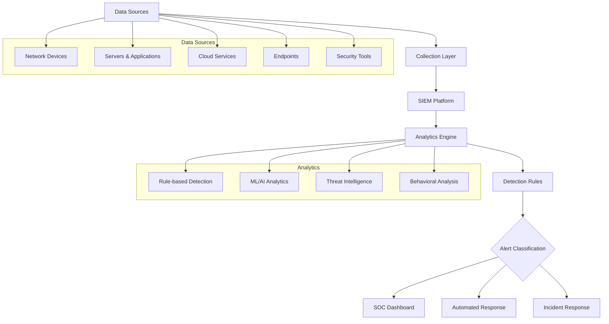
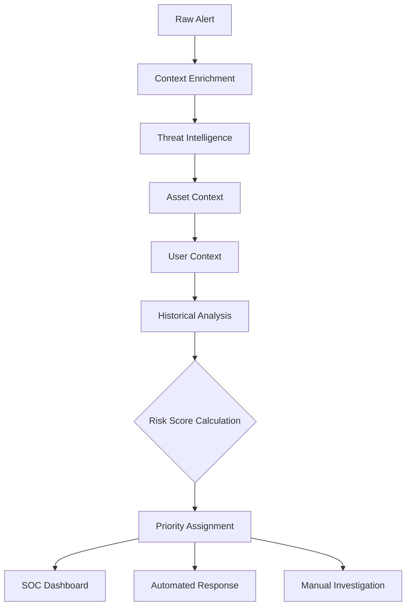
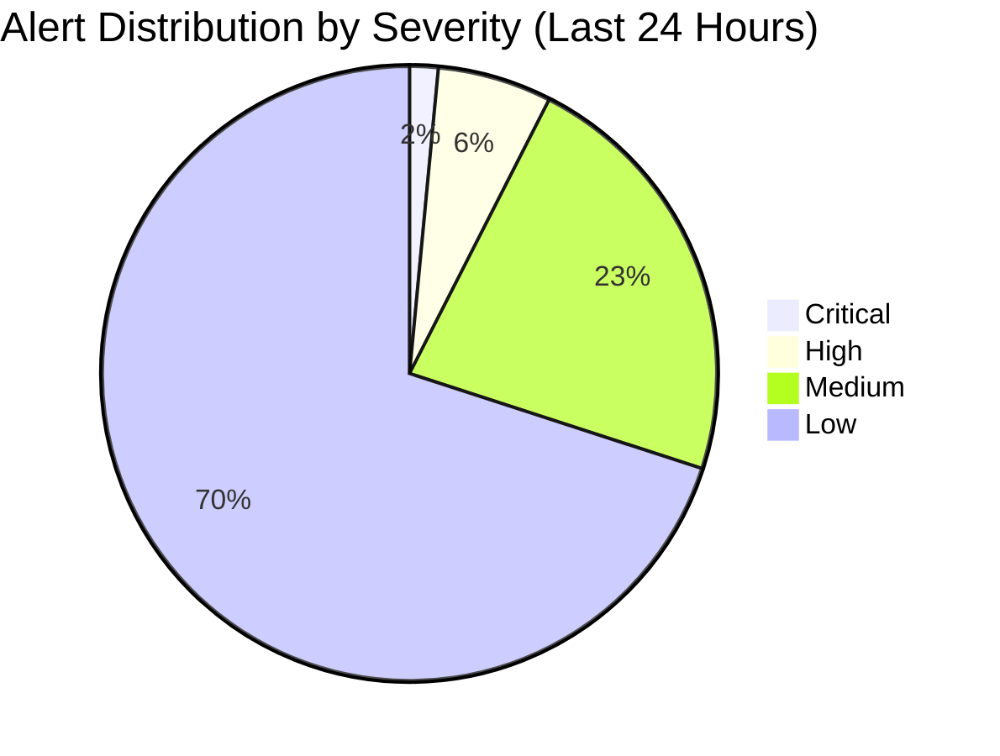

## 📋 Información General

**Documento:** Política de Monitoreo de Eventos de Seguridad  
**Código:** ADR-POL-004  
**Versión:** 1.0.0  
**Fecha:** Enero 2025  
**Clasificación:** Confidencial  
**Audiencia:** Equipos SOC, Security Team, Infrastructure, Development y Compliance de DivisionCero

## 🎯 Propósito

Establecer un marco integral para la supervisión continua, detección, análisis y respuesta a eventos de seguridad en todos los sistemas y servicios de DivisionCero, garantizando la identificación oportuna de amenazas, anomalías y incidentes de seguridad para proteger los activos críticos de la organización.

## 🏢 Alcance

Esta política aplica a:
- **Todos los Sistemas**: Servidores, aplicaciones, bases de datos, dispositivos de red
- **Infraestructura Cloud**: AWS, Azure, GCP y servicios multi-cloud
- **Endpoints**: Workstations, laptops, dispositivos móviles, IoT devices
- **Servicios de Terceros**: SaaS applications, cloud services, managed services
- **Redes**: Internal networks, external connections, VPN, WiFi
- **Aplicaciones**: Custom applications, COTS software, web applications
- **Datos en Tránsito y Reposo**: All data flows y storage systems

## 📚 Definiciones

- **Evento de Seguridad:** Ocurrencia identificable en un sistema o red que puede tener relevancia para la seguridad
- **Incidente de Seguridad:** Evento confirmado que compromete la seguridad de la información
- **SIEM:** Security Information and Event Management - sistema centralizado de gestión de eventos
- **SOC:** Security Operations Center - centro de operaciones de seguridad
- **IoC:** Indicators of Compromise - indicadores de compromiso
- **UEBA:** User and Entity Behavior Analytics - análisis de comportamiento de usuarios y entidades
- **Threat Hunting:** Búsqueda proactiva de amenazas avanzadas

## 🛡️ Arquitectura de Monitoreo

### 📊 Stack de Monitoreo de Seguridad



### 🔧 Componentes Principales

#### SIEM Platform (Core)
- **Splunk Enterprise Security**: SIEM platform principal
- **Microsoft Sentinel**: Cloud-native SIEM para Azure workloads
- **IBM QRadar**: Complementary SIEM para advanced analytics
- **Elastic Security**: Open source SIEM y search capabilities

#### Data Collection & Processing
```yaml
Data_Collection_Layer:
  log_collectors:
    - splunk_universal_forwarders: "Agent-based collection"
    - beats_family: "Filebeat, Metricbeat, Packetbeat"
    - fluentd: "Unified logging layer"
    - aws_cloudtrail: "AWS API call logging"
  
  network_monitoring:
    - zeek: "Network traffic analysis"
    - suricata: "Network IDS/IPS"
    - ntopng: "Network traffic monitoring"
    - wireshark: "Packet analysis tool"
  
  endpoint_monitoring:
    - crowdstrike_falcon: "EDR platform"
    - microsoft_defender: "Windows endpoint protection"
    - osquery: "Cross-platform endpoint monitoring"
    - carbon_black: "Endpoint detection and response"
```

#### Analytics y Detection Engines
- **Machine Learning**: Unsupervised learning para anomaly detection
- **Threat Intelligence**: Integration con commercial y open source feeds
- **User Behavior Analytics**: Behavioral analysis para insider threats
- **Network Traffic Analysis**: Deep packet inspection y traffic analysis

## 🔍 Fuentes de Datos

### 📡 Categorización de Fuentes de Datos

#### Network Infrastructure
```yaml
Network_Data_Sources:
  firewalls:
    - checkpoint_logs: "Firewall allow/deny decisions"
    - palo_alto_logs: "Application-aware firewall logs"
    - fortinet_logs: "UTM security events"
    - aws_waf_logs: "Web application firewall events"
  
  network_devices:
    - switch_logs: "Port security and VLAN events"
    - router_logs: "Routing and access control events"
    - wireless_logs: "WiFi association and authentication"
    - load_balancer_logs: "Traffic distribution and health checks"
  
  network_monitoring:
    - flow_data: "NetFlow/sFlow traffic patterns"
    - dns_logs: "DNS query and response logging"
    - dhcp_logs: "IP address assignment tracking"
    - vpn_logs: "Remote access connection events"
```

#### Server y Application Infrastructure
- **Operating System Logs**: Windows Event Logs, Syslog, system calls
- **Application Logs**: Custom application events, error logs, access logs
- **Database Logs**: SQL queries, login attempts, data access patterns
- **Web Server Logs**: Apache/Nginx access y error logs, HTTP transactions
- **Authentication Systems**: Active Directory, LDAP, SSO authentication events

#### Cloud Platform Integration
```yaml
Cloud_Security_Monitoring:
  aws_integration:
    - cloudtrail: "API call auditing and compliance"
    - guardduty: "Threat detection service"
    - config: "Configuration compliance monitoring"
    - vpc_flow_logs: "Network traffic within VPC"
  
  azure_integration:
    - azure_monitor: "Platform metrics and logs"
    - azure_sentinel: "Cloud-native SIEM"
    - azure_security_center: "Security posture management"
    - azure_ad_logs: "Identity and access events"
  
  gcp_integration:
    - cloud_logging: "Centralized logging service"
    - cloud_security_scanner: "Web application vulnerability scanning"
    - cloud_asset_inventory: "Asset discovery and monitoring"
```

#### Endpoint y User Activity
- **Endpoint Detection**: Process execution, file changes, network connections
- **User Activity**: Login events, privilege escalation, data access
- **Email Security**: Email gateway logs, phishing attempts, malware detection
- **Browser Activity**: Web proxy logs, URL filtering, download tracking

## 🚨 Detection y Alerting

### 🔍 Detection Methodologies

#### Signature-based Detection
```yaml
Signature_Detection:
  known_malware:
    - hash_matching: "MD5, SHA-1, SHA-256 file hashes"
    - yara_rules: "Pattern matching for malware families"
    - ioc_matching: "Known indicators of compromise"
  
  attack_patterns:
    - snort_rules: "Network intrusion signatures"
    - sigma_rules: "Generic signature format for SIEM"
    - mitre_attack_mapping: "TTPs from MITRE ATT&CK framework"
```

#### Anomaly-based Detection
- **Statistical Analysis**: Baseline behavior y statistical deviations
- **Machine Learning**: Unsupervised learning para unknown threats
- **Time Series Analysis**: Temporal patterns y seasonal variations
- **Peer Group Analysis**: Comparison con similar entities

#### Behavioral Analysis
```yaml
Behavioral_Analytics:
  user_behavior:
    - authentication_patterns: "Login times, locations, methods"
    - data_access_patterns: "File access, database queries"
    - privilege_usage: "Administrative actions, role changes"
    - communication_patterns: "Email, messaging, collaboration"
  
  entity_behavior:
    - network_communication: "Unusual network connections"
    - system_resource_usage: "CPU, memory, disk patterns"
    - application_usage: "Software execution patterns"
    - data_movement: "Large or unusual data transfers"
```

### 🎯 Alert Classification

#### Severity Levels
| Level | Criteria | Response Time | Examples |
|-------|----------|---------------|----------|
| **Critical** | Confirmed breach or active attack | ≤ 15 minutes | Active malware, data exfiltration |
| **High** | High probability of security incident | ≤ 1 hour | Multiple failed logins, privilege escalation |
| **Medium** | Potential security concern | ≤ 4 hours | Policy violations, configuration changes |
| **Low** | Informational or minor concern | ≤ 24 hours | Audit events, routine activities |

#### Alert Enrichment Process


### 📊 Use Cases de Detección

#### Authentication y Access Control
- **Failed Login Attempts**: Multiple failed authentication attempts
- **Privileged Account Usage**: Administrative account activities
- **After-Hours Access**: Access outside normal business hours
- **Geographic Anomalies**: Access from unusual locations
- **Account Lockouts**: Excessive account lockout events

#### Network Security
- **Lateral Movement**: Unusual internal network traffic patterns
- **Data Exfiltration**: Large outbound data transfers
- **Command and Control**: C2 communication patterns
- **Port Scanning**: Network reconnaissance activities
- **DNS Anomalies**: Suspicious DNS queries y resolutions

#### Malware y Threats
- **Malware Execution**: Known malicious file execution
- **Suspicious Process Behavior**: Unusual process activities
- **File System Changes**: Unauthorized file modifications
- **Registry Changes**: Windows registry modifications
- **Persistence Mechanisms**: Attempts to maintain access

## 👥 Roles y Responsabilidades

### 🏢 Security Operations Center (SOC)

#### SOC Analyst Level 1
- **Responsibilities**:
  - Monitor security dashboards 24/7
  - Perform initial triage de security alerts
  - Document initial findings y observations
  - Escalate confirmed incidents to Level 2
- **Shift Coverage**: 24/7/365 coverage con handoff procedures
- **Training Requirements**: Security+ certification, SOC analyst training

#### SOC Analyst Level 2
- **Responsibilities**:
  - Investigate escalated security alerts
  - Perform detailed analysis y correlation
  - Coordinate con incident response team
  - Develop y tune detection rules
- **Expertise Areas**: Malware analysis, forensics, threat hunting
- **Escalation Authority**: Can escalate to Level 3 o incident response

#### SOC Manager
- **Responsibilities**:
  - Oversee daily SOC operations
  - Manage analyst workload y shift schedules
  - Report security metrics to CISO
  - Coordinate con other security teams
- **Strategic Focus**: SOC process improvement, team development

### 🔧 Technical Support Roles

#### Security Engineer
- **SIEM Administration**: Platform maintenance, rule development, integration
- **Tool Integration**: Connect new data sources, API integrations
- **Performance Optimization**: Query optimization, resource management
- **Automation Development**: SOAR playbook development

#### Threat Intelligence Analyst
- **Intelligence Collection**: Gather threat intelligence de multiple sources
- **IOC Development**: Create y maintain indicators of compromise
- **Threat Landscape Analysis**: Analysis de current threat trends
- **Strategic Reporting**: Executive threat briefings

### 🎯 Governance y Oversight

#### Chief Information Security Officer (CISO)
- Define security monitoring strategy y priorities
- Approve security monitoring policies y procedures
- Review security metrics y performance reports
- Coordinate con executive team sobre security posture

#### Security Architect
- Design overall security monitoring architecture
- Define integration requirements con existing systems
- Establish security monitoring standards y baselines
- Evaluate new security monitoring technologies

## 📊 Métricas y Reporting

### 🎯 Key Performance Indicators

#### Operational Metrics
- **Alert Volume**: Number of alerts generated per day/week/month
- **Mean Time to Detection (MTTD)**: Average time to detect security incidents
- **Mean Time to Response (MTTR)**: Average time to respond to confirmed incidents
- **False Positive Rate**: Percentage of alerts that are false positives
- **Coverage Metrics**: Percentage of assets covered by monitoring

#### Quality Metrics
```yaml
Quality_Metrics:
  detection_effectiveness:
    - true_positive_rate: "Percentage of actual threats detected"
    - alert_accuracy: "Percentage of actionable alerts"
    - escalation_accuracy: "Percentage of properly escalated incidents"
  
  response_quality:
    - incident_containment_time: "Time to contain security incidents"
    - investigation_completeness: "Thoroughness of security investigations"
    - documentation_quality: "Quality of incident documentation"
```

#### Business Impact Metrics
- **Security Incident Cost**: Financial impact of security incidents
- **Compliance Metrics**: Adherence to regulatory monitoring requirements
- **Risk Reduction**: Quantified risk reduction through monitoring
- **Business Continuity**: Uptime y availability metrics

### 📈 Dashboard y Visualization

#### Real-time SOC Dashboard


#### Executive Security Dashboard
- **Security Posture Overview**: High-level security status
- **Threat Landscape**: Current threats targeting organization
- **Incident Trends**: Historical incident patterns y trends
- **Compliance Status**: Regulatory compliance monitoring status

### 📋 Reporting Structure

#### Daily Reports
- SOC shift report con key events y activities
- Critical alert summary para management review
- System performance y availability metrics
- Threat intelligence updates y advisories

#### Weekly Reports
- Security incident summary y trend analysis
- Alert tuning y false positive reduction efforts
- New detection rule deployment y effectiveness
- Training y professional development updates

#### Monthly Reports
- Comprehensive security posture assessment
- ROI analysis de security monitoring investments
- Compliance reporting para regulatory requirements
- Strategic recommendations para program improvement

## 🔧 Herramientas y Tecnologías

### 🛠️ SIEM y Analytics Platform

#### Primary SIEM Stack
```yaml
SIEM_Architecture:
  core_platform:
    - splunk_enterprise_security: "Primary SIEM platform"
    - data_ingestion_rate: "10TB per day capacity"
    - retention_period: "Hot data: 90 days, Warm data: 1 year, Cold data: 7 years"
    - high_availability: "Active-active cluster configuration"
  
  cloud_siem:
    - microsoft_sentinel: "Azure-native SIEM"
    - aws_security_hub: "AWS security findings aggregation"
    - google_security_command_center: "GCP security insights"
  
  specialized_analytics:
    - ueba_platform: "Exabeam for user behavior analytics"
    - network_traffic_analysis: "Darktrace for AI-powered detection"
    - threat_intelligence: "Recorded Future, Mandiant Threat Intelligence"
```

#### Integration Framework
- **API Integrations**: REST APIs para custom integrations
- **Standard Protocols**: Syslog, SNMP, WMI, HTTP/HTTPS
- **Cloud Connectors**: Native cloud service integrations
- **Database Connections**: Direct database query capabilities

### 📡 Data Collection Infrastructure

#### Log Management
- **Centralized Logging**: Rsyslog, Fluentd, Logstash infrastructure
- **Log Parsing**: Structured y unstructured log parsing
- **Data Normalization**: Common information model implementation
- **Compression y Archival**: Efficient storage y retrieval

#### Network Monitoring
```yaml
Network_Monitoring_Stack:
  traffic_analysis:
    - zeek_sensors: "Network traffic analysis at key network points"
    - suricata_ids: "Intrusion detection system deployment"
    - ntopng_monitoring: "Real-time network traffic monitoring"
  
  packet_capture:
    - full_packet_capture: "Strategic packet capture points"
    - forensic_analysis: "Packet analysis capabilities for investigations"
    - bandwidth_management: "Intelligent capture y storage optimization"
```

### 🤖 Automation y Orchestration

#### SOAR Platform Integration
- **Phantom/Splunk SOAR**: Primary security orchestration platform
- **Automated Playbooks**: Incident response automation
- **Case Management**: Integrated case tracking y management
- **Reporting Automation**: Automated report generation y distribution

#### Machine Learning y AI
- **Anomaly Detection**: Unsupervised learning models
- **Predictive Analytics**: Threat prediction y forecasting
- **Natural Language Processing**: Automated analysis de unstructured data
- **Computer Vision**: Analysis de security-related images y videos

## 🏆 Mejores Prácticas

### 🔒 Monitoring Excellence

#### Data Quality Management
- **Data Validation**: Ensure completeness y accuracy de log data
- **Timestamp Synchronization**: Consistent time synchronization across all sources
- **Data Retention**: Appropriate retention periods for compliance y forensics
- **Data Privacy**: Protect sensitive information in logs

#### Detection Rule Management
- **Rule Lifecycle Management**: Development, testing, deployment, tuning
- **False Positive Reduction**: Continuous tuning to reduce noise
- **Threat Intelligence Integration**: Keep detection rules updated con latest threats
- **Performance Optimization**: Optimize rules para system performance

### 📚 Operational Excellence

#### SOC Operations
- **Shift Management**: Effective shift handoffs y communication
- **Skill Development**: Continuous training y certification programs
- **Knowledge Management**: Centralized knowledge base y documentation
- **Quality Assurance**: Regular quality reviews y improvements

#### Incident Response Integration
- **Seamless Handoff**: Smooth transition from monitoring to incident response
- **Evidence Preservation**: Maintain chain of custody para forensic evidence
- **Communication Protocols**: Clear communication during incidents
- **Lessons Learned**: Incorporate lessons learned into monitoring improvements

### 🤖 Technology Excellence

#### Platform Optimization
- **Performance Tuning**: Regular performance optimization y capacity planning
- **Scalability Planning**: Plan for growth in data volume y complexity
- **High Availability**: Ensure monitoring platform availability y resilience
- **Disaster Recovery**: Backup y recovery procedures para monitoring infrastructure

#### Innovation y Evolution
- **Emerging Technologies**: Evaluate y adopt new security monitoring technologies
- **Cloud Security**: Adapt monitoring para cloud y hybrid environments
- **IoT Security**: Extend monitoring to IoT y edge devices
- **Zero Trust**: Implement monitoring para zero trust architecture

## 📋 Compliance y Auditoría

### 🔍 Regulatory Requirements

#### Compliance Frameworks
```yaml
Compliance_Requirements:
  gdpr_compliance:
    - personal_data_monitoring: "Monitor access to personal data"
    - breach_detection: "Detect potential data breaches within 72 hours"
    - audit_logging: "Maintain comprehensive audit logs"
  
  pci_dss_compliance:
    - cardholder_data_monitoring: "Monitor access to cardholder data environment"
    - network_monitoring: "Monitor network traffic to/from CDE"
    - log_review: "Regular review of security logs"
  
  sox_compliance:
    - financial_system_monitoring: "Monitor access to financial systems"
    - change_monitoring: "Monitor changes to financial applications"
    - privileged_access_monitoring: "Monitor privileged user activities"
```

#### Audit Evidence Management
- **Log Integrity**: Cryptographic hashes y digital signatures
- **Chain of Custody**: Maintain evidence chain para legal proceedings
- **Data Retention**: Meet regulatory retention requirements
- **Access Controls**: Restrict access to audit logs y evidence

### 📝 Documentation y Reporting

#### Compliance Reporting
- **Automated Reports**: Generate compliance reports automatically
- **Evidence Collection**: Collect evidence for audit purposes
- **Gap Analysis**: Identify y address compliance gaps
- **Remediation Tracking**: Track remediation de compliance issues

## 🔄 Mejora Continua

### 📅 Review y Optimization Cycles

#### Operational Reviews
- **Daily**: SOC performance metrics y operational issues
- **Weekly**: Detection rule effectiveness y false positive analysis
- **Monthly**: Overall program performance y strategic adjustments
- **Quarterly**: Technology evaluation y strategic planning

#### Strategic Evolution
```yaml
Program_Evolution:
  2025_objectives:
    - ai_enhancement: "Implement AI/ML for advanced threat detection"
    - cloud_integration: "Full integration with multi-cloud environments"
    - automation_expansion: "Automate 70% of routine SOC tasks"
    - threat_hunting: "Implement proactive threat hunting program"
  
  2026_vision:
    - predictive_security: "Predictive analytics for threat prevention"
    - autonomous_response: "Automated incident response capabilities"
    - zero_trust_monitoring: "Comprehensive zero trust monitoring"
    - business_integration: "Deep integration with business processes"
  
  2027_evolution:
    - quantum_readiness: "Prepare for quantum computing threats"
    - iot_security: "Comprehensive IoT security monitoring"
    - edge_computing: "Extend monitoring to edge environments"
    - business_value_focus: "Security monitoring as business enabler"
```

### 🎯 Innovation Initiatives

#### Emerging Technologies
- **Quantum Computing**: Prepare para quantum threats y opportunities
- **5G Security**: Monitor 5G network security implications
- **Edge Computing**: Extend monitoring to edge y fog computing
- **Blockchain**: Leverage blockchain para log integrity

#### Research Areas
- **Behavioral Analytics**: Advanced user y entity behavior analytics
- **Threat Intelligence**: Enhanced threat intelligence integration
- **Deception Technology**: Honeypots y deception-based detection
- **Privacy-Preserving Analytics**: Monitor while protecting privacy

## 📚 Referencias y Estándares

### 📖 Documentos Relacionados
- [Política de Gestión de Incidentes](politica-gestion-incidentes)
- [Plan de Respuesta a Incidentes](plan-respuesta-incidentes)
- [Correlación de Eventos SIEM](correlacion-eventos-siem)
- [Política de Gestión de Vulnerabilidades](politica-gestion-vulnerabilidades)
- [Matriz de Riesgos de Ciberseguridad](matriz-riesgos-ciberseguridad)

### 🌐 Marcos de Referencia
- **NIST Cybersecurity Framework**: Detect function implementation
- **MITRE ATT&CK**: Threat detection y response methodology
- **ISO/IEC 27035**: Information security incident management
- **SANS Top 20**: Critical security controls implementation

### 🔗 Recursos Profesionales
- **SANS Institute**: Security monitoring y incident response training
- **NIST SP 800-92**: Guide to Computer Security Log Management
- **OWASP Logging Cheat Sheet**: Secure logging practices
- **CIS Controls**: Implementation guide para security monitoring

## 📝 Control de Versiones

| Versión | Fecha | Cambios | Autor |
|---------|-------|---------|-------|
| 1.0.0 | Enero 2025 | Versión inicial - Política completa de monitoreo de eventos de seguridad | SOC Team + Security Architecture |

---

**Próxima Revisión:** Julio 2025  
**Aprobado por:** [CISO] - [Fecha]  
**Clasificación:** Confidencial - Uso Interno DivisionCero
