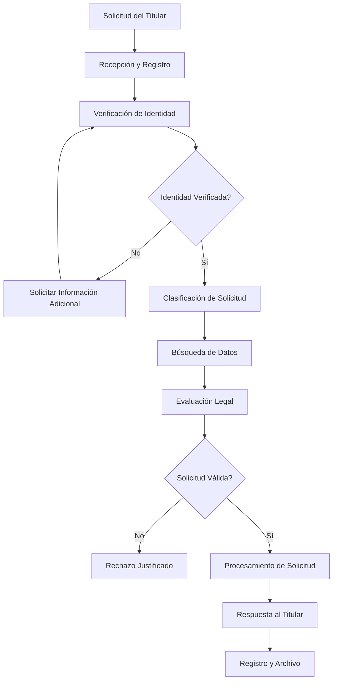
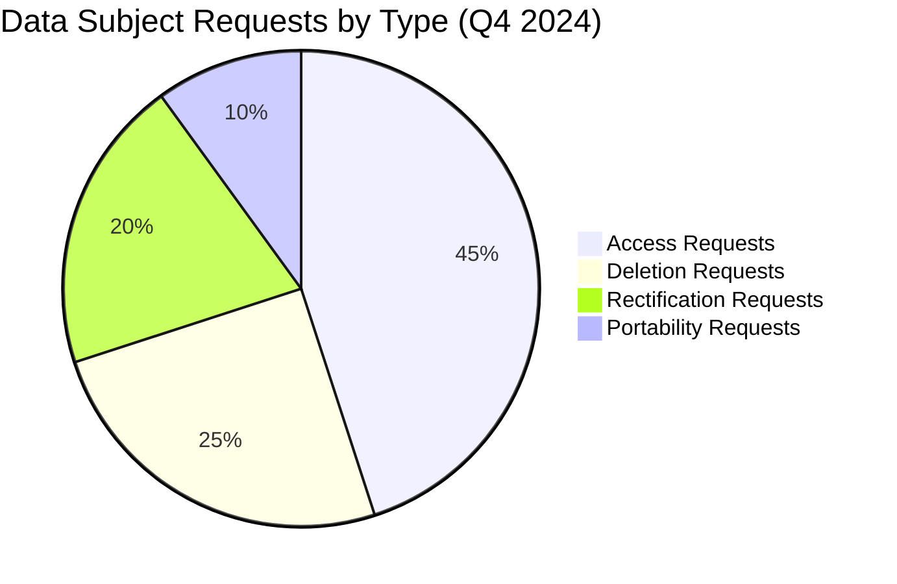

## 📋 Información General

**Documento:** Política de Protección de Datos Personales y Sensibles  
**Código:** DIA-POL-001  
**Versión:** 1.0.0  
**Fecha:** Enero 2025  
**Clasificación:** Confidencial  
**Audiencia:** Todos los empleados, Legal, IT, Security, Privacy Team y Data Owners de DivisionCero

## 🎯 Propósito

Establecer un marco integral para la protección de datos personales y sensibles procesados por DivisionCero, asegurando el cumplimiento de regulaciones de privacidad globales, protegiendo los derechos de los individuos y manteniendo la confianza de nuestros clientes y stakeholders.

## 🏢 Alcance

Esta política aplica a:
- **Datos Personales**: Toda información que identifique directa o indirectamente a una persona
- **Datos Sensibles**: Información especialmente protegida según regulaciones aplicables
- **Todos los Empleados**: Personal propio, contratistas, consultores y terceros
- **Sistemas y Aplicaciones**: Todas las plataformas que procesen datos personales
- **Operaciones Globales**: Todas las jurisdicciones donde opera DivisionCero
- **Ciclo de Vida Completo**: Recolección, procesamiento, almacenamiento, transferencia, eliminación

## 📚 Definiciones

- **Datos Personales:** Información relacionada con una persona física identificada o identificable
- **Datos Sensibles:** Categorías especiales de datos que requieren protección adicional
- **Controlador de Datos:** Entidad que determina los propósitos y medios del procesamiento
- **Procesador de Datos:** Entidad que procesa datos personales en nombre del controlador
- **Titular de Datos:** Persona física a quien se refieren los datos personales
- **Breach de Datos:** Violación de seguridad que resulte en destrucción, pérdida, alteración o divulgación no autorizada

## 🛡️ Marco Regulatorio

### 🌐 Regulaciones Aplicables

#### Regulaciones Principales
```yaml
Global_Privacy_Regulations:
  gdpr_eu:
    - scope: "European Union residents"
    - key_principles: ["lawfulness", "fairness", "transparency", "purpose_limitation", "data_minimization"]
    - data_subject_rights: ["access", "rectification", "erasure", "portability", "objection"]
    - penalties: "Up to 4% of annual turnover or €20M"
  
  ccpa_california:
    - scope: "California residents"
    - consumer_rights: ["know", "delete", "opt_out", "non_discrimination"]
    - sale_definition: "Broad definition including sharing for valuable consideration"
    - penalties: "Up to $7,500 per intentional violation"
  
  lgpd_brazil:
    - scope: "Brazilian residents"
    - legal_bases: "Legitimate interest, consent, legal obligation, etc."
    - data_protection_officer: "Required for certain processing activities"
    - penalties: "Up to 2% of revenue or 50M Brazilian reals"
```

#### Jurisdicciones Adicionales
- **PIPEDA (Canada)**: Personal Information Protection and Electronic Documents Act
- **PDPA (Singapore)**: Personal Data Protection Act
- **APPI (Japan)**: Act on Protection of Personal Information
- **POPIA (South Africa)**: Protection of Personal Information Act

### 🔍 Análisis de Aplicabilidad

#### Matriz de Aplicabilidad Regulatoria
| Regulación | Aplicabilidad | Trigger | Responsable |
|------------|---------------|---------|-------------|
| **GDPR** | Alta - Clientes EU | Ofrecer servicios a residentes UE | Chief Privacy Officer |
| **CCPA** | Alta - Clientes CA | Business con residentes CA | Legal & Compliance |
| **LGPD** | Media - Operaciones BR | Procesamiento datos residentes BR | Regional Privacy Lead |
| **PIPEDA** | Media - Clientes CA | Actividad comercial con canadienses | Legal Team |

## 🔐 Clasificación de Datos

### 📊 Categorías de Datos Personales

#### Datos Personales Básicos
- **Información Identificativa**: Nombre, dirección, teléfono, email
- **Información Demográfica**: Edad, género, nacionalidad
- **Información Profesional**: Empresa, cargo, información laboral
- **Información Técnica**: IP addresses, cookies, identificadores de dispositivo

#### Datos Personales Sensibles (Categorías Especiales)
```yaml
Sensitive_Data_Categories:
  biometric_data:
    - fingerprints: "Identificadores biométricos únicos"
    - facial_recognition: "Datos de reconocimiento facial"
    - voice_patterns: "Patrones de voz para autenticación"
  
  health_data:
    - medical_records: "Información médica y de salud"
    - mental_health: "Información psicológica o psiquiátrica"
    - disability_status: "Información sobre discapacidades"
  
  financial_data:
    - payment_information: "Datos de tarjetas de crédito y pago"
    - banking_details: "Información bancaria y financiera"
    - credit_scores: "Información crediticia"
  
  protected_characteristics:
    - racial_ethnic_origin: "Origen racial o étnico"
    - religious_beliefs: "Creencias religiosas o filosóficas"
    - sexual_orientation: "Orientación sexual o vida sexual"
```

### 🏷️ Sistema de Etiquetado de Datos

#### Etiquetas de Clasificación
- **PUBLIC**: Información que puede ser compartida públicamente
- **INTERNAL**: Información para uso interno de DivisionCero
- **CONFIDENTIAL**: Datos personales que requieren protección especial
- **RESTRICTED**: Datos sensibles con máximo nivel de protección

#### Controles por Clasificación
| Clasificación | Cifrado | Acceso | Retención | Transferencia |
|---------------|---------|--------|-----------|---------------|
| **PUBLIC** | Opcional | Abierto | Sin límite | Sin restricciones |
| **INTERNAL** | Recomendado | Empleados | Según política | Interna únicamente |
| **CONFIDENTIAL** | Obligatorio | Necesidad de saber | Mínimo necesario | Con salvaguardas |
| **RESTRICTED** | Alto nivel | Autorización especial | Período mínimo | Prohibida sin aprobación |

## 🔄 Principios de Protección de Datos

### 📋 Principios Fundamentales

#### 1. Legalidad, Lealtad y Transparencia
- **Base Legal**: Todo procesamiento debe tener una base legal válida
- **Transparencia**: Informar claramente sobre el procesamiento a los titulares
- **Lealtad**: Procesar datos de manera que respete las expectativas razonables

#### 2. Limitación de Finalidad
- **Propósito Específico**: Datos recolectados para propósitos específicos, explícitos y legítimos
- **Uso Compatible**: Uso posterior compatible con propósitos originales
- **Prohibición de Uso Secundario**: No usar para propósitos incompatibles sin nueva base legal

#### 3. Minimización de Datos
```yaml
Data_Minimization:
  collection_principle:
    - necessity_test: "Solo recolectar datos necesarios para el propósito"
    - proportionality: "Cantidad proporcional al objetivo"
    - relevance: "Directamente relacionado con el propósito"
  
  processing_limitation:
    - minimal_processing: "Procesamiento mínimo necesario"
    - automation_limits: "Límites en toma de decisiones automatizadas"
    - profiling_restrictions: "Restricciones en perfilado y análisis"
```

#### 4. Exactitud y Actualización
- **Verificación de Exactitud**: Verificar precisión de datos recolectados
- **Actualización Regular**: Mantener datos actualizados y corregir inexactitudes
- **Eliminación de Datos Incorrectos**: Eliminar datos que son incorrectos

#### 5. Limitación de Almacenamiento
- **Retención Mínima**: Mantener datos solo durante el tiempo necesario
- **Calendarios de Retención**: Establecer períodos específicos de retención
- **Eliminación Segura**: Eliminar datos de manera segura al final del período

#### 6. Integridad y Confidencialidad
- **Medidas Técnicas**: Implementar controles técnicos apropiados
- **Medidas Organizacionales**: Establecer procesos y procedimientos
- **Protección contra Acceso No Autorizado**: Prevenir acceso, divulgación o procesamiento no autorizado

## 👥 Roles y Responsabilidades

### 🏢 Governance Structure

#### Chief Privacy Officer (CPO)
- **Responsabilidades Estratégicas**:
  - Desarrollar estrategia global de privacidad
  - Supervisar cumplimiento regulatorio de privacidad
  - Reportar al Board sobre riesgos de privacidad
  - Coordinar con reguladores de protección de datos

#### Data Protection Officer (DPO)
- **Responsabilidades Operacionales**:
  - Monitorear cumplimiento interno de políticas de privacidad
  - Conducir evaluaciones de impacto de privacidad (DPIA)
  - Servir como punto de contacto para reguladores
  - Proporcionar capacitación en protección de datos

#### Privacy by Design Team
```yaml
Privacy_Team_Structure:
  privacy_engineers:
    - technical_privacy_controls: "Implementar controles técnicos de privacidad"
    - system_design_review: "Revisar diseño de sistemas para privacidad"
    - privacy_technology: "Evaluar y implementar tecnologías de privacidad"
  
  privacy_analysts:
    - compliance_monitoring: "Monitorear cumplimiento regulatorio"
    - incident_response: "Responder a incidentes de privacidad"
    - vendor_assessments: "Evaluar proveedores desde perspectiva de privacidad"
  
  privacy_counsel:
    - legal_interpretation: "Interpretar requerimientos legales"
    - contract_review: "Revisar contratos para protección de datos"
    - regulatory_liaison: "Comunicación con reguladores"
```

### 👤 Roles Operacionales

#### Data Owners
- **Clasificación de Datos**: Clasificar datos según sensibilidad y requerimientos
- **Controles de Acceso**: Aprobar acceso a datos personales bajo su responsabilidad
- **Calidad de Datos**: Asegurar exactitud y actualización de datos
- **Retención y Eliminación**: Implementar políticas de retención

#### Data Processors
- **Procesamiento Lawful**: Procesar datos solo según instrucciones documentadas
- **Medidas de Seguridad**: Implementar controles de seguridad apropiados
- **Notificación de Incidentes**: Reportar incidentes de seguridad inmediatamente
- **Auditoría y Cooperación**: Permitir auditorías y cooperar con evaluaciones

#### Data Subjects Liaison
- **Manejo de Solicitudes**: Procesar solicitudes de derechos de titulares de datos
- **Comunicación**: Comunicar claramente políticas y prácticas de privacidad
- **Escalación**: Escalar issues complejos al equipo de privacidad
- **Documentación**: Mantener registros de solicitudes y respuestas

## 🔐 Controles Técnicos de Protección

### 🛡️ Seguridad de Datos

#### Cifrado de Datos
```yaml
Encryption_Requirements:
  data_at_rest:
    - storage_encryption: "AES-256 encryption for all personal data storage"
    - database_encryption: "Transparent data encryption (TDE) for databases"
    - backup_encryption: "Encrypted backups with separate key management"
    - key_management: "Hardware security modules (HSM) for key protection"
  
  data_in_transit:
    - network_encryption: "TLS 1.3 minimum for all network communications"
    - api_security: "mTLS for API communications"
    - email_encryption: "S/MIME or PGP for sensitive email communications"
    - file_transfer: "SFTP/FTPS for file transfers containing personal data"
  
  data_in_use:
    - application_encryption: "Application-level encryption for sensitive processing"
    - memory_protection: "Secure memory handling and clearing"
    - processing_isolation: "Isolated processing environments for sensitive data"
```

#### Controles de Acceso y Autenticación
- **Multi-Factor Authentication**: MFA obligatorio para acceso a datos personales
- **Role-Based Access Control**: Acceso basado en roles y principio de menor privilegio
- **Privileged Access Management**: Gestión estricta de cuentas privilegiadas
- **Regular Access Reviews**: Revisión periódica de permisos de acceso

#### Data Loss Prevention (DLP)
- **Content Discovery**: Identificación automática de datos personales
- **Policy Enforcement**: Aplicación automática de políticas de protección
- **Monitoring y Alerting**: Monitoreo continuo de movimiento de datos
- **Incident Response**: Respuesta automática a violaciones de políticas

### 🔍 Monitoreo y Auditoría

#### Logging y Monitoring
```yaml
Privacy_Monitoring:
  access_logging:
    - user_access: "Log all access to personal data with timestamps"
    - administrative_access: "Enhanced logging for privileged access"
    - failed_attempts: "Log and alert on failed access attempts"
    - data_export: "Special logging for data export/download activities"
  
  processing_monitoring:
    - data_lifecycle: "Monitor data through entire lifecycle"
    - automated_processing: "Log automated decision-making activities"
    - cross_border_transfers: "Monitor international data transfers"
    - retention_compliance: "Monitor compliance with retention policies"
```

#### Privacy Impact Monitoring
- **Real-time Privacy Metrics**: Dashboards de métricas de privacidad en tiempo real
- **Compliance Scoring**: Scoring automático de cumplimiento regulatorio
- **Risk Indicators**: KPIs de riesgo de privacidad y alertas tempranas
- **Trend Analysis**: Análisis de tendencias en procesamiento de datos

## 🌐 Transferencias Internacionales

### 🔄 Marcos Legales para Transferencias

#### Mecanismos de Transferencia Válidos
```yaml
Transfer_Mechanisms:
  adequacy_decisions:
    - eu_adequacy: "Countries with EU adequacy decisions"
    - automatic_transfer: "No additional safeguards required"
    - current_countries: ["Canada", "Japan", "South Korea", "UK"]
  
  appropriate_safeguards:
    - standard_contractual_clauses: "EU Standard Contractual Clauses (SCCs)"
    - binding_corporate_rules: "Internal data transfer agreements"
    - certification_schemes: "Privacy certification programs"
    - codes_of_conduct: "Industry-approved codes of conduct"
  
  derogations_specific_situations:
    - explicit_consent: "Specific, informed consent from data subject"
    - contract_performance: "Necessary for contract performance"
    - public_interest: "Important reasons of public interest"
    - legal_claims: "Establishment, exercise or defense of legal claims"
```

#### Evaluación de Transferencias
1. **Necessity Assessment**: Evaluar si la transferencia es necesaria
2. **Destination Assessment**: Evaluar nivel de protección en país destino
3. **Safeguards Implementation**: Implementar salvaguardas apropiadas
4. **Ongoing Monitoring**: Monitoreo continuo de condiciones de transferencia

### 🛡️ Salvaguardas Suplementarias

#### Medidas Técnicas
- **Cifrado End-to-End**: Cifrado que permanece bajo control del exportador
- **Pseudonymization**: Técnicas de seudonimización para reducir riesgos
- **Data Minimization**: Transferir solo datos mínimos necesarios
- **Access Controls**: Controles estrictos de acceso en destino

#### Medidas Organizacionales
```yaml
Organizational_Safeguards:
  contractual_protections:
    - data_processing_agreements: "Detailed data processing terms"
    - security_requirements: "Specific technical and organizational measures"
    - audit_rights: "Right to audit compliance with safeguards"
    - incident_notification: "Immediate notification of security incidents"
  
  governance_measures:
    - local_representation: "Local data protection representation"
    - compliance_monitoring: "Regular compliance assessments"
    - training_requirements: "Privacy training for personnel handling data"
    - escalation_procedures: "Clear escalation paths for privacy issues"
```

## 👤 Derechos de los Titulares de Datos

### 📋 Catálogo de Derechos

#### Derechos Fundamentales
```yaml
Data_Subject_Rights:
  right_to_information:
    - privacy_notice: "Clear, comprehensive privacy notices"
    - processing_purposes: "Specific purposes for data processing"
    - retention_periods: "How long data will be retained"
    - contact_details: "How to contact about privacy matters"
  
  right_of_access:
    - data_copy: "Copy of personal data being processed"
    - processing_details: "Information about processing activities"
    - source_information: "Where personal data was obtained"
    - response_timeline: "Within 1 month (extendable to 3 months)"
  
  right_to_rectification:
    - correction_inaccurate_data: "Correct inaccurate personal data"
    - completion_incomplete_data: "Complete incomplete personal data"
    - notification_third_parties: "Inform recipients of corrections"
  
  right_to_erasure:
    - data_no_longer_necessary: "Data no longer needed for original purpose"
    - withdrawal_of_consent: "When consent is withdrawn"
    - unlawful_processing: "Processing was unlawful"
    - legal_obligation: "Erasure required by legal obligation"
```

#### Derechos Avanzados
- **Right to Data Portability**: Recibir datos en formato estructurado, uso común, legible por máquina
- **Right to Object**: Objetar procesamiento basado en interés legítimo o marketing directo  
- **Right to Restrict Processing**: Limitar procesamiento en ciertas circunstancias
- **Rights Related to Automated Decision-making**: No estar sujeto a decisiones basadas únicamente en procesamiento automatizado

### 🔄 Proceso de Gestión de Solicitudes

#### Workflow de Solicitudes de Derechos


#### SLAs de Respuesta
- **Acknowledgment**: Dentro de 72 horas de recepción
- **Full Response**: Dentro de 1 mes (extendible a 3 meses para requests complejos)
- **Fee Structure**: Sin costo para solicitudes razonables; tarifas para requests excesivos
- **Communication**: En lenguaje claro y comprensible para el titular de datos

## 🚨 Gestión de Incidentes de Privacidad

### 🔍 Detección y Clasificación

#### Tipos de Incidentes de Privacidad
```yaml
Privacy_Incident_Types:
  data_breaches:
    - unauthorized_access: "Acceso no autorizado a datos personales"
    - data_theft: "Robo de información personal"
    - accidental_disclosure: "Divulgación accidental de datos"
    - system_intrusion: "Intrusión en sistemas con datos personales"
  
  processing_violations:
    - unlawful_processing: "Procesamiento sin base legal válida"
    - purpose_limitation_breach: "Uso de datos para propósitos incompatibles"
    - retention_violations: "Retención excesiva de datos personales"
    - consent_violations: "Procesamiento sin consentimiento válido"
  
  rights_violations:
    - denied_access: "Denegación injustificada de acceso a datos"
    - failed_erasure: "Falla en cumplir solicitud de eliminación"
    - portability_issues: "Problemas con portabilidad de datos"
    - automated_decision_issues: "Problemas con decisiones automatizadas"
```

#### Matriz de Severidad
| Severidad | Criterios | Notificación Regulador | Notificación Titulares |
|-----------|-----------|----------------------|----------------------|
| **Crítica** | Alto riesgo para derechos/libertades | Dentro de 72 horas | Sin demora indebida |
| **Alta** | Riesgo significativo | Dentro de 72 horas | Si es probable alto riesgo |
| **Media** | Riesgo moderado | Evaluación caso por caso | Generalmente no requerido |
| **Baja** | Riesgo mínimo | Generalmente no requerido | No requerido |

### 🚨 Proceso de Respuesta

#### Respuesta Inmediata (0-24 horas)
1. **Detección y Reporte**: Identificación y reporte inicial del incidente
2. **Evaluación Preliminar**: Assessment inicial de scope e impacto
3. **Contención**: Medidas inmediatas para prevenir daño adicional
4. **Notificación Interna**: Alertar a Privacy Team y management

#### Investigación y Evaluación (24-72 horas)
```yaml
Investigation_Phase:
  technical_analysis:
    - scope_determination: "Determinar alcance exacto de la violación"
    - root_cause_analysis: "Identificar causa raíz del incidente"
    - impact_assessment: "Evaluar impacto en titulares de datos"
    - evidence_collection: "Recopilar evidencia para investigación"
  
  legal_assessment:
    - regulatory_requirements: "Evaluar obligaciones de notificación"
    - liability_assessment: "Evaluar responsabilidad legal potencial"
    - mitigation_options: "Identificar opciones de mitigación"
    - communication_strategy: "Desarrollar estrategia de comunicación"
```

#### Notificaciones Regulatorias
- **Timeline**: Dentro de 72 horas del conocimiento del incidente
- **Content Requirements**: Naturaleza, categorías de datos, número aproximado de titulares afectados
- **Contact Information**: Detalles del DPO u otro punto de contacto
- **Likely Consequences**: Consecuencias probables de la violación
- **Measures Taken**: Medidas tomadas para abordar la violación

## 📊 Métricas y Reporting

### 🎯 KPIs de Privacidad

#### Métricas de Cumplimiento
- **Compliance Score**: Puntuación general de cumplimiento regulatorio
- **Data Subject Request Response Time**: Tiempo promedio de respuesta a solicitudes
- **Privacy Training Completion**: % de empleados con training actualizado
- **Vendor Privacy Assessment Coverage**: % de vendors evaluados por privacidad

#### Métricas Operacionales
```yaml
Privacy_Metrics:
  data_processing_metrics:
    - data_volume_processed: "Volumen de datos personales procesados"
    - processing_activities: "Número de actividades de procesamiento"
    - cross_border_transfers: "Número de transferencias internacionales"
    - retention_compliance: "% de datos cumpliendo políticas de retención"
  
  incident_metrics:
    - privacy_incidents: "Número de incidentes de privacidad reportados"
    - regulatory_notifications: "Notificaciones a reguladores realizadas"
    - data_subject_complaints: "Quejas de titulares de datos recibidas"
    - resolution_time: "Tiempo promedio de resolución de incidentes"
```

### 📈 Privacy Dashboard

#### Executive Privacy Dashboard


#### Regulatory Compliance Dashboard
- **GDPR Compliance Score**: Puntuación general de cumplimiento GDPR
- **Cross-Border Transfer Status**: Estado de transferencias internacionales
- **Consent Management**: Estado de consentimientos y bases legales
- **Vendor Compliance**: Estado de cumplimiento de procesadores de datos

## 📚 Referencias y Estándares

### 📖 Documentos Relacionados
- [Política de Clasificación de Información](clasificacion-informacion)
- [Política de Retención y Eliminación Segura](politica-retencion-eliminacion-segura)
- [Política de Cumplimiento Regulatorio y Legal](politica-cumplimiento-regulatorio-legal)
- [Plan de Respuesta a Incidentes](plan-respuesta-incidentes)
- [Acuerdo de Confidencialidad](acuerdo-confidencialidad)

### 🌐 Marcos Regulatorios
- **GDPR**: General Data Protection Regulation (EU) 2016/679
- **CCPA**: California Consumer Privacy Act of 2018
- **LGPD**: Lei Geral de Proteção de Dados (Brazil)
- **PIPEDA**: Personal Information Protection and Electronic Documents Act (Canada)

### 🔗 Recursos Profesionales
- **IAPP**: International Association of Privacy Professionals
- **EDPB**: European Data Protection Board guidelines
- **ICO**: UK Information Commissioner's Office guidance
- **NIST Privacy Framework**: Privacy engineering and risk management

## 📝 Control de Versiones

| Versión | Fecha | Cambios | Autor |
|---------|-------|---------|-------|
| 1.0.0 | Enero 2025 | Versión inicial - Política completa de protección de datos personales | Privacy Team + Legal Counsel |

---

**Próxima Revisión:** Julio 2025  
**Aprobado por:** [CPO] - [Fecha]  
**Clasificación:** Confidencial - Uso Interno DivisionCero
