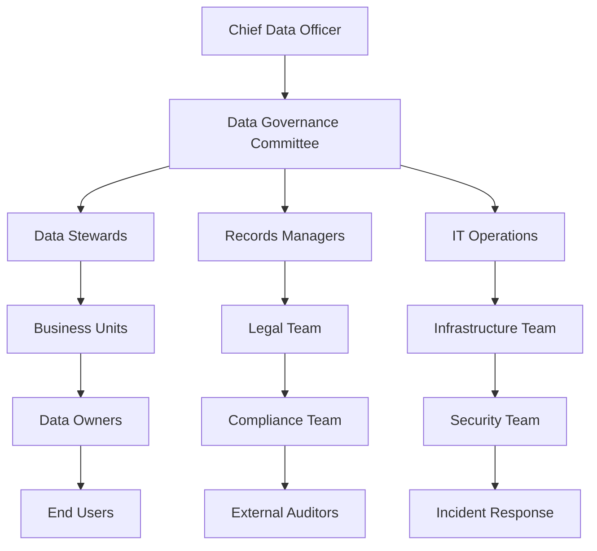
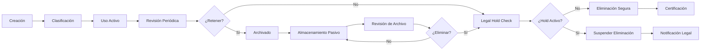
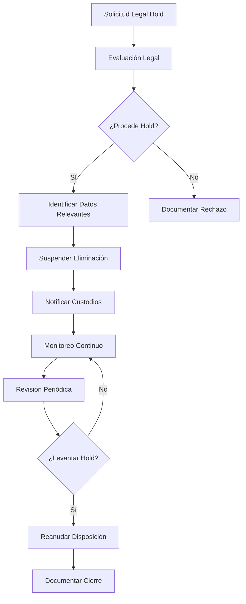
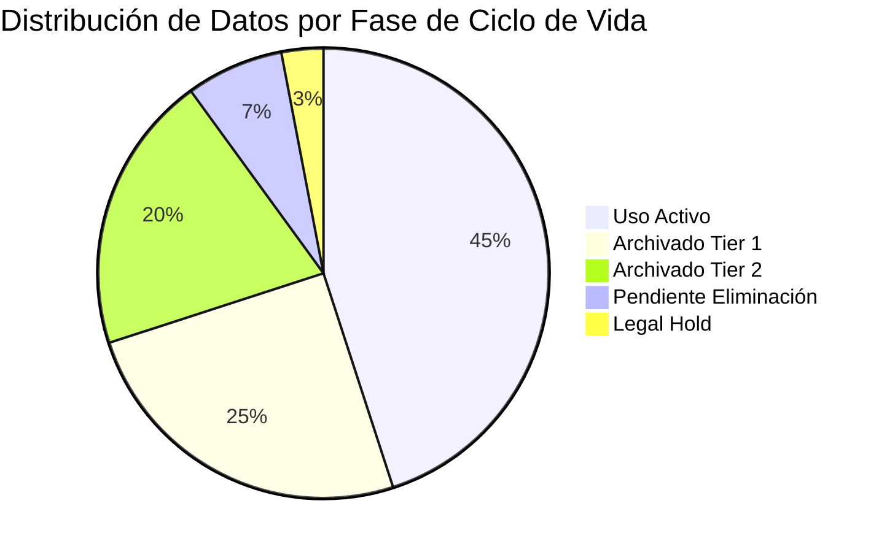
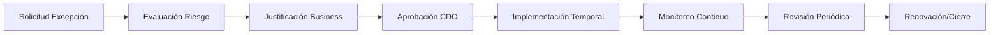

## 1. Información General

| Campo | Detalle |
|-------|---------|
| **Código de Documento** | DIA-POL-002 |
| **Nombre** | Política de Retención y Eliminación Segura de Información |
| **Versión** | v2.1.0 |
| **Fecha de Aprobación** | 2024-11-15 |
| **Fecha de Vigencia** | 2024-12-01 |
| **Fecha de Próxima Revisión** | 2025-12-01 |
| **Clasificación** | Confidencial |
| **Responsable** | Chief Data Officer (CDO) |
| **Aprobado por** | Junta Directiva |
| **Aplica a** | Toda la organización DivisionCero |

## 2. Propósito

Establecer los lineamientos y procedimientos para la **retención, archivado y eliminación segura** de información en DivisionCero, garantizando el cumplimiento regulatorio, la eficiencia operacional y la protección de datos sensibles durante todo el ciclo de vida de la información.

## 3. Alcance

Esta política aplica a:

- **Información digital**: Bases de datos, archivos, correos electrónicos, logs, backups
- **Información física**: Documentos impresos, medios de almacenamiento
- **Información en la nube**: Datos almacenados en servicios cloud públicos y privados
- **Metadatos**: Información sobre la información (timestamps, autores, versiones)
- **Información de terceros**: Datos de clientes, proveedores y socios comerciales

## 4. Definiciones

| Término | Definición |
|---------|------------|
| **Retención** | Período durante el cual la información debe mantenerse accesible según requisitos legales o de negocio |
| **Archivado** | Proceso de transferir información de sistemas activos a almacenamiento de largo plazo |
| **Eliminación Segura** | Destrucción irreversible de información que impide su recuperación |
| **Clasificación de Datos** | Categorización de información según su sensibilidad y criticidad |
| **Custodio de Datos** | Persona responsable del mantenimiento técnico y protección de conjuntos específicos de datos |
| **Legal Hold** | Suspensión de eliminación por requerimientos legales o investigaciones |

## 5. Responsabilidades



### 5.1 Chief Data Officer (CDO)
- Aprobar y mantener la política de retención
- Establecer el Data Governance Committee
- Reportar al CEO sobre cumplimiento de retención
- Autorizar excepciones a la política

### 5.2 Data Governance Committee
- Definir schedules de retención por tipo de información
- Aprobar herramientas de gestión del ciclo de vida
- Revisar y actualizar políticas anualmente
- Resolver conflictos de retención entre departamentos

### 5.3 Data Stewards
- Clasificar información según sensibilidad
- Definir períodos de retención para sus dominios
- Monitorear cumplimiento de schedules
- Coordinar con Legal para requirements regulatorios

### 5.4 Records Managers
- Implementar y operar sistemas de gestión documental
- Ejecutar procesos de archivado automatizado
- Supervisar eliminación segura de información
- Mantener registros de disposición de datos

### 5.5 IT Operations
- Implementar controles técnicos de retención
- Configurar backup y archival systems
- Ejecutar procedimientos de eliminación segura
- Monitorear almacenamiento y capacidad

## 6. Clasificación y Períodos de Retención

### 6.1 Matriz de Clasificación de Datos

```yaml
data_classification:
  public:
    retention_period: "3 años"
    disposal_method: "eliminación_estándar"
    backup_required: false
    
  internal:
    retention_period: "5 años"
    disposal_method: "eliminación_segura"
    backup_required: true
    
  confidential:
    retention_period: "7 años"
    disposal_method: "eliminación_certificada"
    backup_required: true
    encryption_required: true
    
  restricted:
    retention_period: "10 años"
    disposal_method: "destrucción_física"
    backup_required: true
    encryption_required: true
    access_logging: true
```

### 6.2 Schedules de Retención por Categoría

| Categoría | Subcategoría | Período Activo | Período Archivo | Disposición Final | Base Legal |
|-----------|--------------|----------------|-----------------|-------------------|------------|
| **Datos de Clientes** | Información personal | 6 años | 4 años | Eliminación certificada | GDPR Art. 5 |
| **Registros Financieros** | Estados financieros | 7 años | 3 años | Archivo permanente | SOX Sec. 802 |
| **Logs de Seguridad** | Eventos de acceso | 1 año | 6 años | Eliminación segura | ISO 27001:2013 |
| **Comunicaciones** | Correo electrónico | 3 años | 2 años | Eliminación estándar | Política interna |
| **Código Fuente** | Aplicaciones críticas | Permanente | N/A | N/A | Propiedad intelectual |
| **Documentos Legales** | Contratos | 10 años | 15 años | Archivo permanente | Código de Comercio |
| **Datos de RRHH** | Expedientes empleados | 5 años post-salida | 10 años | Eliminación certificada | Ley laboral |
| **Datos de Proveedores** | Evaluaciones | 3 años | 2 años | Eliminación segura | Política interna |

## 7. Proceso de Gestión del Ciclo de Vida



### 7.1 Fases del Ciclo de Vida

#### Fase 1: Creación y Clasificación
```yaml
creation_process:
  automatic_classification:
    enabled: true
    ml_models: ["content_analyzer", "pii_detector"]
    confidence_threshold: 0.85
    
  manual_classification:
    required_for: ["restricted", "confidential"]
    approval_workflow: true
    steward_review: mandatory
    
  metadata_capture:
    creation_date: automatic
    creator_id: automatic
    business_purpose: manual
    retention_trigger: automatic
```

#### Fase 2: Uso Activo y Monitoreo
```yaml
active_use_monitoring:
  access_tracking:
    enabled: true
    log_retention: "1 año"
    anomaly_detection: true
    
  usage_analytics:
    last_access_date: tracked
    access_frequency: calculated
    modification_history: maintained
    
  compliance_checks:
    retention_alerts: "90 días antes de vencimiento"
    legal_hold_scanning: "diario"
    classification_review: "anual"
```

#### Fase 3: Archivado y Almacenamiento Pasivo
```yaml
archival_process:
  eligibility_criteria:
    - last_access_date: "> 1 año"
    - business_value: "bajo"
    - legal_requirement: "archivo_permitido"
    
  archive_tiers:
    tier_1:
      access_time: "< 1 hora"
      cost_multiplier: 1.0
      retention_period: "2 años"
      
    tier_2:
      access_time: "< 24 horas"
      cost_multiplier: 0.3
      retention_period: "5 años"
      
    tier_3:
      access_time: "< 7 días"
      cost_multiplier: 0.1
      retention_period: "permanente"
```

#### Fase 4: Eliminación Segura
```yaml
secure_disposal:
  validation_checks:
    - legal_hold_status: false
    - business_approval: required
    - retention_period_expired: true
    - backup_verification: completed
    
  disposal_methods:
    digital_data:
      standard: "sobrescritura_3_pases"
      secure: "sobrescritura_7_pases + verificación"
      certified: "destrucción_física_del_medio"
      
    physical_media:
      paper: "trituración_cross_cut + incineración"
      magnetic: "degaussing + destrucción_física"
      optical: "trituración_industrial"
```

## 8. Herramientas y Tecnologías

### 8.1 Plataforma de Data Lifecycle Management
```yaml
dlm_platform:
  primary_tool: "Microsoft Purview"
  integration_apis:
    - azure_information_protection
    - office_365_retention
    - sharepoint_governance
    
  automation_capabilities:
    auto_classification: enabled
    policy_enforcement: active
    disposition_workflows: configured
    
  monitoring_dashboard:
    retention_compliance: 98.5%
    archive_efficiency: 87.2%
    disposal_backlog: 14_items
```

### 8.2 Herramientas Complementarias
```yaml
complementary_tools:
  backup_management:
    tool: "Veeam Backup & Replication"
    retention_integration: true
    automated_disposal: enabled
    
  database_lifecycle:
    tool: "IBM InfoSphere Optim"
    data_archiving: active
    test_data_management: enabled
    
  email_archiving:
    tool: "Enterprise Vault"
    policy_enforcement: automatic
    legal_hold_integration: active
    
  document_management:
    tool: "SharePoint + Syntex"
    auto_classification: enabled
    retention_labels: applied
```

## 9. Procedimientos de Legal Hold

### 9.1 Proceso de Legal Hold


### 9.2 Gestión de Legal Holds
```yaml
legal_hold_management:
  hold_triggers:
    - litigation_notice: "inmediato"
    - regulatory_investigation: "24 horas"
    - internal_investigation: "48 horas"
    - audit_request: "72 horas"
    
  scope_definition:
    data_sources: ["email", "documents", "databases", "backup"]
    time_period: "definido_por_legal"
    custodians: "identificados_específicamente"
    keywords: "términos_de_búsqueda"
    
  monitoring_requirements:
    compliance_tracking: "diario"
    custodian_reporting: "semanal"
    legal_review: "mensual"
    cost_tracking: "continuo"
```

## 10. Métricas y KPIs

### 10.1 Dashboard de Retención


### 10.2 Indicadores Clave
```yaml
retention_kpis:
  compliance_metrics:
    retention_compliance_rate: 
      target: "> 95%"
      current: "98.2%"
      trend: "mejorando"
      
    disposal_timeliness:
      target: "< 30 días post-vencimiento"
      current: "18 días promedio"
      trend: "estable"
      
  efficiency_metrics:
    storage_optimization:
      active_vs_archive_ratio: "60:40"
      cost_reduction: "35% anual"
      archive_automation: "87%"
      
    processing_efficiency:
      auto_classification_accuracy: "92%"
      manual_review_reduction: "68%"
      disposition_automation: "78%"
      
  risk_metrics:
    overretention_risk:
      data_beyond_policy: "2.1%"
      high_risk_categories: "0.3%"
      regulatory_exposure: "bajo"
      
    underretention_risk:
      premature_disposal: "0.1%"
      legal_hold_violations: "0"
      audit_findings: "0"
```

## 11. Mejores Prácticas

### 11.1 Principios de Retención
1. **Minimización de Datos**: Retener solo lo necesario para propósitos legítimos
2. **Automatización**: Implementar procesos automatizados siempre que sea posible
3. **Documentación**: Mantener registros detallados de todas las acciones de disposición
4. **Revisión Regular**: Evaluar y actualizar schedules de retención periódicamente
5. **Seguridad**: Proteger datos durante todo el ciclo de vida
6. **Transparencia**: Comunicar políticas claramente a todos los stakeholders

### 11.2 Implementación Gradual
```yaml
implementation_roadmap:
  fase_1_q1_2025:
    - implementar_clasificacion_automatica
    - configurar_retention_labels
    - entrenar_data_stewards
    
  fase_2_q2_2025:
    - habilitar_archivado_automatico
    - integrar_legal_hold_system
    - implementar_monitoring_dashboard
    
  fase_3_q3_2025:
    - automatizar_eliminacion_segura
    - optimizar_costos_almacenamiento
    - implementar_advanced_analytics
    
  fase_4_q4_2025:
    - auditoria_compliance_completa
    - certificacion_iso_27001
    - expansion_a_subsidiarias
```

## 12. Cumplimiento y Auditoría

### 12.1 Marcos Regulatorios
```yaml
compliance_frameworks:
  gdpr:
    article_5: "principio_minimización"
    article_17: "derecho_al_olvido"
    article_25: "privacy_by_design"
    
  ccpa:
    section_1798_105: "derecho_eliminación"
    section_1798_100: "transparencia_retención"
    
  sox:
    section_802: "retención_documentos_7_años"
    section_404: "controles_internos"
    
  iso_27001:
    control_8_3: "manejo_medios"
    control_12_3: "respaldo_información"
    control_11_2: "disposición_segura"
```

### 12.2 Programa de Auditoría
```yaml
audit_program:
  internal_audits:
    frequency: "trimestral"
    scope: "25% de categorías por trimestre"
    methodology: "muestreo_estadístico"
    
  external_audits:
    frequency: "anual"
    auditor: "firma_big_four"
    certification_target: "iso_27001"
    
  continuous_monitoring:
    automated_controls: "87% de políticas"
    exception_reporting: "tiempo_real"
    dashboard_updates: "diario"
```

## 13. Gestión de Excepciones

### 13.1 Proceso de Excepciones


### 13.2 Criterios de Aprobación
```yaml
exception_criteria:
  business_justification:
    revenue_impact: "> $100K anual"
    regulatory_requirement: "mandatorio"
    customer_commitment: "contractual"
    
  risk_assessment:
    data_sensitivity: "evaluado"
    exposure_duration: "limitado"
    mitigation_controls: "implementados"
    
  approval_matrix:
    public_data: "data_steward"
    internal_data: "department_head"
    confidential_data: "cdo_approval"
    restricted_data: "board_approval"
```

## 14. Capacitación y Concientización

### 14.1 Programa de Formación
```yaml
training_program:
  general_awareness:
    target_audience: "todos_empleados"
    frequency: "anual"
    duration: "2 horas"
    delivery: "e-learning"
    
  specialized_training:
    data_stewards:
      duration: "16 horas"
      certification: "required"
      recertification: "cada_2_años"
      
    it_operations:
      duration: "24 horas"
      hands_on_labs: "included"
      vendor_training: "available"
      
  executive_briefings:
    frequency: "semestral"
    duration: "1 hora"
    focus: "compliance_risk_metrics"
```

## 15. Plan de Continuidad

### 15.1 Escenarios de Contingencia
```yaml
contingency_scenarios:
  system_failure:
    backup_procedures: "manual_disposition_process"
    recovery_time: "< 24 horas"
    data_integrity: "verified"
    
  vendor_discontinuation:
    migration_plan: "6_meses"
    data_extraction: "garantizado"
    alternative_tools: "pre_identificadas"
    
  regulatory_change:
    impact_assessment: "30 días"
    policy_update: "60 días"
    implementation: "90 días"
```

## 16. Referencias y Documentos Relacionados

### 16.1 Normativas y Estándares
- **GDPR**: Regulation (EU) 2016/679 - General Data Protection Regulation
- **CCPA**: California Consumer Privacy Act of 2018
- **SOX**: Sarbanes-Oxley Act of 2002, Section 802
- **ISO 27001:2013**: Information Security Management Systems
- **NIST SP 800-88**: Guidelines for Media Sanitization
- **ARMA International**: Generally Accepted Recordkeeping Principles

### 16.2 Documentos Internos
- **DIA-POL-001**: Política de Protección de Datos Personales
- **SIF-POL-003**: Política de Gestión de Backups
- **COR-POL-001**: Política de Clasificación de Información
- **ADR-PLA-001**: Plan de Respuesta a Incidentes de Seguridad
- **CCN-POL-001**: Política de Continuidad de Negocio

## 17. Control de Versiones

| Versión | Fecha | Autor | Cambios Principales |
|---------|-------|-------|-------------------|
| v1.0.0 | 2023-01-15 | CDO | Versión inicial |
| v1.1.0 | 2023-07-20 | Data Governance Committee | Integración GDPR, nuevas herramientas |
| v2.0.0 | 2024-03-10 | CDO | Automatización, legal hold, nuevos KPIs |
| v2.1.0 | 2024-11-15 | CDO | Optimización costos, compliance frameworks |

---

**Documento clasificado como CONFIDENCIAL**  
**© 2024 DivisionCero. Todos los derechos reservados.**  
**Próxima revisión programada: Diciembre 2025**
