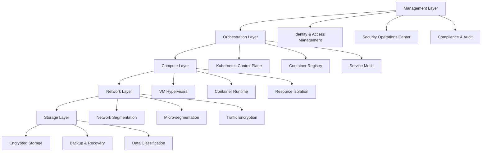
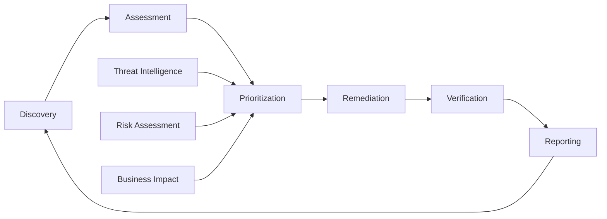
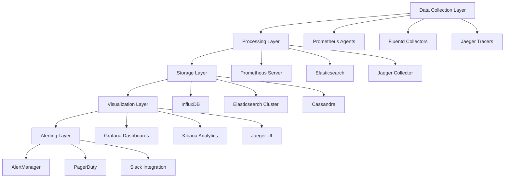
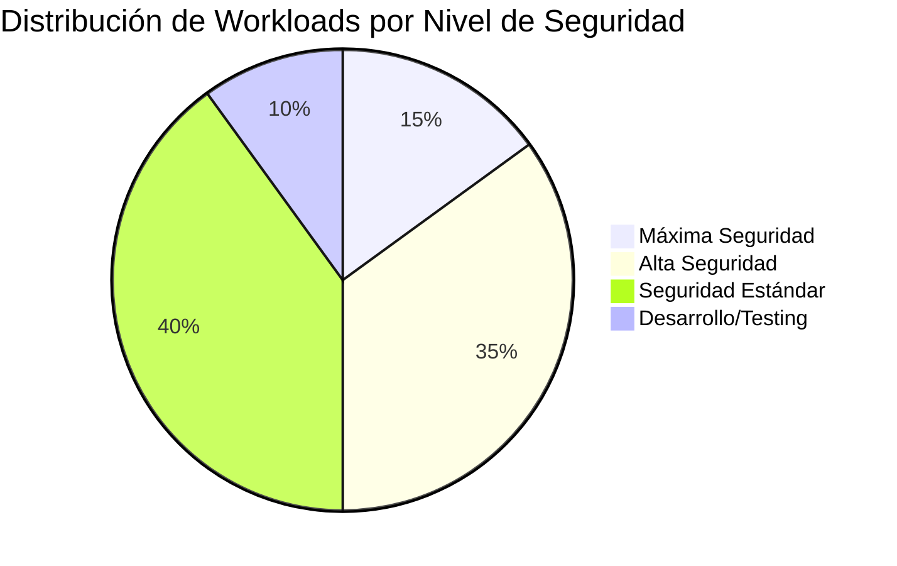

## 1. Información General

| Campo | Detalle |
|-------|---------|
| **Código de Documento** | SIF-POL-007 |
| **Nombre** | Política de Seguridad en Entornos Virtuales |
| **Versión** | v3.2.0 |
| **Fecha de Aprobación** | 2024-11-20 |
| **Fecha de Vigencia** | 2024-12-01 |
| **Fecha de Próxima Revisión** | 2025-12-01 |
| **Clasificación** | Confidencial |
| **Responsable** | Chief Technology Officer (CTO) |
| **Aprobado por** | Comité Ejecutivo de Tecnología |
| **Aplica a** | Toda la infraestructura virtualizada de DivisionCero |

## 2. Propósito

Establecer los **controles de seguridad, procedimientos y mejores prácticas** para proteger la infraestructura virtualizada de DivisionCero, incluyendo máquinas virtuales, hipervisores, containers, y entornos de nube híbrida, garantizando la integridad, confidencialidad y disponibilidad de los recursos virtualizados.

## 3. Alcance

Esta política aplica a:

- **Infraestructura de virtualización**: VMware vSphere, Hyper-V, KVM, Xen
- **Contenedores**: Docker, Kubernetes, OpenShift, containerd
- **Orquestación**: Kubernetes clusters, Docker Swarm, Nomad
- **Nube híbrida**: AWS, Azure, Google Cloud, infraestructura on-premises
- **Redes virtuales**: SDN, VLANs, micro-segmentación, service mesh
- **Almacenamiento virtualizado**: vSAN, distributed storage, cloud storage

## 4. Definiciones

| Término | Definición |
|---------|------------|
| **Hipervisor** | Software que crea y ejecuta máquinas virtuales, gestionando recursos físicos |
| **Container** | Unidad de software que empaqueta código y dependencias para ejecución consistente |
| **Orquestador** | Sistema que automatiza el despliegue, escalado y gestión de containers |
| **Micro-segmentación** | División de la red en zonas pequeñas para contener amenazas |
| **Service Mesh** | Infraestructura para comunicación segura entre microservicios |
| **Image Registry** | Repositorio centralizado para imágenes de containers y VMs |
| **Escape de VM** | Vulnerabilidad que permite acceso desde VM guest al host subyacente |

## 5. Arquitectura de Seguridad Virtualizada



## 6. Responsabilidades

### 6.1 Chief Technology Officer (CTO)
- Aprobar arquitectura de seguridad virtualizada
- Establecer estándares de virtualización segura
- Supervisar inversión en tecnologías de virtualización
- Reportar métricas de seguridad al CEO

### 6.2 Virtualization Security Team
- Implementar y mantener controles de seguridad
- Monitorear amenazas específicas de virtualización
- Realizar evaluaciones de vulnerabilidades
- Gestionar incidentes de seguridad en entornos virtuales

### 6.3 Platform Engineering Team
- Configurar y mantener plataformas de virtualización
- Implementar hardening de hipervisores y containers
- Gestionar imágenes base y registries
- Automatizar despliegues seguros

### 6.4 DevSecOps Team
- Integrar seguridad en pipelines CI/CD
- Implementar scanning de vulnerabilidades
- Gestionar secrets y certificados
- Establecer políticas de security-as-code

### 6.5 Network Security Team
- Implementar micro-segmentación
- Configurar firewalls virtuales y service mesh
- Monitorear tráfico east-west
- Gestionar VPNs y túneles seguros

## 7. Controles de Seguridad por Capa

### 7.1 Seguridad del Hipervisor

```yaml
hypervisor_security:
  hardening_standards:
    vmware_vsphere:
      version_minimum: "8.0U2"
      security_patches: "automatic"
      secure_boot: enabled
      tpm_integration: required
      
    microsoft_hyperv:
      version_minimum: "Server 2022"
      hvci_enabled: true
      credential_guard: enabled
      shielded_vms: "for_sensitive_workloads"
      
    kvm_qemu:
      selinux_enforcement: enabled
      seccomp_filtering: active
      memory_protection: "aslr + dep"
      
  access_controls:
    management_network: "isolated_vlan"
    admin_access: "mfa_required"
    api_authentication: "certificate_based"
    privilege_escalation: "monitored"
    
  monitoring_controls:
    hypervisor_logs: "centralized_siem"
    performance_monitoring: "real_time"
    configuration_drift: "detected"
    vm_escape_detection: "behavioral_analysis"
```

### 7.2 Seguridad de Máquinas Virtuales

```yaml
vm_security:
  vm_templates:
    golden_images:
      hardening_applied: true
      vulnerability_scanning: "passed"
      antimalware_installed: true
      configuration_baseline: "cis_benchmarks"
      
    image_management:
      registry_scanning: "continuous"
      signature_verification: required
      vulnerability_threshold: "critical_zero"
      update_automation: enabled
      
  runtime_security:
    guest_os_protection:
      endpoint_detection: "crowdstrike_falcon"
      application_whitelisting: enabled
      behavior_monitoring: active
      
    vm_isolation:
      resource_limits: enforced
      network_segmentation: "vlan_per_tenant"
      storage_encryption: "vm_level"
      
  vm_lifecycle:
    provisioning_automation:
      infrastructure_as_code: "terraform + ansible"
      security_validation: "pre_deployment"
      compliance_checking: automatic
      
    decommissioning:
      secure_deletion: "nist_800_88"
      certificate_revocation: automatic
      inventory_cleanup: verified
```

### 7.3 Seguridad de Containers

```yaml
container_security:
  image_security:
    base_images:
      approved_registries: ["harbor.divisioncero.com", "mcr.microsoft.com"]
      vulnerability_scanning: "trivy + snyk"
      malware_scanning: "clamav_integration"
      signature_verification: "cosign_required"
      
    build_pipeline:
      dockerfile_linting: "hadolint"
      secrets_scanning: "gitleaks"
      dependency_scanning: "snyk + npm_audit"
      sbom_generation: "syft"
      
  runtime_security:
    container_runtime:
      runtime_type: "containerd"
      rootless_containers: "preferred"
      seccomp_profiles: "custom_restrictive"
      apparmor_profiles: enabled
      
    kubernetes_security:
      rbac_enforcement: "least_privilege"
      network_policies: "default_deny"
      pod_security_standards: "restricted"
      admission_controllers: ["opa_gatekeeper", "falco"]
      
  workload_isolation:
    namespace_segmentation:
      tenant_isolation: "namespace_per_team"
      resource_quotas: enforced
      network_segmentation: "calico_policies"
      
    secrets_management:
      external_secrets_operator: enabled
      vault_integration: active
      rotation_automation: "30_days"
```

### 7.4 Seguridad de Red Virtualizada

```yaml
network_security:
  micro_segmentation:
    segmentation_strategy:
      zero_trust_model: implemented
      east_west_inspection: "palo_alto_cn_series"
      application_segmentation: "by_data_classification"
      
    implementation:
      sdn_controller: "vmware_nsx"
      policy_enforcement: "distributed_firewall"
      traffic_analysis: "vrealize_network_insight"
      
  service_mesh:
    istio_configuration:
      mtls_enforcement: "strict"
      authorization_policies: "fine_grained"
      traffic_encryption: "end_to_end"
      observability: "jaeger + prometheus"
      
    ingress_security:
      waf_protection: "cloudflare + modsecurity"
      rate_limiting: "envoy_proxy"
      certificate_management: "cert_manager"
      
  network_monitoring:
    traffic_analysis:
      netflow_collection: enabled
      anomaly_detection: "darktrace"
      threat_intelligence: "crowdstrike_falcon_x"
      
    incident_response:
      network_forensics: "wireshark + zeek"
      traffic_capture: "on_demand"
      isolation_automation: "via_api"
```

## 8. Gestión de Vulnerabilidades

### 8.1 Programa de Vulnerability Management



### 8.2 Scanning y Assessment

```yaml
vulnerability_management:
  scanning_tools:
    infrastructure_scanning:
      nessus_professional: "weekly_scans"
      qualys_vmdr: "continuous_monitoring"
      rapid7_nexpose: "monthly_deep_scans"
      
    container_scanning:
      aqua_security: "registry_integration"
      twistlock_prisma: "runtime_protection"
      anchore_enterprise: "policy_enforcement"
      
    application_scanning:
      checkmarx_sast: "code_commit_triggers"
      veracode_dast: "staging_environment"
      snyk_code: "ide_integration"
      
  vulnerability_prioritization:
    scoring_matrix:
      cvss_base_score: "weight_40%"
      exploit_availability: "weight_25%"
      asset_criticality: "weight_20%"
      data_classification: "weight_15%"
      
    sla_targets:
      critical_vulnerabilities: "24_hours"
      high_vulnerabilities: "72_hours"
      medium_vulnerabilities: "2_weeks"
      low_vulnerabilities: "1_month"
```

## 9. Gestión de Configuración Segura

### 9.1 Infrastructure as Code (IaC)

```yaml
iac_security:
  policy_as_code:
    open_policy_agent:
      policy_language: "rego"
      policy_coverage: "100%_infrastructure"
      automated_testing: enabled
      
    terraform_validation:
      tfsec_scanning: "pre_commit_hooks"
      checkov_analysis: "ci_cd_pipeline"
      terraform_compliance: "business_rules"
      
  configuration_management:
    ansible_hardening:
      cis_benchmarks: "automated_application"
      stig_compliance: "government_standards"
      custom_baselines: "organization_specific"
      
    configuration_drift:
      detection_tools: ["chef_inspec", "aws_config"]
      remediation: "automatic_correction"
      alerting: "real_time_notifications"
```

### 9.2 Secure Defaults

```yaml
secure_defaults:
  vm_configurations:
    resource_allocation:
      cpu_limits: "prevent_resource_exhaustion"
      memory_limits: "isolation_enforcement"
      disk_quotas: "storage_optimization"
      
    security_features:
      secure_boot: enabled
      encrypted_vmotion: required
      vm_encryption: "for_sensitive_data"
      
  container_configurations:
    security_contexts:
      run_as_non_root: true
      read_only_filesystem: "when_possible"
      drop_all_capabilities: true
      no_privilege_escalation: true
      
    resource_constraints:
      cpu_requests: "100m"
      memory_requests: "128Mi"
      cpu_limits: "500m"
      memory_limits: "512Mi"
```

## 10. Backup y Recuperación

### 10.1 Estrategia de Backup Virtualizada

```yaml
backup_strategy:
  vm_backups:
    backup_tool: "veeam_backup_replication"
    schedule: "daily_incremental_weekly_full"
    retention: "30_days_local_365_days_cloud"
    encryption: "aes_256_in_transit_and_rest"
    
  container_backups:
    persistent_volumes:
      backup_tool: "velero"
      schedule: "daily_snapshots"
      cross_region_replication: enabled
      
    application_state:
      database_backups: "native_tools + velero"
      configuration_backups: "git_repository"
      secrets_backup: "vault_replication"
      
  disaster_recovery:
    rpo_targets:
      tier_1_applications: "15_minutes"
      tier_2_applications: "4_hours"
      tier_3_applications: "24_hours"
      
    rto_targets:
      tier_1_applications: "1_hour"
      tier_2_applications: "8_hours"
      tier_3_applications: "24_hours"
```

## 11. Monitoreo y Observabilidad

### 11.1 Stack de Monitoreo



### 11.2 Métricas de Seguridad

```yaml
security_monitoring:
  infrastructure_metrics:
    hypervisor_health:
      cpu_utilization: "threshold_80%"
      memory_usage: "threshold_85%"
      storage_capacity: "threshold_90%"
      network_throughput: "baseline_deviation"
      
    security_events:
      failed_login_attempts: "threshold_5_per_hour"
      privilege_escalations: "any_occurrence"
      configuration_changes: "unauthorized_modifications"
      vm_creation_deletion: "outside_business_hours"
      
  application_metrics:
    container_security:
      vulnerability_count: "by_severity"
      policy_violations: "opa_gatekeeper_denials"
      runtime_anomalies: "falco_alerts"
      image_scan_results: "failed_scans"
      
    performance_security:
      response_time_anomalies: "potential_dos"
      error_rate_spikes: "application_attacks"
      resource_exhaustion: "container_limits_reached"
```

## 12. Incident Response para Entornos Virtuales

### 12.1 Playbooks Específicos

```yaml
incident_playbooks:
  vm_escape_detection:
    severity: "critical"
    initial_response: "isolate_affected_host"
    investigation_steps:
      - "capture_hypervisor_memory_dump"
      - "analyze_vm_guest_artifacts"
      - "check_privilege_escalation_logs"
      - "validate_hypervisor_integrity"
    
  container_breakout:
    severity: "high"
    initial_response: "terminate_container_immediately"
    investigation_steps:
      - "analyze_container_runtime_logs"
      - "inspect_kernel_audit_logs"
      - "check_selinux_apparmor_violations"
      - "validate_host_system_integrity"
      
  malicious_image_deployment:
    severity: "medium"
    initial_response: "quarantine_affected_registries"
    investigation_steps:
      - "scan_all_running_instances"
      - "analyze_image_build_history"
      - "check_supply_chain_integrity"
      - "update_admission_policies"
```

## 13. Compliance y Auditoría

### 13.1 Marcos de Cumplimiento

```yaml
compliance_frameworks:
  iso_27001:
    control_a_12_6_2: "secure_disposal_virtual_assets"
    control_a_13_1_3: "network_segregation"
    control_a_14_1_3: "secure_development_virtualization"
    
  nist_cybersecurity:
    identify_function: "asset_inventory_virtualization"
    protect_function: "access_control_virtual_assets"
    detect_function: "anomaly_detection_virtual_environments"
    respond_function: "incident_response_virtualization"
    recover_function: "backup_recovery_virtual_systems"
    
  cis_controls:
    control_1: "inventory_authorized_devices_virtual"
    control_2: "inventory_authorized_software_containers"
    control_11: "secure_configuration_virtual_infrastructure"
    control_12: "boundary_defense_micro_segmentation"
```

### 13.2 Auditoría Continua

```yaml
continuous_audit:
  automated_compliance:
    policy_validation: "opa_daily_checks"
    configuration_compliance: "chef_inspec_hourly"
    vulnerability_assessment: "qualys_continuous"
    
  audit_trails:
    vm_lifecycle_events: "vcenter_logs"
    container_operations: "kubernetes_audit_logs"
    network_changes: "nsx_audit_trail"
    access_attempts: "active_directory_logs"
    
  reporting:
    compliance_dashboard: "real_time_updates"
    executive_reports: "monthly_summaries"
    audit_evidence: "automated_collection"
```

## 14. Roadmap de Mejoras

### 14.1 Innovaciones de Seguridad

```yaml
security_roadmap:
  q1_2025:
    - implement_confidential_computing
    - deploy_kubernetes_security_operator
    - enhance_zero_trust_architecture
    
  q2_2025:
    - integrate_ai_threat_detection
    - implement_chaos_engineering_security
    - deploy_serverless_security_controls
    
  q3_2025:
    - quantum_ready_cryptography
    - edge_computing_security_framework
    - autonomous_incident_response
    
  q4_2025:
    - next_gen_virtualization_security
    - integrated_devsecops_platform
    - predictive_security_analytics
```

## 15. Métricas y KPIs

### 15.1 Dashboard de Seguridad Virtualizada



### 15.2 Indicadores Clave

```yaml
virtualization_kpis:
  security_posture:
    vulnerability_reduction: 
      target: "90% reduction_year_over_year"
      current: "87% achieved"
      trend: "improving"
      
    zero_day_protection:
      target: "100% containment"
      current: "98.5%"
      trend: "stable"
      
  operational_efficiency:
    automation_coverage:
      target: "95% automated_security_controls"
      current: "92%"
      trend: "improving"
      
    incident_response_time:
      target: "< 15_minutes_detection_to_containment"
      current: "12_minutes_average"
      trend: "improving"
      
  compliance_metrics:
    policy_compliance:
      target: "100% policy_adherence"
      current: "99.2%"
      trend: "stable"
      
    audit_findings:
      target: "zero_critical_findings"
      current: "1_medium_finding_q4"
      trend: "improving"
```

## 16. Capacitación y Certificaciones

### 16.1 Programa de Formación

```yaml
training_program:
  technical_teams:
    vmware_certified_professional:
      target_coverage: "100% platform_engineers"
      certification_maintenance: "annual"
      hands_on_labs: "quarterly"
      
    kubernetes_security_specialist:
      target_coverage: "80% devops_engineers"
      certification_path: "cks + ckad"
      training_budget: "$5000_per_engineer"
      
  security_teams:
    virtualization_security_expert:
      custom_curriculum: "internal_development"
      vendor_training: "vmware + kubernetes"
      threat_hunting_focus: "virtual_environments"
      
  executive_awareness:
    virtualization_risk_overview:
      frequency: "semi_annual"
      duration: "2_hours"
      focus: "business_impact_metrics"
```

## 17. Referencias y Documentos Relacionados

### 17.1 Estándares y Frameworks
- **NIST SP 800-125**: Guide to Security for Full Virtualization Technologies
- **NIST SP 800-190**: Application Container Security Guide
- **CIS Benchmarks**: VMware vSphere, Docker, Kubernetes
- **ENISA**: Security Aspects of Virtualization
- **SANS Institute**: Virtualization Security Guidelines

### 17.2 Documentos Internos
- **SIF-POL-001**: Política de Seguridad en Infraestructura
- **SIF-POL-003**: Política de Gestión de Backups
- **ADR-POL-001**: Política de Monitoreo de Eventos de Seguridad
- **COR-POL-001**: Política de Clasificación de Información
- **CCN-POL-001**: Política de Continuidad de Negocio

## 18. Control de Versiones

| Versión | Fecha | Autor | Cambios Principales |
|---------|-------|-------|-------------------|
| v1.0.0 | 2022-03-15 | CTO | Versión inicial VMware |
| v2.0.0 | 2023-02-20 | Platform Engineering | Integración Kubernetes |
| v3.0.0 | 2024-06-10 | DevSecOps Team | Container security, service mesh |
| v3.2.0 | 2024-11-20 | CTO | Zero Trust, AI/ML integration, compliance |

---

**Documento clasificado como CONFIDENCIAL**  
**© 2024 DivisionCero. Todos los derechos reservados.**  
**Próxima revisión programada: Diciembre 2025**
