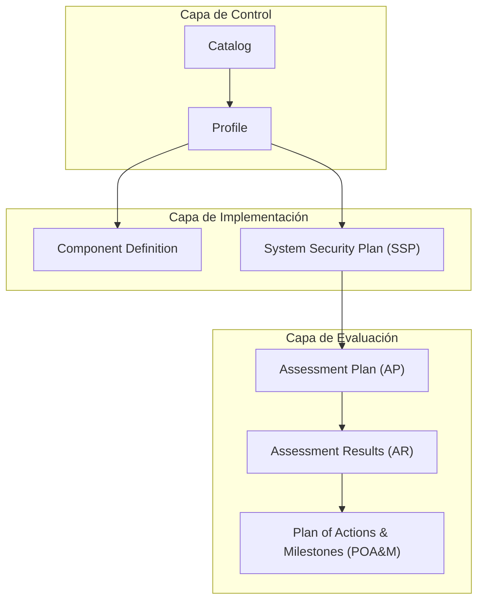

import { Database, Settings2, Boxes, ShieldCheck, ClipboardList, ClipboardCheck, ListChecks } from 'lucide-react';
import { Accordion, Accordions } from 'fumadocs-ui/components/accordion';

## Framework Kudo

| Elemento     | Cantidad |
| ------------ | -------- |
| Dominios     | 8        |
| Controles    | 35       |
| Requisitos   | 491      |

## ¿Qué es OSCAL?

OSCAL (Open Security Controls Assessment Language) es un conjunto de formatos desarrollado por NIST (National Institute of Standards and Technology) que estandariza la expresión, evaluación e intercambio de información sobre controles de seguridad de sistemas de información.

## Formatos OSCAL

OSCAL permite el tratamiento de tres formatos: **json**, **xml** y **yaml**.

Adicionalmente con kudo generamos la exportación en: **toon**.

## Integración Kudo-OSCAL

El framework Kudo está diseñado para ser compatible con OSCAL, proporcionando una implementación práctica de controles de seguridad expresada en los 7 componentes principales del modelo OSCAL:

<Cards>
  <Card href="/framework/oscal/catalog" icon={<Database />} title="Catalog">
    Catálogo de controles de seguridad del framework Kudo estructurado según modelo OSCAL
  </Card>
  <Card href="/framework/oscal/profile" icon={<Settings2 />} title="Profile">
    Perfil de implementación que define la selección y configuración específica de controles Kudo
  </Card>
  <Card href="/framework/oscal/component-definition" icon={<Boxes />} title="Component Definition">
    Definición de componentes del sistema y sus implementaciones de controles según modelo OSCAL
  </Card>
  <Card href="/framework/oscal/ssp-system-security-plan" icon={<ShieldCheck />} title="System Security Plan (SSP)">
    Plan integral de seguridad del sistema que documenta la implementación de controles según framework Kudo
  </Card>
  <Card href="/framework/oscal/ap-assessment-plan" icon={<ClipboardList />} title="Assessment Plan (AP)">
    Plan de evaluación de controles de seguridad basado en OSCAL para validar la implementación de controles Kudo
  </Card>
  <Card href="/framework/oscal/ar-assessment-results" icon={<ClipboardCheck />} title="Assessment Results (AR)">
    Resultados de la evaluación de controles de seguridad Kudo documentados según estándares OSCAL
  </Card>
  <Card href="/framework/oscal/poam-plan-of-actions-and-milestones" icon={<ListChecks />} title="Plan of Actions & Milestones (POA&M)">
    Plan de acciones correctivas y cronograma para remediar deficiencias identificadas en controles de seguridad
  </Card>
</Cards>

## Referencia

La adaptación de Kudo sobre OSCAL es un proyecto colaborativo. Para contribuir:

1. Consulta nuestro [repositorio en GitHub](https://github.com/PetterVargas/kudo?utm_source=kudo.divisioncero.com)
2. Revisa los [estándares OSCAL de NIST](https://pages.nist.gov/OSCAL/?utm_source=kudo.divisioncero.com)