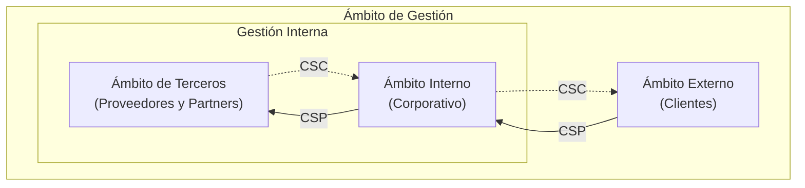

import { Step, Steps } from 'fumadocs-ui/components/steps';

## Roles Organizacionales

Kudo tiene dos roles organizaciones

<Steps>
<Step>

### CSP (Cloud Service Provider)

</Step>

<Step>

### CSC (Cloud Service Customer)

</Step>
</Steps>

## Ámbitos de Gestión

Kudo tiene tres ámbitos de gestión:

<Steps>
<Step>

### Ámbito Interno (Corporativo)

</Step>

<Step>

### Ámbito de Terceros (Proveedores y Partners); también Interno.

</Step>

<Step>

### Ámbito Externo (Clientes)

</Step>
</Steps>

## Gráfica del Ecosistema

